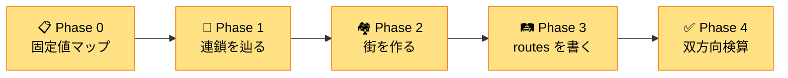

# 🧭 NetPractice 共通の解き方 — どこから手を付けるか

!!! tip "💡 このページの位置付け"
    Level 4 以降の **複雑なレベル**（ルータが出てくる問題）で
    「**どこから手を付ければいいか分からない**」と固まるあなたへ。
    どのレベルでも使える **「決まった解き方」** を 1 ページにまとめました。

---

## 📖 結論

NetPractice は **「穴埋めパズル」** です。固定値（薄ピンク）が **答えへの矢印** になっているので、その矢印を辿るだけで解けます。

**順番は 5 つの Phase**：



---

## 📋 Phase 0 — 固定値マップを作る (絶対最初にやる)

### やること

画面を見渡して **動かせない値（薄ピンクの欄）** を全部リストアップ。
**白い欄は無視** して、まずは固定値だけに集中。

### なぜ最初にやる？

固定値は **「動かせない手がかり」**。これを軸にしないと、白い欄を埋めても後で矛盾が出ます。

### チェックリスト

```
□ 画面の各 IF (interface) を見て、IP/Mask が固定 (薄ピンク) か確認
□ 各 router の routes 欄を見て、route/gate が固定か確認
□ 各 host の routes/gate を確認
□ 固定値だけを紙に書き出す
```

### 例: Level 8 の固定値

| 場所 | 固定値 |
|---|---|
| D1 IP | `7.9.10.11` |
| D1 Mask | `/28` |
| R12 | `163.178.250.12/28` |
| R2r1 gate | `161.138.113.62` |
| Ir1 route | `161.138.113.0/26` |

→ この **5 個** が全ての出発点。

---

## 🔗 Phase 1 — 固定値の "連鎖" を辿る

### やること

固定値同士は **「A だから B、B だから C」** と連鎖します。
1 つの固定値から **何が決まるか** を順に書き出す。

### 連鎖パターン (頻出)

#### パターン A: gate が固定 → 隣のルータの IP が決まる

```
ホストや router の gate 欄が固定 .X
   ↓
その gate が指している隣のルータの IP は必ず .X
```

**例**: `R2r1 gate = .62` (固定) → R13 IP は **必ず .62**

#### パターン B: route の左側 (CIDR) が固定 → リンクのマスクが決まる

```
route の左側 .Y/N が固定
   ↓
その宛先サブネットは /N サイズ
   ↓
そのリンクの両端 IF のマスクは /N に揃える
```

**例**: `Ir1 route = .0/26` (固定) → R13 と R21 の Mask は **必ず /26**

#### パターン C: ホストの IP/Mask 固定 → 街と街の住人が決まる

```
ホスト .X/N が固定
   ↓
そのホストが住む街 = .X を /N で切った先頭
   ↓
同じ街の他の住人 (玄関ルータ) は .Y (空き住人)
```

**例**: `D1 = .11/28` 固定 → 街 = `.0/28` → R23 (= D の玄関) は `.1` など

### Phase 1 のゴール

固定値の連鎖だけで埋まる **編集可能欄** をすべて埋め切る。

---

## 🏘️ Phase 2 — 残りの街 (サブネット) を設計する

### やること

連鎖だけで決まらなかった部分（**自由度の高いホストや街**）を設計する。

### 設計のコツ

1. **サブネットの空き範囲を地図化** ([🗺️ 占有マップ参照](#))
2. **R1 などのルータで routes が制限される** なら、ホストの街を **隣接配置** して **ルート集約** で乗り切る
3. プライベート IP 帯 (`10.x`, `172.16.x`, `192.168.x`) を使う

### 例: Level 8 の C の街

> R1 で書ける routes は 1 本のみ。
> → C を D の隣 (`.16/28`) に置けば、`/27` で 2 街を 1 本に集約できる

---

## 🛤️ Phase 3 — routes (経路) を埋める

### やること

各ルータとホストの **routes 欄** を埋める。

### routes の書き方ルール

| 書く欄 | 何を書く？ |
|---|---|
| 左 (route) | **宛先サブネットのネットワークアドレス** + マスク (例: `.64/26`) |
| 右 (gate) | **次に渡す相手の IP** (= 自分と同じ街の住人) |

詳細: [06. ルーティングテーブル — `.0/26` や `.64/26` の数字って何？](01-basics/routing-table.md#routes-cidr-meaning)

### 順番

```
1. ホストの default route + gate (= 自分の街の玄関)
2. 各ルータの「向こう側の街への routes」
3. Internet 側の「自分の LAN への戻り道」(双方向通信のため)
```

### よくある失敗

- ❌ ホストの IP (`.66`) を route に書く → ✅ **街の住所 (`.64/26`)** を書く
- ❌ 別の街のルータ IP を gate に書く → ✅ **同じ街の住人** を書く
- ❌ Internet からの戻り道 routes を忘れる → ✅ Internet 側にも書く

---

## ✅ Phase 4 — 双方向で検算

### やること

各ゴール（A↔B、A↔Internet など）について、**行き** と **帰り** の両方を頭の中で追跡。

### 検算の手順

```
ゴール: X ↔ Y
─────────────────
🚀 行き:
  X → 自分のサブネット内? Yes → 直接 / No → default → ルータへ
  ルータ → routes 確認 → 該当行 → next hop へ
  ... 続ける ...
  Y に到達 ✅

📬 帰り:
  Y → 自分のサブネット内? Yes → 直接 / No → default → ルータへ
  ... 同じ作業を逆方向で ...
  X に到達 ✅

両方 ✅ ならゴール緑になる
```

### エラーメッセージとの対応

| エラー | 意味 | 確認すべきこと |
|---|---|---|
| `No forward way` | 行きの routes が見つからない | 各ルータの routes に該当エントリがあるか |
| `No reverse way` | 帰りの routes が見つからない | Internet 側 / 上流 routes に LAN の戻り道があるか |
| `loop detected` | ぐるぐる回ってる | gate がお互いを指してないか |

---

## 🎯 解いた順を「絵」で見たい場合

レベル 8 で **8 段階の Mermaid 図** で進捗を見える化しています。
ぜひ参照してください: [🎬 Level 8 を解く順 (絵で順番に追跡)](02-levels/level8.md#step-by-step)

---

## 📋 「埋める順」共通テンプレート

どのレベルでもこの順で攻めれば OK：

| Phase | やること | 出力 |
|:-:|---|---|
| 0 | 固定値（薄ピンク）を全部マーク | 固定値リスト |
| 1 | 固定 gate / route から連鎖で IF の値を決定 | 一部 IF が確定 |
| 2 | 残りのホストの街を設計（必要なら集約も意識） | 全 IF の IP/Mask 確定 |
| 3 | routes と gate を埋める (ホスト → ルータ → Internet 側) | 全 route 確定 |
| 4 | 各ゴールを行き・帰り両方で検算 → Check again | 全 Goal 緑 ✅ |

---

## 🆘 詰まった時のチェックリスト

```
□ 固定値を全部書き出した？ (Phase 0 をスキップしてない？)
□ 固定 gate が指している IP と、隣のルータの IP は一致してる？
□ 固定 route の左側 CIDR と、そのリンクのマスクは一致してる？
□ ホストの IP がその街の住人 (.0 や .ブロードキャスト じゃない) に入ってる？
□ ホストの gate は自分の街の住人 (= 直結ルータ IF) を指してる？
□ Internet 側の routes に、自分の LAN への戻り道 (.X/N) が書いてある？
□ default route (0.0.0.0/0) は最後に評価されるよう、具体的な route の下に書いてある？
```

---

## 📚 各レベルの突破ポイント早見表

| Level | 鍵となる固定値 | 学ぶこと |
|:-:|---|---|
| 1-2 | A1/B1 IP and Mask | 同じサブネット = 同じ街 |
| 3 | スイッチ配下の固定マスク | スイッチ = 全員同じ街 |
| 4 | R2/R3 の固定 IP/Mask | 占有されてない範囲を探す |
| 5 | R1/R2 の IP | ホストを街に入れて gate 設定 |
| 6 | A1 IP, R1 Mask | Internet 側 routes (帰り道) |
| 7 | R11 .1 と R12 .254 | /24 を /26 で 4 等分 |
| 8 | R2r1 gate, Ir1 route, D1 IP | ⭐ ルート集約 |
| 9 | 多数 (連鎖) | 分割統治、複数 routes |
| 10 | ほぼ全部固定 | 0.0.0.0/0 で全戻り経路カバー |

---

## ▶️ 次に読むページ

[🗺️ 全 10 レベル攻略 (第 2 部)](02-levels/level1.md) — 各レベルの詳細解説
