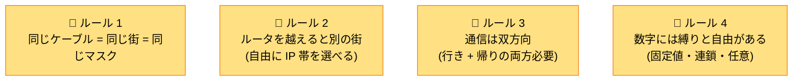
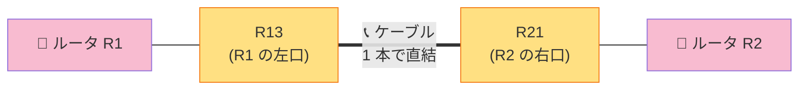
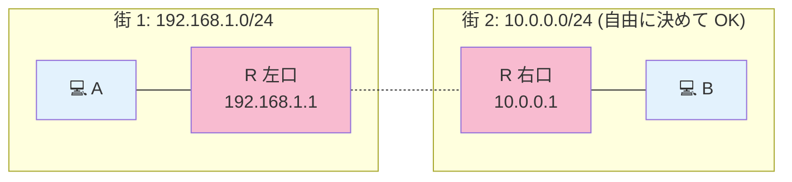
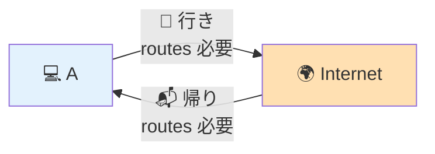
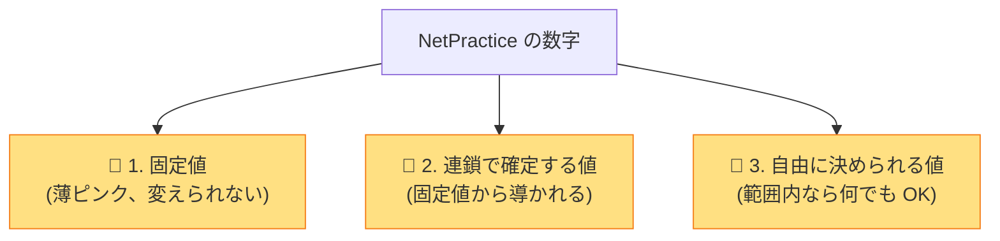
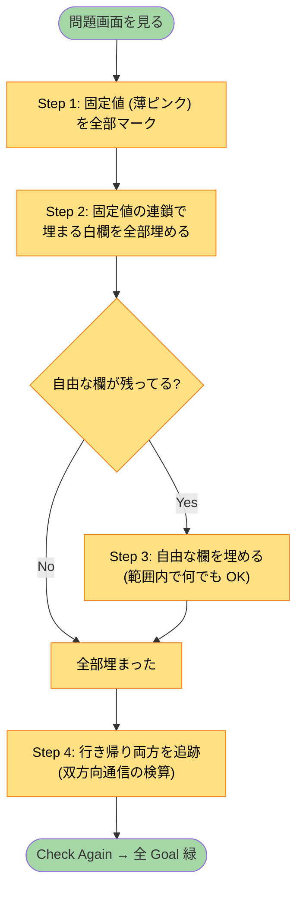

# 🎓 数字の決め方 — 4 つの黄金ルール

!!! tip "💡 このページの位置付け"
    「**なぜこの数字なの？**」「**自分の画面では数字が違うけど、どうやって決めればいい？**」と固まった時に読むページ。
    NetPractice の **全レベルで使える 4 つの黄金ルール** を、小学生でも分かるように説明します。

---

## ✨ 4 つの黄金ルール（先に結論）



各ルールを詳しく見ていきます。

---

## 📐 ルール 1: 同じケーブルで繋がってる人 = 同じ街 = 同じマスク

### 言い換えると

**「ケーブル 1 本で直接繋がってる 2 人 (もしくはスイッチ配下の全員) は、必ず同じサブネットの住人でなければならない」**

### なぜそうなる？

ネットワークの大原則：**直接話せるのは「同じ街の住人」だけ**。
ケーブルで物理的に繋がっていても、IP の街が違うと相手を「赤の他人」と思って話せません。

### 「同じ街」を判定する方法

両方の IP に **同じマスク** を当てて、**ネットワーク部 (= 街の住所)** を計算。
両方が **同じ街の住所** になれば「同じ街」。

```
例:
  R13 IP   = 161.138.113.62
  R21 IP   = 161.138.113.1

同じ /26 マスクで街を計算:
  R13: .62 ÷ 64 = 0 余り 62 → 街 = .0/26
  R21: .1  ÷ 64 = 0 余り 1  → 街 = .0/26
                                   ↑
                          同じ! → 同じ街 ✅ → 通信可能
```

### マスクが違うとどうなる？

```
❌ 悪い例:
  R13 IP   = 161.138.113.62  Mask = /26
  R21 IP   = 161.138.113.1   Mask = /28  ← マスクが違う!

R13 から見た街 = .0/26 (.0〜.63)
R21 から見た街 = .0/28 (.0〜.15)  ← 違う街と判定される!

R13 が R21 (.1) に手紙を書こうとすると:
  → R13 の街は .0〜.63、R21 (.1) はその中? → YES → 直接届けようとする
  
R21 が R13 (.62) に手紙を書こうとすると:
  → R21 の街は .0〜.15、R13 (.62) はその中? → NO → "別の街、ルータ経由で…" → でもルータは無い → 通信失敗 ❌
```

→ **マスクが違うと、片方が「同じ街」だと思っても、もう片方が「違う街」と判定して通信失敗。**

### 具体例: Level 8 の R13 と R21 の話

質問: **「なんで R13 と R21 を同じ /26 にしなきゃいけないの？」**

#### ① まず R13 と R21 がどこにいるか



→ **R13 と R21 は 1 本のケーブルで直接繋がっている**。これは「直結リンク」と呼ばれる。

#### ② ケーブルで直結 = 同じ街じゃないとダメ

ルール 1 により、**R13 と R21 は同じ街 (= 同じサブネット)** でなければならない。

#### ③ 街の大きさはどう決まる？ → **固定値の Ir1 route が「/26 だ」と言ってる**

```
Ir1 route (固定): 161.138.113.0/26
                              ↑
                  Internet が「R1-R2 間の街は /26 サイズ」だと前提
```

→ **Internet が「/26 の街がある」と思っているので、本当に /26 にしないと矛盾**。
→ R13 と R21 は **両方とも /26 マスク** にする必要がある。

#### ④ もし /28 や /24 にしたらどうなる？

##### `/28` にしたら → Internet と矛盾

```
R13/R21 を /28 にすると:
  R13 (.62) → /28 マスク → 街 = .48/28 (.48〜.63)
  R21 (.1)  → /28 マスク → 街 = .0/28  (.0〜.15)
                               ↑↑
                        違う街になる! → R13 と R21 が話せない
```

##### `/24` にしたら → Internet と矛盾

```
R13/R21 を /24 にすると:
  Internet は「R1-R2 間の街は /26 (.0〜.63)」だと思ってる
  でも実際は /24 (.0〜.255) になっている
  → Internet は .65 を「R1-R2 間にいない」と判定するけど、実際の /24 ならいる
  → ルーティング判定が狂う
```

→ **「同じ /26 にする」のは Internet 側の固定値と整合させるための強制。**

---

## 🚪 ルール 2: ルータを越えると「別の街」になる → 自由に IP 帯を選べる

### 言い換えると

**「ルータの反対側は別の街なので、好きな IP 帯 (10.x, 192.168.x, 172.16.x など) を割り当てて良い」**

### なぜそうなる？

ルータは **「街と街を繋ぐ集配局」**。
ルータの片側と反対側は **物理的に別のネットワーク** なので、住所体系が独立。



→ 街 1 が `192.168.x.x` でも、街 2 は **全く違う `10.x.x.x` で OK**。

### 「自由」と「縛り」の境目

何でも自由か？というと **NO**。次の制約があります：

#### ✅ 自由なケース (好きに決められる)

| 状況 | なぜ自由？ |
|---|---|
| ルータを 1 つ越えた先のホスト IP | 別ネットワークだから |
| 別 LAN の街の住所 (`10.0.0.0/24` など) | 他の街と被らなければ何でも OK |
| ルータ間リンクの IP (両端の住人) | 街の中で空きの住人なら何でも OK |

#### ❌ 縛りがあるケース (好きに決められない)

| 状況 | 縛りの理由 |
|---|---|
| 固定値 (薄ピンク) | 動かせない |
| 固定 gate が指してる先のルータ IP | gate と一致しなきゃダメ |
| 他のホストやルータと **同じ街** にいる IF | 街の中の住人じゃないとダメ |
| 他の LAN とアドレス帯が **被ってる** | 重複してると routes が混乱 |

### 具体例: Level 10 の H3 の街

問題: H3 (Host 3) の街は **完全に自由に決められる**。

```
H3 の街の選び方:
  - 10.0.0.0/24    ← OK (他で使ってないプライベート帯)
  - 172.16.0.0/24  ← OK
  - 192.168.50.0/24 ← OK (他のレベルで 192.168.x が出てきても、
                         50 が他で被ってなければ OK)
```

→ **「好きに決めて OK」**。ただし他の街と被らないこと。

### 「適当な数字で良い」場面のチェックリスト

✅ **適当でも OK な場合:**
- ルータ越えの新しい LAN を作る時 → プライベート帯から好きに選ぶ
- 街の中で「空いてる住人」を埋める時 → `.1` でも `.50` でも OK (`.0`/`.255` 等の予約は除く)

❌ **適当だとダメな場合:**
- 固定 gate が指してる先 → 必ずその値
- 固定 route の左側 CIDR → そのリンクのマスクと一致
- 他の固定 IF と同じ街にいる場合 → 街の住人じゃないとダメ

---

## 🔄 ルール 3: 通信は必ず双方向 (行き + 帰りの両方が要る)

### 言い換えると

**「A から B にパケットが届くだけでは通信成立しない。B から A への "返事" の道も必要」**

### なぜそうなる？

ネットワーク通信は **会話** と同じ。

```
HTTP の例:
  クライアント → サーバ:  「GET /index.html」  (お願い)
  クライアント ← サーバ:  「200 OK + データ」   (返事)
                           ↑
                   返事が届かないと、クライアントは何も得られない
```

ping ですら echo request と echo reply の往復が必要。

### 視覚化: 行きと帰り



→ **どっちか片方だけ routes が成立しても通信失敗**。

### よくある失敗: 帰り道を忘れる

#### 行きの routes を設定 (これで安心… と思いきや)

```
A の routes: 0.0.0.0/0 → R1   ✅ 行きは R1 経由で OK
R1 の routes: 0.0.0.0/0 → ISP ✅ 行きは ISP へ
```

A → Internet までは届く。✅

#### でも帰り道がない

```
Internet の routes: ???
  → A の街 (例: 55.232.27.128/25) への戻り道が無い!
  → Internet は「.227 宛のパケットをどこに送ればいいか」分からず破棄
  → "No reverse way" エラー ❌
```

→ **Internet 側にも「自分の LAN への戻り routes」を必ず書く** 必要がある。

### 双方向チェックの習慣

各ゴール (A↔B、A↔Internet など) について、必ず両方を追跡：

```
ゴール: A ↔ B

✅ 行き: A → ? → ? → ... → B
✅ 帰り: B → ? → ? → ... → A

→ 両方 OK で初めて緑になる
```

詳しくは [07. 双方向到達性](01-basics/bidirectional.md)。

---

## 🎲 ルール 4: 数字には「縛り」と「自由」がある

### 数字の 3 段階

NetPractice の各欄に入れる数字は **3 種類** に分けられます：



### 1. 📌 固定値 (薄ピンク背景)

**触れない**。出題者が決めた制約。
これらが **問題を解く出発点**。

例: D1 IP = `7.9.10.11/28` (固定) → D の街が `.0/28` だと自動的に決まる。

### 2. 🔗 連鎖で確定する値 (= 計算で 1 つに決まる)

固定値から **論理的に導かれる** 値。**「これしかない」** という値。

例:
- `R2r1 gate` が固定で `.62` → **R13 IP は必ず `.62`** (連鎖でこの値になる)
- `Ir1 route` が固定で `.0/26` → **R13 と R21 のマスクは必ず /26** (連鎖)

### 3. 🎲 自由に決められる値 (= 範囲内なら何でも OK)

固定でも連鎖でもない、**設計者の好み** で決めて良い値。

例:
- R21 IP は `.62` 以外の `.1〜.61` から好きに選べる → `.1` でも `.50` でも OK
- 新しい LAN の街は `10.0.0.0/24` でも `172.16.5.0/24` でも OK

### 「自由」とは言っても 4 つだけ守る

```
✅ ネットワークアドレス (ブロック先頭) は使えない (例: .0/26 の .0)
✅ ブロードキャストアドレス (ブロック末尾) は使えない (例: .0/26 の .63)
✅ 同じ街の他のホストと重複しない
✅ 他の LAN のサブネットと被らない
```

これさえ守れば、**残りは何でも OK**。

---

## 🧩 数字の決め方フロー (どんなレベルでもこの順)



---

## 🔁 「数字が違う時にどう再現するか」

NetPractice は **アカウント (intra login) ごとにランダムな IP** を生成します。
あなたの画面では数字が違っていても、**4 つの黄金ルール** に従えば必ず解けます。

### 数字を「自分の画面の値」に置き換える手順

1. **このページや Level 解説の "解答例" は鵜呑みにしない**（数字違うので動きません）
2. 自分の画面で **固定値 (薄ピンク) を全部リスト化**
3. **同じ "考え方"** を適用：
   - 固定 gate が `.X` → そのルータの IF IP は `.X` にする
   - 固定 route が `.Y/N` → リンクのマスクは `/N` にする
   - ホスト IP の街を計算 → 同じ街に他の IF を入れる
4. 自由な値は範囲内で適当に決める

### 例: Level 8 で数字が違っていても

仮にあなたの画面で:
- D1 IP = `8.8.8.20/28`
- R2r1 gate = `200.50.20.10`

→ 街の計算は **同じ手順**:
- D の街 = `.20` を /28 で切る → `.20 ÷ 16 = 1 余り 4` → `.16/28` (`.16〜.31`)
- R23 を D と同じ街に → `8.8.8.17` (空き住人)
- R13 IP = R2r1 gate と一致 → `200.50.20.10`
- C を D の隣 (`.0/28` か `.32/28`) に → `8.8.8.0/28` か `8.8.8.32/28`

→ **数字が違っても、考え方を変えなくていい** ことが分かるはず。

---

## 📚 関連ページ

- [🧭 共通の解き方 (5 Phase の手順)](00-how-to-solve.md)
- [00. このガイドの使い方](00-start-here.md)
- [02. サブネットマスク](01-basics/subnet-mask.md)
- [05. ゲートウェイ](01-basics/gateway.md)
- [06. ルーティングテーブル](01-basics/routing-table.md)
- [07. 双方向到達性](01-basics/bidirectional.md)

---

## ▶️ 次に読むページ

- 解き方の Phase 詳細 → [🧭 共通の解き方](00-how-to-solve.md)
- 各レベル → [Level 1 から](02-levels/level1.md)
