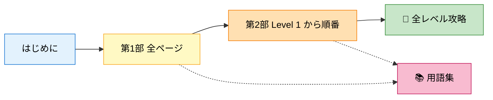

# 📌 このガイドの使い方

## このページは何？

**ガイドの読み進め方と、各ページの役割** を 3 分で説明するページです。

---

## 推奨の読み順

### 🌱 ネットワーク初心者の方



*途中で分からない単語が出たら用語集へ戻れます。*

**所要時間目安**: 全部で **3〜4 時間**。1日 30 分で 1 週間というペース推奨。

---

### 🎓 評価（ディフェンス）が明日の方


**所要時間目安**: **1 時間**。

---

### 🔧 42 で基礎は知ってるが NetPractice 初挑戦の方


**所要時間目安**: **2 時間**。第1部前半はさっと流し読みで OK。

---

## ページの構造（どのページも同じ）

!!! note "統一テンプレート"
    全ての解説ページは **同じ構造** で書かれています。
    どこから読んでも迷わないように。

| セクション | 役割 |
|:---|:---|
| 1. **このページは何？** | 読む前に「自分に必要か」を 5 秒で判断 |
| 2. **このページで学ぶこと** | ゴールのリスト |
| 3. **用語の整理** | 知らない単語をゼロにする |
| 4. **具体例・たとえ話** | イメージを先につかむ |
| 5. **図解（Mermaid）** | 文字だけに頼らない視覚化 |
| 6. **よくあるミス** | 失敗パターンを先に知る |
| 7. **次のページへ** | 順路ナビ |

---

## このサイトで出てくる **アイコンの意味**

| アイコン | 意味 |
|:-:|:---|
| 💡 `!!! tip` | 便利なコツ |
| ℹ️ `!!! info` | 補足、なぜそうするかの説明 |
| ⚠️ `!!! warning` | よくあるミス |
| 🚨 `!!! danger` | 評価で即不合格になる危険 |
| 📋 `!!! note` | 原文引用・重要事項 |

---

## 検索機能の使い方

右上の **🔍 検索ボックス** で、全ページ横断検索できます。

検索例:
- `/25` → CIDR の説明ページがヒット
- `ゲートウェイ` → ゲートウェイ関連全ページ
- `level7` → レベル 7 攻略ページ

---

## 自分の PC で実際に動かしたい場合

NetPractice の simulator は公式サイトからダウンロードして **ローカルで動かせます**。

```bash
# tgz を展開したディレクトリで
cd net_practice
./run.sh    # http://localhost:49242 で開く
```

**intra login** を入れると自分専用の問題が生成され、そのまま提出できます。
詳しくは [提出用リポジトリの README](https://github.com/Tsunanko/netpractice) を参照。

---

## ▶️ 次に読むページ

次は [01. IP アドレスって何？](01-basics/ip-address.md) から。
**家の住所** に例えて IP アドレスを説明します。
