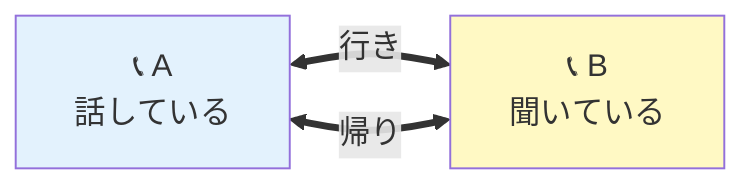
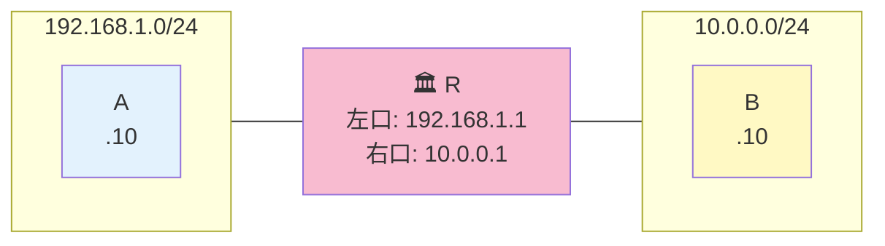

# 07. 双方向到達性（最重要）

## このページは何？

NetPractice で最もハマる落とし穴、**「行き道は繋がっても、帰り道がないと通信は成立しない」**
という **双方向到達性 (bidirectional reachability)** を理解するページです。

---

## このページで学ぶこと

- 通信は **行き道** と **帰り道** の両方が必要
- Level 6 以降で必ず出てくる「Internet の戻り route」の意味
- 「ping は一方通行ではない」という感覚

---

## 📞 メタファー: 電話は双方向

!!! tip "例え話"
    電話をかけたとき、あなたの声が相手に届く **行き** の回線だけでは会話できない。
    相手の声があなたに届く **帰り** の回線も必要。

    ネットワーク通信も同じ。A → B のパケットが届くだけでなく、**B → A の返信** が届かないと通信は成立しない。



---

## 💥 典型的な失敗パターン

### ケース 1: A → Internet の行きはあるが帰りがない

```mermaid
flowchart LR
    A[Host A<br>192.168.1.10/24] --> R[🏛️ Router]
    R --> I[🌍 Internet]
    I -. 帰り道が知らない<br>192.168.1.0/24 .-> R

    style A fill:#E3F2FD
    style R fill:#F8BBD0
    style I fill:#FFCDD2
```

**症状**: A から「ping 8.8.8.8」はパケットが出て行くが、応答が **戻って来ない**。

**原因**: Internet 側に「**192.168.1.0/24 宛てはここに戻す**」というルートがない。
ping のレスポンスが迷子になる。

### NetPractice での解決

Internet インターフェイス（`I1` とか `Ir1`）の **route** 欄に
**A のサブネット（例: 192.168.1.0/24）** を書き、**gateway** にルータの IP を書く。

```
I route: 192.168.1.0/24 → gate: 163.172.250.12 (R のインターフェイス)
```

---

## 🎯 ルーティングは行き帰りそれぞれ別々に設定する

### 重要な事実

!!! warning "ルーティングは一方向ずつ"
    - A → B の通信経路は **A 側と途中のルータ** に設定する必要がある
    - B → A の通信経路は **B 側と途中のルータ** に設定する必要がある
    - **この 2 つは独立** で、片方だけ設定しても通信できない

### 2 台のホスト + 1 ルータの例



### 行きの設定（A → B）

```
A 側:
  A の gateway = 192.168.1.1 (R の左口)

R の自動ルート:
  192.168.1.0/24 は左口で直接送る
  10.0.0.0/24 は右口で直接送る （これがあるので A→B が繋がる）
```

### 帰りの設定（B → A）

```
B 側:
  B の gateway = 10.0.0.1 (R の右口)  ← これを忘れると通信失敗！

R の自動ルート（既にある）:
  192.168.1.0/24 は左口で直接送る （B→A のパケットをここで A に渡す）
```

**両方設定して初めて A ↔ B が繋がる**。

---

## 🔥 Level 6 を例に見る

Level 6 の教訓:

```
A → Internet (8.8.8.8 など) に通信したい。
行きは gateway を設定すれば OK。
問題は帰り:
  Internet 側の "I route" が
    55.232.27.0/31
  となっていると、A の IP (55.232.27.227) はこの /31 に含まれない。
  → 帰りパケットが A に届かない → ping 失敗
修正:
  I route を
    55.232.27.128/25
  に変更 → A の IP を含む範囲を指定 → 帰りが成立
```

詳しくは [Level 6 攻略ページ](../02-levels/level6.md) で解説します。

---

## 🧭 双方向確認のチェックリスト

!!! tip "通信が繋がらないときの確認手順"
    以下を **両方向** 順番に確認:

    **行き (A → B):**
    1. A のルーティングテーブルに B の宛先が含まれているか（default で OK）
    2. 中間ルータのテーブルに B のサブネットへの route があるか
    3. B が居るセグメントに正しく届くか

    **帰り (B → A):**
    4. B のルーティングテーブルに A の宛先が含まれているか（default で OK）
    5. 中間ルータのテーブルに A のサブネットへの route があるか
    6. A が居るセグメントに正しく届くか

---

## 🏭 なぜこんなに帰り道を意識する必要がある？

### 現実の Internet では

現実の Internet は、世界中のルータが BGP というプロトコルで **自動的に route 情報を交換** している。
だから私たちは普通「行きだけ設定すれば帰りは自動」と思い込みがち。

### NetPractice では

NetPractice は **Internet 側も手動設定** する。
つまり **「現実では隠れている帰り道の設定」を自分で書かされる** 課題。

!!! info "これこそが NetPractice の出題意図"
    42 は「ネットワークは双方向である」という **実感** を持たせたい。
    だから帰り道を明示させる問題を出す。第3部で詳しく考察します。

---

## ⚠️ よくあるミス

!!! warning "default だけで全部行けると思う"
    ホスト間なら default で OK だが、**Internet → ホスト の帰り道** は
    Internet 側に具体的な route を書く必要がある場合が多い。

!!! warning "片側のゲートウェイを直す → もう片側を直し忘れ"
    2 ホストが対称な構造でも、**それぞれ独立に** ルーティング設定が必要。

!!! warning "ルート集約しすぎて帰れなくなる"
    逆に、広すぎる範囲の route を書くと **他の LAN も巻き込む** ため、
    特定ホストに届かなくなることもある。

---

## 🎯 まとめ

- 通信は **行き** と **帰り** の両方の経路が必要
- ルーティング設定は **方向ごと独立** に考える
- NetPractice では Internet 側の route も自分で設定する → 現実では隠れている仕組みが見える
- Level 6 以降で必ず「帰り道」に気をつける

---

## 🏁 第1部を読み終わったら

お疲れ様です。これで全 10 レベルを解くための **基礎がすべて揃いました**。

次は第2部で、実際のレベルを 1 つずつ解いていきます。

## ▶️ 次に読むページ

[Level 1 — 直結リンク](../02-levels/level1.md) — 2 台を繋ぐだけの最もやさしい問題から
