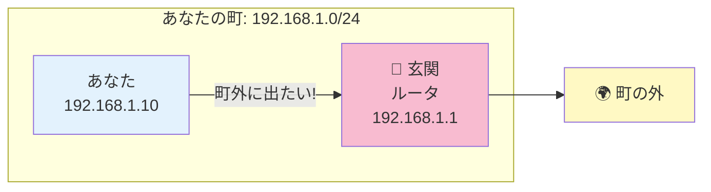
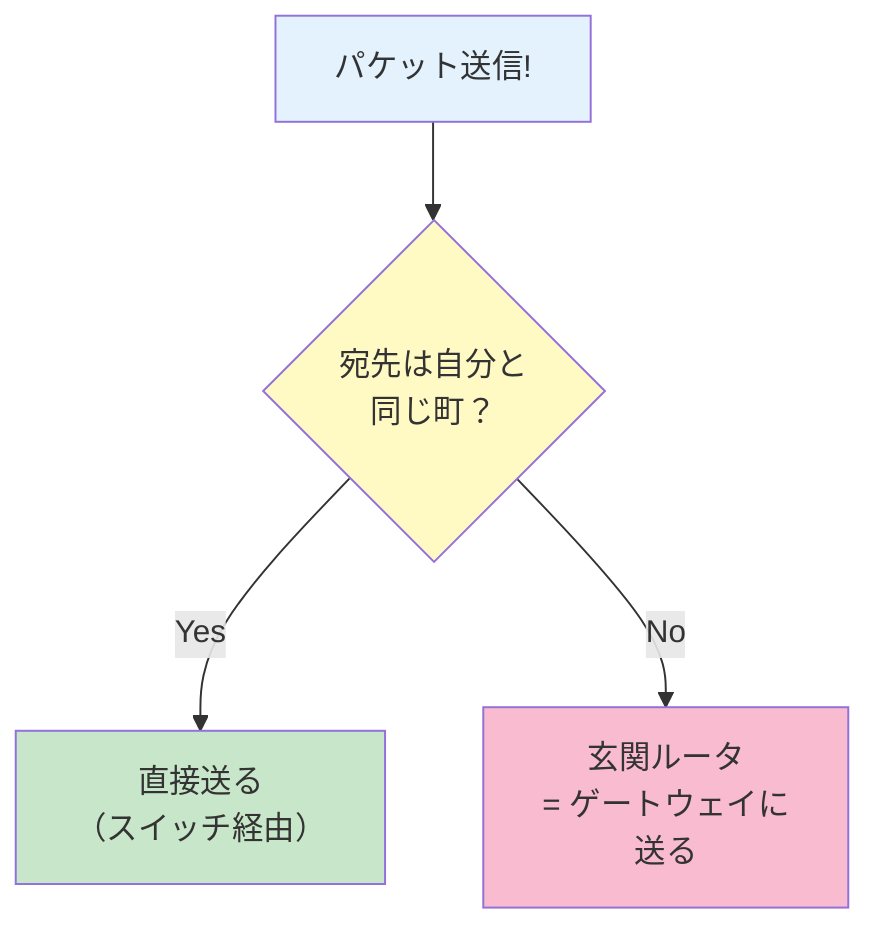
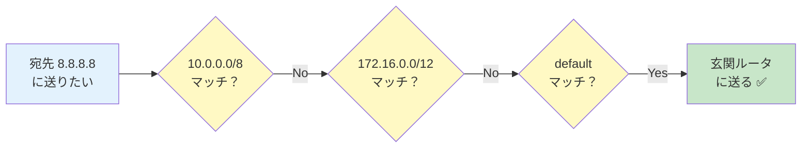

# 05. ゲートウェイって何？

## このページは何？

自分の町の外へ通信するときの **「玄関ルータの IP」** である
**ゲートウェイ (gateway)** を理解するページです。

---

## このページで学ぶこと

- ゲートウェイ = 自分の町の「玄関」にあるルータの IP
- **ゲートウェイは必ず自分と同じサブネット内** にいなければならない
- 「デフォルトゲートウェイ」は「どこに出るか分からないときの最終玄関」
- unreachable gateway（到達不能なゲートウェイ）エラーの意味

---

## 🚪 メタファー: ゲートウェイ = 町の玄関

!!! tip "例え話"
    あなたの家から **隣町のお店** に行くとき、まず町の **玄関（= 最寄りのルータ）** に行く必要がある。
    玄関は **同じ町内** になければ辿り着けない（= 町の外にある玄関を指定しても届かない）。



---

## 📖 定義

**ゲートウェイ (gateway)** = 「自分のネットワーク外に出るときの、最初に送り出すルータの IP アドレス」

### 設定の場所

ホスト（パソコン）にも、ルータにも、それぞれ **デフォルトゲートウェイ** を設定する。

```
host: 192.168.1.10/24
  default gateway: 192.168.1.1   ← この町の「玄関ルータ」の IP
```

### 動作イメージ

パソコンは通信するとき、**宛先 IP を見て毎回こう考える**:



1. 「宛先 IP は自分と同じサブネット内？」
2. Yes → スイッチ経由で **直接送る**
3. No → **ゲートウェイ** に投げる（= 「あとは頼んだ！」）

---

## 🎯 ゲートウェイの超重要ルール

!!! danger "ゲートウェイは必ず自分と同じサブネット内"
    **これを守らないと unreachable gateway（到達不能）エラーが出る**。

### なぜ？

ゲートウェイ自体にパケットを届けるには、**直接到達できる** 必要がある。
直接到達できるのは **同じサブネット内だけ**。

| | Host A の IP | マスク | Gateway | 判定 |
|:---|:---|:---|:---|:-:|
| ✅ OK | `192.168.1.10` | `/24` | `192.168.1.1`（同じ町にある） | 到達可 |
| ❌ NG | `192.168.1.10` | `/24` | `10.0.0.1`（別の町） | unreachable |

NG のケースで `10.0.0.1` にパケットを送りたくても、そもそも `10.0.0.x` に届ける手段がないので失敗する。

---

## 🌐 デフォルトゲートウェイ（default gateway）

**「宛先がどこか分からないとき、とにかくここに送る」** と決めておくゲートウェイ。

```
route:  default または 0.0.0.0/0
gate:   192.168.1.1
```

!!! info "default と 0.0.0.0/0 は同じ意味"
    NetPractice の画面では `default` と書かれる。
    内部的には `0.0.0.0/0`（= 全ての IP にマッチするルート）。

### 動きの例



ルーティングテーブルを上から確認して、どれにもマッチしなければ最終的に `default` にマッチ。

---

## 🔎 NetPractice でのゲートウェイ設定手順

!!! tip "鉄則"
    1. **ホストがいるサブネットを確認**（IP とマスク）
    2. **そのサブネット内にある ルータの IP** を探す
    3. それをゲートウェイに設定

### 例

```
Host A: 192.168.1.10 /24
隣のルータ R1: 192.168.1.1 /24   ← 同じサブネット

→ A のゲートウェイ = 192.168.1.1  ✓
```

### 複数のルータ口がある場合

```
R1 左口: 192.168.1.1  /24  ← A と同じサブネット
R1 右口: 10.0.0.1     /24  ← 別サブネット

A のゲートウェイ = 192.168.1.1 （左口の IP を使う）
```

ルータの **どの口か** ではなく、**どの IP アドレスか** を指定する。

---

## 🧪 unreachable gateway エラーって？

NetPractice で **赤文字で「unreachable」** と出たらこれ。

### 原因

**ゲートウェイの IP が自分のサブネットにいない**。

### チェックリスト

!!! warning "unreachable が出たら"
    1. 自分のサブネットを再計算
       - `IP AND マスク = ?` で自分の町を確認
    2. ゲートウェイ IP がその町に **属しているか**
       - 属していなければ、**自分の IP かマスクか、またはゲートウェイ側の IP** を見直す
    3. ゲートウェイ IP が **存在するルータの口** か
       - 架空の IP を書いてないか

---

## 🎯 ルータ自身のゲートウェイ

ルータにもデフォルトゲートウェイを設定できる（= 他のルータに転送させる時）。

```
R1 left: 192.168.1.1
R1 right: 10.0.0.1

R1 のルーティングテーブル:
  default → 10.0.0.2   ← 別のルータ R2 の IP（右口と同じサブネット）
```

ルータの場合も **「玄関ルータは同じサブネット内」の rule は同じ**。

---

## ⚠️ よくあるミス

!!! warning "ゲートウェイを相手のホスト側のルータ IP にする"
    ❌ A (192.168.1.10) のゲートウェイ = R1 の右口 `10.0.0.1`
    ✅ A (192.168.1.10) のゲートウェイ = R1 の左口 `192.168.1.1`

    A にとって到達可能なのは **自分と同じサブネットにいる R1 の左口だけ**。

!!! warning "ゲートウェイを自分自身の IP にする"
    ❌ A (192.168.1.10) のゲートウェイ = `192.168.1.10`（自分）
    自分を経由する意味がないので NG。

!!! warning "ゲートウェイが空欄"
    外のネットワーク（別の町）と通信する必要があるのにゲートウェイを書き忘れる。
    **同じ町の中だけの通信ならゲートウェイは不要** だが、
    NetPractice の多くのレベルでは外に通信するのが目的。

---

## 🎯 まとめ

- ゲートウェイ = 町の外に出るときに最初に送るルータの IP
- **ゲートウェイは必ず自分と同じサブネット内** にいなければならない
- `default` / `0.0.0.0/0` = どこに行くか分からないときの最終ルート
- unreachable gateway は「ゲートウェイが別サブネット」が原因

---

## ▶️ 次に読むページ

[06. ルーティングテーブル](routing-table.md) — ルータの「住所録」の読み方
