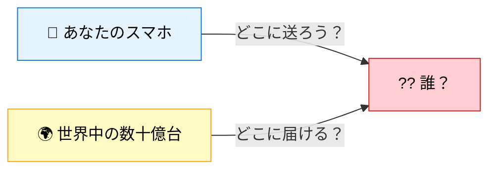
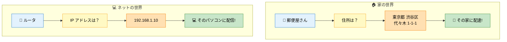
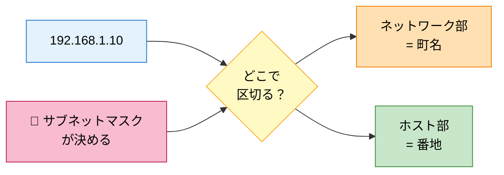

# 01. IP アドレスって何？

## このページは何？

**「もし IP アドレスが無かったら、世界中のパソコンはどうなる？」** から始めて、
IP アドレスが **なぜ必要か**、**どうやって書くか** をゼロから理解するページです。

---

## 🤔 まず考えてみよう

### もし家に住所が無かったら？

!!! question "想像してみてください"
    あなたの家に **住所も番地もない** 世界を想像してください。

    - 🎂 友達から「誕生日プレゼントを送りたい」と言われても、**どこに送ればいいか伝えられない**
    - 🛒 通販の荷物も **届く場所が決まらない**
    - 🚑 救急車を呼んでも **たどり着けない**

**住所** があるから、世界中の郵便局・宅配業者・友達はあなたに物を届けられる。
住所は「たくさんある家の中からあなたの家を **たった 1 つに決める目印**」です。

### コンピュータも同じ問題を抱えていた

世界には **数十億台** のパソコン・スマホ・サーバーが繋がっている。

もし **全てのコンピュータに住所が無かったら**、
YouTube の動画も、LINE のメッセージも、Google の検索結果も、**どこにも届けられない**。

だから各コンピュータに **住所** を割り当てることにした。それが **IP アドレス**。

---

## 🎯 IP アドレスの役割

💡 IP アドレス = コンピュータの住所

世界中にあるたくさんのコンピュータの中から、<strong>1 台を特定する ID</strong>。
「このメッセージはこのパソコンに送って」と指定するための目印。

### 家の住所と比べると…

**住所** → 家を特定する。**IP アドレス** → コンピュータを特定する。
同じ仕組みです。

---

## 📖 IP アドレスの書き方

!!! tip "形はこれだけ"
    IP アドレスは **4 つの数字を `.`（ドット）で繋げた形** で書きます。

  192
  .
  168
  .
  1
  .
  10

### 各数字のルール

| ルール | 具体的には |
|:---|:---|
| **数字は 4 つ** | `◯.◯.◯.◯` という形 |
| **1 つの数字は 0〜255 まで** | `256` や `300` は NG |
| **ドット（`.`）で区切る** | 半角のピリオド |

### 呼び方

1 つ 1 つの数字のことを **オクテット (octet)** と呼びます。
「オクト」は「8」の意味（タコ = octopus と同じ語源）。
1 オクテット = 8 ビット だから「オクテット」。

---

## 👀 実は 32 個の 0 と 1 でできている

コンピュータは **電気の ON / OFF** しか分かりません。
だから、すべての数字は **0 と 1 の 2 種類** だけで表します（= **2 進数**）。

### `192.168.1.10` を 2 進数で書き直すと

  192
  =
  11000000

  168
  =
  10101000

  1
  =
  00000001

  10
  =
  00001010

### 全部繋げると 32 個の 0/1

`192` の部分 (8 ビット):

  1
  1
  0
  0
  0
  0
  0
  0

`168` の部分 (8 ビット):

  1
  0
  1
  0
  1
  0
  0
  0

`1` の部分 (8 ビット):

  0
  0
  0
  0
  0
  0
  0
  1

`10` の部分 (8 ビット):

  0
  0
  0
  0
  1
  0
  1
  0

**合計 32 個のマス** = **32 ビット**。これが IP アドレスの正体。

!!! info "黄色のマス = 1、水色のマス = 0"
    コンピュータは黄色（電気 ON）と水色（電気 OFF）のマスを **32 個並べて** 1 つのアドレスを表しています。

---

## 🧮 10 進 ⇄ 2 進のしくみ

なぜ `192` が `11000000` になるのか？

### 2 進の各桁は「2 のべき乗」

8 個のマスは、それぞれ以下の値を表します:

| マス位置 | 1 | 2 | 3 | 4 | 5 | 6 | 7 | 8 |
|:---:|:---:|:---:|:---:|:---:|:---:|:---:|:---:|:---:|
| **そのマスが 1 のときの値** | 128 | 64 | 32 | 16 | 8 | 4 | 2 | 1 |

### `192` を作る

`192 = 128 + 64` なので、**1 つめと 2 つめのマス** だけが 1:

  128
  64
  32
  16
  8
  4
  2
  1

→ 128 + 64 = **192** ✓

### 重要な値の早見表

| 10 進 | 2 進 | どのマスが 1？ |
|---:|:---|:---|
| **0** | `00000000` | 全部 0 |
| **1** | `00000001` | 右端だけ 1 |
| **128** | `10000000` | 左端だけ 1（= 2⁷） |
| **192** | `11000000` | 左 2 つ（128 + 64） |
| **255** | `11111111` | 全部 1（= 2⁸ − 1） |

!!! tip "覚えるコツ"
    **「255 = 全部 1」** **「128 = 左端だけ」** の 2 つを覚えておけば、
    あとは足し算で他の値を導けます。

---

## 🌍 アドレスの種類（3 つだけ覚える）

IP アドレスには **使い道による区別** があります。NetPractice でよく出るのは以下:

### 1. プライベートアドレス（家・会社用）

**内輪で使う** 範囲。家の Wi-Fi でも使われている。

| 範囲 | よく見る例 |
|:---|:---|
| `10.0.0.0` 〜 `10.255.255.255` | `10.0.0.1` |
| `172.16.0.0` 〜 `172.31.255.255` | `172.16.0.1` |
| `192.168.0.0` 〜 `192.168.255.255` | **`192.168.1.1`** ← これが家の Wi-Fi ルータの定番 |

!!! info "なぜ 3 つも範囲があるの？"
    世界共通の約束（RFC 1918）で、**誰でも自由に使っていい** 3 種類の範囲を予約している。
    家庭用・会社用・クラウド用と、**バッティングしないように** 3 つあります。

### 2. グローバルアドレス（世界の住所）

**Internet 上で一意** に決まる住所。Google の DNS サーバーの `8.8.8.8` が有名。
これを持っていないと、Internet のどこからも直接アクセスできない。

### 3. 特殊アドレス

| アドレス | 意味 |
|:---|:---|
| `127.0.0.1` | **自分自身** を指す（loopback = 「自分にループバック」） |
| `0.0.0.0` | **どこでも・未指定** の意味 |
| `255.255.255.255` | **全員に送る**（ブロードキャスト） |

---

## 🧱 中身は 2 つのパートに分かれている

!!! warning "これが NetPractice の核心"
    IP アドレスには **「ネットワーク部」** と **「ホスト部」** という 2 つのパートがあり、
    どこで区切るかは **次ページの「サブネットマスク」** で決まります。

- **ネットワーク部** = どの「町」に住んでいるか（= 同じ町の住人同士は直接話せる）
- **ホスト部** = その町の中で「あなたは何番地」か

---

## 🎯 まとめ

🎯 このページで学んだこと

<ul>
<li><strong>IP アドレス</strong> は「コンピュータの住所」。世界中の機器を 1 台に絞るための ID</li>
<li>書き方は <code>192.168.1.10</code> のように <strong>4 つの数字（0〜255）を <code>.</code> で繋ぐ</strong></li>
<li>中身は <strong>32 個の 0 か 1</strong>（= 32 ビット）</li>
<li>家用・会社用は <strong>プライベートアドレス</strong>（<code>192.168.x.x</code> など）</li>
<li>世界の住所は <strong>グローバルアドレス</strong>（<code>8.8.8.8</code> など）</li>
<li>IP には <strong>町名（ネットワーク部）</strong> と <strong>番地（ホスト部）</strong> があり、
  その区切りは <strong>次ページのサブネットマスク</strong> で決まる</li>
</ul>

---

## ▶️ 次に読むページ

[02. サブネットマスクって何？](subnet-mask.md) — 「町」と「番地」の境目をどう決めるか
