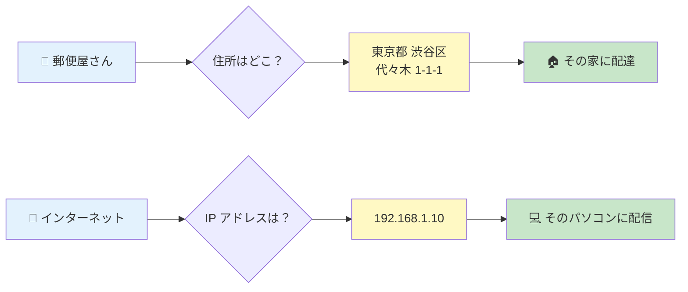

# 01. IP アドレスって何？

## このページは何？

コンピュータの「住所」である **IP アドレス** が、実はただの **32 個の 0 か 1** だと理解するページです。

---

## このページで学ぶこと

- IP アドレスは「家の住所」のようなもの
- ドット区切りの数字（`192.168.1.10`）の正体は 32 ビットの 2 進数
- 1 オクテット = 8 ビット = 0〜255 の数字

---

## 家の住所で例えると

!!! tip "メタファー: IP アドレス = 家の住所"
    手紙を届けるには「どの家に」が必要。
    インターネットでデータを届けるには「どのパソコンに」が必要。
    その「どのパソコンに」を指定するのが **IP アドレス**。



---

## 📖 IP アドレスの書き方

普段 **ドット (`.`) で区切った 4 つの数字** で書きます。

```
192.168.1.10
 ↑   ↑  ↑  ↑
 1番 2番 3番 4番目の数字
```

- それぞれの数字は **0 〜 255** の範囲（= 256 通り）
- この 4 つのセットで **1 つのアドレス** を表す

### それぞれの「数字」の呼び方

| 正式名称 | 意味 |
|:---|:---|
| **オクテット (octet)** | 「8 の固まり」という意味。1 つの数字 = 8 ビット だから |
| **バイト (byte)** | 8 ビットの単位。実はオクテットと同じもの |

!!! info "なぜ 0〜255 なの？"
    1 つの数字は 8 ビット（= 0 か 1 が 8 個）。
    8 ビットで表せる値は **2⁸ = 256 通り** なので **0 から 255** まで。

---

## 👀 2 進数で見ると正体が見える

`192.168.1.10` を 2 進数に変換すると:

```
192     .  168     .  1       .  10
↓          ↓          ↓          ↓
11000000 . 10101000 . 00000001 . 00001010

←── 32 ビット全体 ──→
```

!!! info "2 進数って？"
    「0 と 1 だけで数を表す書き方」。コンピュータは電気の ON / OFF しか分からないので、
    すべての数字は 2 進数で扱われる。`192` は普段使う 10 進数の書き方で、
    内部では `11000000` という 8 個の 0/1 で記憶されている。

### 10 進数 ⇄ 2 進数の変換（例）

| 10 進 | 2 進 | なぜ？ |
|---:|:---|:---|
| 0 | `00000000` | 全部 0 |
| 1 | `00000001` | 右端が 1 |
| 128 | `10000000` | 左端が 1 （= 2⁷） |
| 192 | `11000000` | 128 + 64 = 2⁷ + 2⁶ |
| 255 | `11111111` | 全部 1 （= 2⁸ − 1） |

---

## 🌍 アドレスの種類

IP アドレスには **使い方によって区別** があります。NetPractice でよく出てくるのは:

### プライベートアドレス（家・会社用）

外から直接アクセスできない、**内輪で使う範囲**。

| 範囲 | よく見るやつ |
|:---|:---|
| `10.0.0.0` 〜 `10.255.255.255` | `10.0.0.1` |
| `172.16.0.0` 〜 `172.31.255.255` | `172.16.0.1` |
| `192.168.0.0` 〜 `192.168.255.255` | `192.168.1.1` ← 家の Wi-Fi ルータ |

!!! info "なぜ 3 つも範囲があるの？"
    インターネット業界の決まり（RFC 1918）で、**誰でも自由に使っていい** 3 種類の範囲が
    予約されている。家庭用・会社用・クラウド用など好きに使い分けられる。

### グローバルアドレス（世界の住所）

インターネット上で **一意に** 決まる住所。Google DNS の `8.8.8.8` が有名。

### 特殊アドレス

| アドレス | 意味 |
|:---|:---|
| `127.0.0.1` | **自分自身**（loopback = 「自分に戻る」） |
| `0.0.0.0` | **どこでも・未指定** の意味で使う |
| `255.255.255.255` | **全員に送る**（ブロードキャスト） |

---

## 🧱 アドレスの内部構造を先にチラ見

NetPractice で一番重要な事実:

!!! warning "IP アドレスには「ネットワーク部」と「ホスト部」がある"
    `192.168.1.10` の **どこまでが「町名」で、どこからが「番地」か** は、
    次ページで説明する **サブネットマスク** で決まる。

```
192.168.1.10
├── 町名（ネットワーク部）──┤├─ 番地（ホスト部）─┤
         例: 192.168.1                    例: 10
```

同じ町内（= ネットワーク部が一致）なら直接お話できる。
違う町なら郵便局（= ルータ）を経由する必要がある。

---

## 🎯 まとめ

- IP アドレスは **コンピュータの住所**
- 4 つの数字（0〜255）を `.` で繋げた書き方だが、内部は **32 ビットの 2 進数**
- 1 オクテット = 8 ビット = 0〜255
- `192.168.x.x` や `10.x.x.x` は家や会社の内輪用（プライベート）
- `8.8.8.8` 等は世界中で一意（グローバル）
- **どこまでが町名か** は次ページの **サブネットマスク** で決まる

---

## ▶️ 次に読むページ

[02. サブネットマスクって何？](subnet-mask.md) — 「町」の境界をどう決めるか
