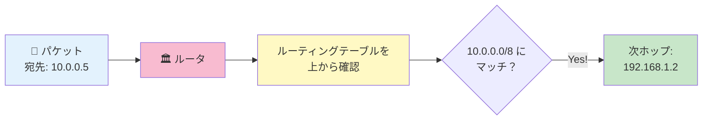
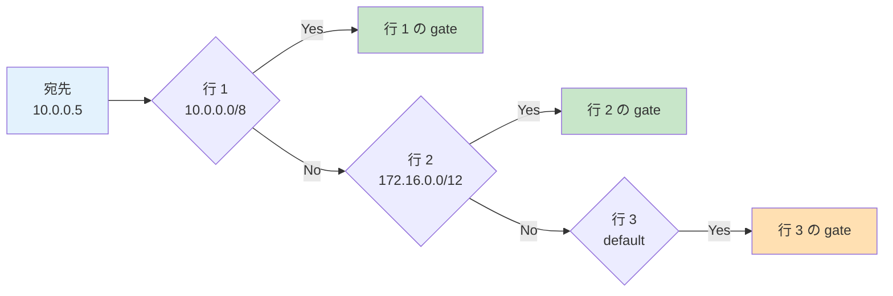
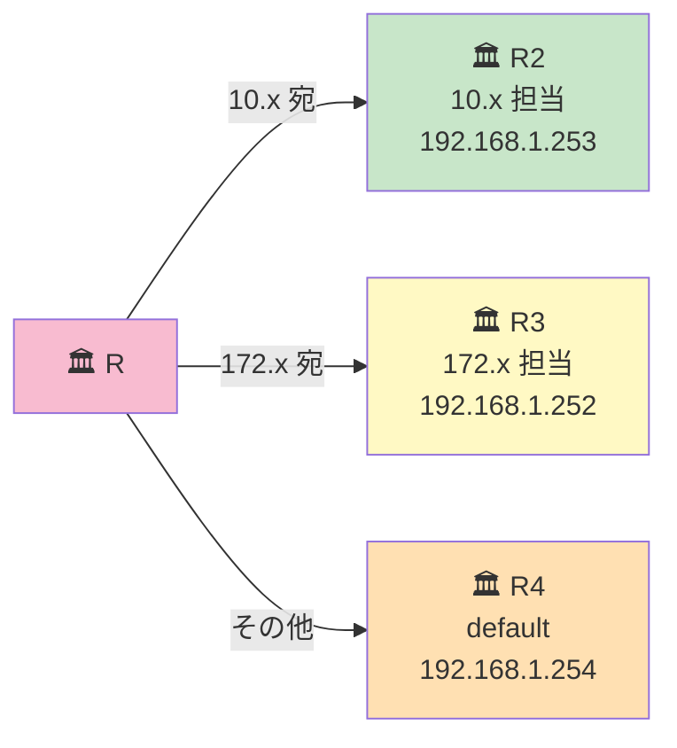

# 06. ルーティングテーブル

## このページは何？

ルータ（やホスト）が持つ「**宛先 → 次の転送先**」の表である
**ルーティングテーブル (routing table)** を理解するページです。

---

## このページで学ぶこと

- ルーティングテーブル = ルータの「住所録」
- エントリは **上から順番に** 照合される（= 順番が命）
- `default` は一番下に置くのが原則
- **最長マッチ (longest prefix match)** のルール

---

## 📔 イメージで言うと: 住所録

!!! tip "例え話"
    郵便屋さん（ルータ）が持っている「**宛先地区 → 配達員の名前**」の分厚い表。
    手紙が来たら **宛先の番地** を確認し、その地区担当の配達員に渡す。
    担当が見つからなければ「**その他**」欄の人（default）に渡す。



---

## 📋 ルーティングテーブルの形

普通の書き方:

| 宛先ネットワーク (route) | 次ホップ (gateway) |
|:---|:---|
| `10.0.0.0/8` | `192.168.1.254` |
| `172.16.0.0/12` | `192.168.1.253` |
| `default` | `192.168.1.1` |

### 各列の意味

- **route**: 「この宛先範囲にマッチしたら」
- **gateway**: 「このルータ（または IP）に転送する」

---

## 🗂️ 3種類のルートを区別する

ルーティングテーブルには、見た目は同じ行でも **役割の違う 3 種類のルート** が共存します。これを区別できると、各レベルで「**何を書いて、何を書かなくていいか**」が即決できる。

| 種類 | 設定方法 | 対象範囲 | LPM での優先度 |
|:---|:---|:---|:---|
| **直結ルート** | 自動（書く必要なし） | 自分の IF が直結しているサブネット | 最高（`/N` が大きい） |
| **静的ルート** | `routes` 欄に手書き | 直結していないサブネット | 中（`/N` の長さで決まる） |
| **デフォルトルート** | `0.0.0.0/0` を `routes` に書く | 上記いずれにもマッチしない全て | 最低（`/0` で常に負ける） |

押さえるべきポイントは 3 つ：

- **直結ルートは書く必要がない** — 自分の IF に IP を設定した瞬間、そのサブネットへの直結ルートは自動で出来上がっている
- **静的ルートは「自分が直結していない宛先」用** — next hop は必ず**自分の直結内**の IP（= 直接渡せる相手）でなければならない
- **default は最後の砦** — どこに書こうが LPM で最後にしか選ばれない（→ 後述の Longest Prefix Match セクション参照）

!!! info "💡 NetPractice の入力欄は静的ルート + default だけ"
    NetPractice の `routes` 欄に書くのは **静的ルート** か **default** だけ。
    直結ルートは画面に出てこない（自動扱い）ので、「自分のサブネットへのルートが書いてないけど大丈夫？」と心配する必要はありません。

---

## 🤔 ❓ よく混乱する: 「`.0/26` や `.64/26` の数字って何？」 {#routes-cidr-meaning}

NetPractice の画面で routes を見ていると、こんな数字が出てきます：

```
111.198.14.0/26  => 111.198.14.254
111.198.14.64/26 => 111.198.14.193
```

「**`.0` とか `.64` ってどこから来たの？** ホストの IP は `.66` とか `.193` なのに…」と混乱したら、ここを読んでください。

### 結論: routes の左側は「街の住所」を書く

routes の左側は **「ホストの住所」じゃなくて「街全体の住所」** を書く欄です。
**街の住所 = そのブロックの "先頭アドレス"（= ネットワークアドレス）**。

### 例で理解する

`/24` を `/26` で 4 等分すると、4 つの街ができます。各街の **「先頭アドレス」** が街の住所：

<div class="subnet-ruler cols-4">
  <div class="subnet-block target">
    <span class="block-name">⬇️ .0</span>
    <span class="block-range">.0/26<br>(.0〜.63)</span>
    <span class="block-purpose">この街の住所 = .0</span>
  </div>
  <div class="subnet-block target-2">
    <span class="block-name">⬇️ .64</span>
    <span class="block-range">.64/26<br>(.64〜.127)</span>
    <span class="block-purpose">この街の住所 = .64</span>
  </div>
  <div class="subnet-block target">
    <span class="block-name">⬇️ .128</span>
    <span class="block-range">.128/26<br>(.128〜.191)</span>
    <span class="block-purpose">この街の住所 = .128</span>
  </div>
  <div class="subnet-block target-2">
    <span class="block-name">⬇️ .192</span>
    <span class="block-range">.192/26<br>(.192〜.255)</span>
    <span class="block-purpose">この街の住所 = .192</span>
  </div>
</div>

→ つまり `/26` だと、書ける街の住所は **`.0` `.64` `.128` `.192` の 4 つだけ**。

### 「ホストの IP」と「街の住所」の違い

| 項目 | 例 | 何？ |
|---|---|---|
| ホストの IP | `111.198.14.66` | 1 軒の家の住所 |
| ホストが住む街 | `111.198.14.64/26` | その家がある街の住所 |
| 街の範囲 | `.64〜.127` | 街に含まれる全 IP (64 個) |

→ routes には「**家の住所**」じゃなくて「**街の住所**」を書く！

### なぜ「街単位」で書くのか？

ルータが世界中の **ホスト 1 軒ずつ** を覚えていたら、テーブルが莫大に膨れ上がる。
代わりに **「街単位」** で覚えれば、その街に住む数百〜数千のホスト全員を **1 行で** カバーできる。

```
❌ 「.65 は R21 へ、.66 は R21 へ、.67 は R21 へ、.68 は R21 へ…」(64 行!)
✅ 「.64/26 は R21 へ」(1 行で済む!)
```

### 郵便で例えると

```
❌ 個人宛: 「鈴木一郎さんへ」「田中花子さんへ」… (人数分の指示)
✅ 街宛:   「新宿区へ」(その地区担当の配達員に一括で渡す)
```

→ ルータは郵便配達員と同じで、**地区単位** で運ぶ。

### 「街の住所」の見つけ方

ホストの IP が分かっていれば、**マスクで AND** すれば街の住所が出ます：

```
ホストの IP : 111.198.14.66
マスク      : 255.255.255.192 (/26)
              ↓ AND 演算
街の住所    : 111.198.14.64
              ↑
        これを routes に書く
```

10 進だけで計算するなら **「ブロック幅で割って、商 × ブロック幅」** ([CIDR 早見表参照](cidr.md)):

```
.66 ÷ 64 = 1 余り 2
1 × 64 = 64
→ 街の住所は .64
```

### NetPractice の画面での見え方

NetPractice では各ルータに `Rr1`, `Rr2`, … と番号付きの route 行が並んでいる。
例えば上の表なら画面にはこう表示される:

| # | route | gate |
|:-:|:---|:---|
| `Rr1` | `10.0.0.0/8` | `192.168.1.254` |
| `Rr2` | `default` | `192.168.1.1` |

---

## 🔎 マッチングの仕組み

### ルール 1: 上から順に見る



**最初にマッチした行** を使う。残りの行は見ない。

!!! info "💡 ここでつまずく人へ — 「上から順」って何で大事？"
    郵便屋さんは **辞書のように行を辿って、見つかった瞬間に配達する** から、
    **テーブルの並び順がそのまま運命を決めます**。

    たとえ正しいルートが下にあっても、上に「全部にマッチする `default`」が来ていたら
    その瞬間に default が選ばれ、下の正しいルートは **永遠に読まれません**。

### ルール 2: default は一番下

| 順番 | ❌ NG（default を上） | ✅ OK（default を下） |
|:-:|:---|:---|
| 1 行目 | `default → ...` | `10.0.0.0/8 → ...` |
| 2 行目 | `10.0.0.0/8 → ...` | `default → ...` |

**default は「他にマッチしなければ」の意味** なので、他の具体的ルートより下に。
上に置くと、全てのパケットが default にマッチして **他のルートが無視される**。

---

## 🎯 Longest Prefix Match — ルーティングの第一原則

!!! info "鉄則: `/N` の数字が大きい方が勝つ"
    複数のルートが宛先にマッチしたとき、**プレフィックス長 `/N` が長い方**（= より具体的）が選ばれる。これがルーティングの第一原則 **Longest Prefix Match (LPM)** です。

    例: 宛先 `10.1.0.5` に対して、
    - `10.0.0.0/8` もマッチ（8 bit 一致）
    - `10.1.0.0/16` もマッチ（16 bit 一致）
    - → **より具体的な `/16` が採用される**

| route | 転送先 | マッチの細かさ | 採用？ |
|:---|:---|:---|:-:|
| `10.0.0.0/8` | ルータ A | 8 bit マッチ（ざっくり） | — |
| `10.1.0.0/16` | ルータ B | 16 bit マッチ（詳しい） | ✅ |

### なぜ `default` は「最後の砦」になるのか？

`default` を CIDR で書くと **`0.0.0.0/0`**。プレフィックス長は **`/0`** で、すべてのルートの中で **最も短い**。
LPM のルールに照らせば、`/0` は **他のどんなルートにも負ける**。
→ だから「default は他のルートに**負け続けて、最後にだけ**選ばれる」= 最後の砦になる。

「default は最後に書く」という慣習は、特殊ルールではなく **LPM の自然な帰結**。

### 実装上のコツ — ルートを書く順番

NetPractice の入力欄は、**`/N` の大きい順**（具体的な順）に並べると、LPM の動きと一致して読みやすい：

| 並べる位置 | 推奨内容 | 理由 |
|:---|:---|:---|
| 上のほう | 具体的なルート（`/26`, `/30` など） | LPM で最初に勝つ |
| 真ん中 | 中くらい（`/24`, `/16`, `/8`） | |
| 一番下 | `default`（= `/0`） | LPM で最後にだけ選ばれる |

!!! warning "default を上に書いても**判定結果は変わらない**（が、人間が混乱する）"
    判定は LPM で決まるので、`default` を上に書いても動作は同じ。
    ただし「default が最初にあるから他が無視されるのでは？」と**読み手が誤解する**ので、慣習として `default` は最後に書きます。

---

## 🧪 ホスト側のルーティングテーブル

実はホスト（パソコン）にもルーティングテーブルがある。

### 典型的なホストのテーブル

| route | gateway |
|:---|:---|
| `192.168.1.0/24` | 自分のネットワーク（直接送信） |
| `default` | `192.168.1.1` （玄関ルータ） |

**自分のサブネットへの直接ルート** は暗黙的（設定しなくても存在する）。
NetPractice で明示的に書くのは **default (= ゲートウェイ)** だけというケースが多い。

---

## 🔄 複数のルータがある場合の経路選択

### 例: 3 つの宛先をそれぞれ別ルータに送る

```
ルータ R のテーブル:
  route: 10.0.0.0/8       → gate: 192.168.1.253  (R2 経由で 10.x)
  route: 172.16.0.0/12    → gate: 192.168.1.252  (R3 経由で 172.x)
  route: default          → gate: 192.168.1.254  (R4 経由で他全部)
```



---

## 📝 NetPractice で書く時の流れ

!!! tip "5 ステップ"
    1. **自分から見た宛先のサブネット** を洗い出す
    2. それぞれ **「どのルータに送れば届くか」** を考える
    3. そのルータの IP（= 自分と同じサブネット内にいる口）を書く
    4. その中で **一番広いカバー範囲のものを default** に
    5. **default は一番下** に書く

### 例: ホストの設定

```
ホスト A: 192.168.1.10/24

送りたい先:
  - Internet (8.8.8.8 など) → R1 経由
  - 10.0.0.0/8 の社内 LAN → R1 経由

→ どちらも R1 経由なので default だけで OK
  default → 192.168.1.1  (R1)
```

---

## ⚠️ よくあるミス

!!! warning "default を上に書いてしまう"
    上にあると全てのパケットが default にマッチして、他のルートが無視される。
    **必ず一番下** に。

!!! warning "ゲートウェイを別サブネットの IP にする"
    ルーティングテーブルの gateway 欄も **自分と同じサブネット内の IP** でなければならない。
    詳しくは [ゲートウェイの章](gateway.md) で。

!!! warning "存在しないルートを期待する"
    テーブルに該当するルートがなく default もないと、パケットは **破棄** される。
    「届かない」と嘆く前に、そのパケットを処理するルートが本当にあるか確認。

!!! warning "戻りのルートを忘れる"
    **行き道** を設定しても **帰り道** のルートがなければ通信は成立しない（次章参照）。

---

## 🎯 まとめ

- ルーティングテーブル = 「宛先 → 次の転送先」の住所録
- 上から順にマッチを探して、最初にマッチした行を使う
- **`default` は一番下に** 書くのが原則
- ゲートウェイは **自分と同じサブネット内** でなければならない
- 行き道だけでなく **帰り道のルート** も必要（次ページ参照）

---

## ▶️ 次に読むページ

[07. 双方向到達性](bidirectional.md) — これが NetPractice 最大の落とし穴
