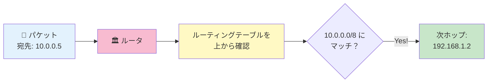
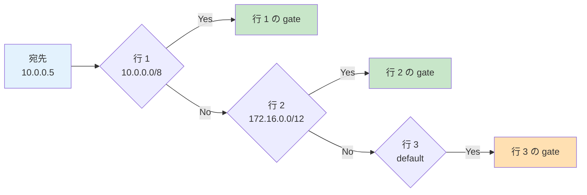
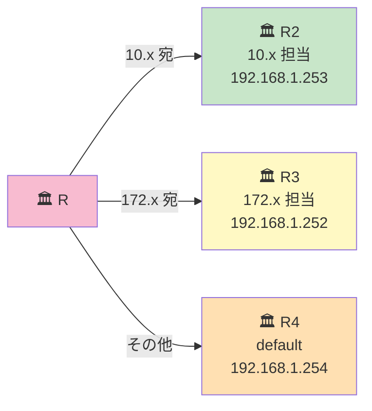

# 06. ルーティングテーブル

## このページは何？

ルータ（やホスト）が持つ「**宛先 → 次の転送先**」の表である
**ルーティングテーブル (routing table)** を理解するページです。

---

## このページで学ぶこと

- ルーティングテーブル = ルータの「住所録」
- エントリは **上から順番に** 照合される（= 順番が命）
- `default` は一番下に置くのが原則
- **最長マッチ (longest prefix match)** のルール

---

## 📔 イメージで言うと: 住所録

!!! tip "例え話"
    郵便屋さん（ルータ）が持っている「**宛先地区 → 配達員の名前**」の分厚い表。
    手紙が来たら **宛先の番地** を確認し、その地区担当の配達員に渡す。
    担当が見つからなければ「**その他**」欄の人（default）に渡す。



---

## 📋 ルーティングテーブルの形

普通の書き方:

| 宛先ネットワーク (route) | 次ホップ (gateway) |
|:---|:---|
| `10.0.0.0/8` | `192.168.1.254` |
| `172.16.0.0/12` | `192.168.1.253` |
| `default` | `192.168.1.1` |

### 各列の意味

- **route**: 「この宛先範囲にマッチしたら」
- **gateway**: 「このルータ（または IP）に転送する」

### NetPractice の画面での見え方

NetPractice では各ルータに `Rr1`, `Rr2`, … と番号付きの route 行が並んでいる。
例えば上の表なら画面にはこう表示される:

| # | route | gate |
|:-:|:---|:---|
| `Rr1` | `10.0.0.0/8` | `192.168.1.254` |
| `Rr2` | `default` | `192.168.1.1` |

---

## 🔎 マッチングの仕組み

### ルール 1: 上から順に見る



**最初にマッチした行** を使う。残りの行は見ない。

!!! info "💡 ここでつまずく人へ — 「上から順」って何で大事？"
    郵便屋さんは **辞書のように行を辿って、見つかった瞬間に配達する** から、
    **テーブルの並び順がそのまま運命を決めます**。

    たとえ正しいルートが下にあっても、上に「全部にマッチする `default`」が来ていたら
    その瞬間に default が選ばれ、下の正しいルートは **永遠に読まれません**。

### ルール 2: default は一番下

| 順番 | ❌ NG（default を上） | ✅ OK（default を下） |
|:-:|:---|:---|
| 1 行目 | `default → ...` | `10.0.0.0/8 → ...` |
| 2 行目 | `10.0.0.0/8 → ...` | `default → ...` |

**default は「他にマッチしなければ」の意味** なので、他の具体的ルートより下に。
上に置くと、全てのパケットが default にマッチして **他のルートが無視される**。

---

## 🎯 最長マッチ（longest prefix match）

!!! info "ちょっと発展: 一番詳しいルートが勝つ"
    **2 つのルートが両方マッチした場合**、
    **プレフィックス（CIDR の数字）が長い方** が優先される。

    例: 宛先 `10.1.0.5` に対して、
    - `10.0.0.0/8` もマッチする
    - `10.1.0.0/16` もマッチする
    - → **`/16` の方が長いので `/16` が採用される**

| route | 転送先 | マッチの細かさ | 採用？ |
|:---|:---|:---|:-:|
| `10.0.0.0/8` | ルータ A | 8 bit マッチ（ざっくり） | — |
| `10.1.0.0/16` | ルータ B | 16 bit マッチ（詳しい） | ✅ |

NetPractice のレベル判定は **上から順 + 同じ長さは早いもの勝ち** で十分通せる。
厳密には最長マッチだが、テーブルの順序を工夫すれば問題ない。

---

## 🧪 ホスト側のルーティングテーブル

実はホスト（パソコン）にもルーティングテーブルがある。

### 典型的なホストのテーブル

| route | gateway |
|:---|:---|
| `192.168.1.0/24` | 自分のネットワーク（直接送信） |
| `default` | `192.168.1.1` （玄関ルータ） |

**自分のサブネットへの直接ルート** は暗黙的（設定しなくても存在する）。
NetPractice で明示的に書くのは **default (= ゲートウェイ)** だけというケースが多い。

---

## 🔄 複数のルータがある場合の経路選択

### 例: 3 つの宛先をそれぞれ別ルータに送る

```
ルータ R のテーブル:
  route: 10.0.0.0/8       → gate: 192.168.1.253  (R2 経由で 10.x)
  route: 172.16.0.0/12    → gate: 192.168.1.252  (R3 経由で 172.x)
  route: default          → gate: 192.168.1.254  (R4 経由で他全部)
```



---

## 📝 NetPractice で書く時の流れ

!!! tip "5 ステップ"
    1. **自分から見た宛先のサブネット** を洗い出す
    2. それぞれ **「どのルータに送れば届くか」** を考える
    3. そのルータの IP（= 自分と同じサブネット内にいる口）を書く
    4. その中で **一番広いカバー範囲のものを default** に
    5. **default は一番下** に書く

### 例: ホストの設定

```
ホスト A: 192.168.1.10/24

送りたい先:
  - Internet (8.8.8.8 など) → R1 経由
  - 10.0.0.0/8 の社内 LAN → R1 経由

→ どちらも R1 経由なので default だけで OK
  default → 192.168.1.1  (R1)
```

---

## ⚠️ よくあるミス

!!! warning "default を上に書いてしまう"
    上にあると全てのパケットが default にマッチして、他のルートが無視される。
    **必ず一番下** に。

!!! warning "ゲートウェイを別サブネットの IP にする"
    ルーティングテーブルの gateway 欄も **自分と同じサブネット内の IP** でなければならない。
    詳しくは [ゲートウェイの章](gateway.md) で。

!!! warning "存在しないルートを期待する"
    テーブルに該当するルートがなく default もないと、パケットは **破棄** される。
    「届かない」と嘆く前に、そのパケットを処理するルートが本当にあるか確認。

!!! warning "戻りのルートを忘れる"
    **行き道** を設定しても **帰り道** のルートがなければ通信は成立しない（次章参照）。

---

## 🎯 まとめ

- ルーティングテーブル = 「宛先 → 次の転送先」の住所録
- 上から順にマッチを探して、最初にマッチした行を使う
- **`default` は一番下に** 書くのが原則
- ゲートウェイは **自分と同じサブネット内** でなければならない
- 行き道だけでなく **帰り道のルート** も必要（次ページ参照）

---

## ▶️ 次に読むページ

[07. 双方向到達性](bidirectional.md) — これが NetPractice 最大の落とし穴
