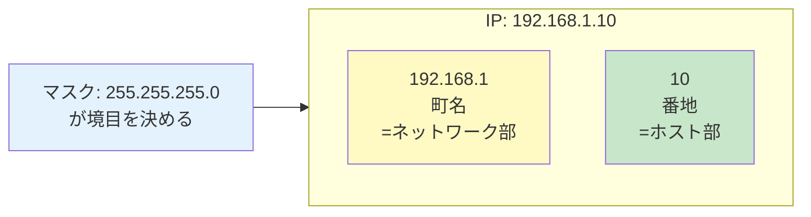
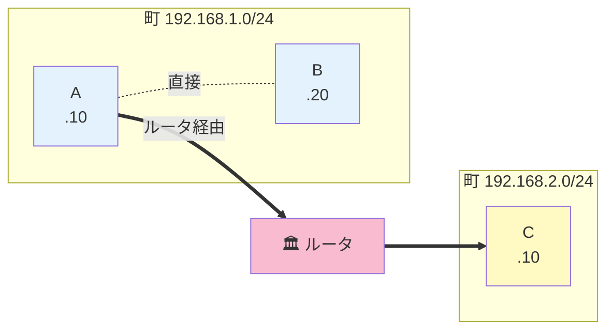

# 02. サブネットマスクって何？

## このページは何？

**IP アドレスのどこまでが「町名」でどこからが「番地」か** を決める、サブネットマスク (subnet mask) を理解するページです。
NetPractice で最も重要な概念。

---

## このページで学ぶこと

- サブネットマスクは「町名と番地の境目」を決める定規
- 「同じ町 = 直接通信できる」「違う町 = ルータ経由」
- マスクは **1 が連続して並んでから 0 が並ぶ** 形でなければ無効
- ネットワークアドレスとブロードキャストアドレスは使えない

---

## 👀 イメージで言うと: マスク = 住所の「町名と番地の境目」

!!! tip "住所で例えると"
    「**東京都渋谷区代々木 1-1-1**」という住所のうち、
    「**東京都渋谷区代々木**」までが **町名**、「**1-1-1**」が **番地** です。

    ネットワークでも同じように、IP の **前半何ビット** が「町名」、
    **残り何ビット** が「番地」かを決める仕組みが必要。それが **サブネットマスク**。



---

## 📐 マスクの書き方

### 10 進数表記（4 つの数字）

IP アドレスと同じ書き方。

```
255.255.255.0
```

### 2 進数で見ると

| 部分 | 2 進 | 意味 |
|:---|:---|:---|
| ネットワーク部（`1` が 24 個） | `11111111.11111111.11111111` | どこの「町」か |
| ホスト部（`0` が 8 個） | `00000000` | 町の中の「番地」 |

!!! warning "マスクのルール"
    マスクは **必ず「先頭から `1` が連続して並び、その後 `0` が続く」** 形でなければならない。
    **`1` と `0` が混ざっている形は無効**（= NetPractice で弾かれる）。

    | | 2 進 | 結果 |
    |:---|:---|:-:|
    | ✅ OK | `11111111.11111111.11111111.00000000`（= `/24`） | 有効 |
    | ❌ NG | `11111111.11111111.11111111.00100000`（= `255.255.255.32`） | 無効 |

    NG の方は **`1` の後に `0` が挟まってから、また `1` が出ている**（線の後半）ので規則違反。

---

## 🔬 マスクと IP を合わせて「町名」を取り出す

同じ町（= 同じサブネット）かどうかは **IP とマスクの AND 演算** で判定します。

!!! info "💡 ここでつまずく人へ — なぜ AND を使うの？"
    マスクは「町名の範囲を `1` で示した定規」だと思ってください。
    AND を取ると **`1` の範囲（= 町名）だけ IP の値が残り、`0` の範囲（= 番地）が消える** ので、
    「町名の部分だけ取り出す」操作になります。

    例: マスク `11111111.11111111.11111111.00000000` を IP に AND →
    **左 24 ビット（町名）だけ残し、右 8 ビット（番地）はゼロにする**、という意味。

### AND 演算って？

2 つの値を比べて **両方 1 なら 1、そうでなければ 0** にする計算。

| A | B | A AND B |
|:-:|:-:|:-:|
| 0 | 0 | 0 |
| 0 | 1 | 0 |
| 1 | 0 | 0 |
| 1 | 1 | **1** |

### 実例で見る

| | 10 進 | 2 進 |
|:---|:---|:---|
| IP | `192.168.1.10` | `11000000.10101000.00000001.00001010` |
| マスク | `255.255.255.0` | `11111111.11111111.11111111.00000000` |
| **AND の結果 = 町** | **`192.168.1.0`** | `11000000.10101000.00000001.00000000` |

**この `192.168.1.0` が「このパソコンが住んでいる町」**。
2 つのパソコンの「町」が一致すれば直接通信できる。

---

## 🏘️ 同じ町 vs 別の町

### 例 1: 同じ町に住んでいる

| ホスト | IP | マスク | 町 |
|:---:|:---|:---:|:---|
| A | `192.168.1.10` | `/24` | `192.168.1.0` |
| B | `192.168.1.20` | `/24` | `192.168.1.0` |

→ 町名が両方 `192.168.1.0` → **同じ町 → 直接通話 OK**。

### 例 2: 違う町に住んでいる

| ホスト | IP | マスク | 町 |
|:---:|:---|:---:|:---|
| A | `192.168.1.10` | `/24` | `192.168.1.0` |
| C | `192.168.2.10` | `/24` | `192.168.2.0` |

→ 町名が違う → **ルータ（郵便局）を経由しないと届かない**。



---

## 🚫 使えないアドレス 2 種類

各町には **住民が使えない 2 つの番地** がある。

### 1. ネットワークアドレス（町全体を指す番号）

番地部分が全部 0 の IP。「この町そのもの」を意味する。

| アドレス | 意味 | 住民が使える？ |
|:---|:---|:-:|
| `192.168.1.0` | 町全体（= 町そのもの）を指す | ❌ NG |

### 2. ブロードキャストアドレス（町内全員宛）

番地部分が全部 1 の IP。「この町内の全員に送信」を意味する。

| アドレス | 意味 | 住民が使える？ |
|:---|:---|:-:|
| `192.168.1.255` | 町内の全員に同じパケットを配る | ❌ NG |

!!! info "💡 ここでつまずく人へ — どうしてこの 2 つは使えないの？"
    - `.0` は「住所そのもの（町の名札）」、`.255` は「全員にメガホンで叫ぶための番号」と
      **既に役割が決まっている** ので、住人 1 人に重ねて貼れません。
    - NetPractice で `.0` や `.255` をホストに割り当てると **赤くエラー** になるのはこのため。

### 住人が使える範囲

| IP | 使える？ | 意味 |
|:---|:-:|:---|
| `192.168.1.0` | ❌ NG | ネットワークアドレス |
| `192.168.1.1` | ✅ OK | 最初の住人 |
| `192.168.1.2` | ✅ OK | — |
| … | … | … |
| `192.168.1.254` | ✅ OK | 最後の住人 |
| `192.168.1.255` | ❌ NG | ブロードキャスト |

**使える住人の数** = `256 − 2 = 254` 台。

!!! warning "/25 以降は区切り位置が変わる"
    マスクが /25 になると **128 個ずつ** のブロックに分割される。
    そのとき `.255` は **下のブロックのブロードキャスト** になり、
    `.128` は **上のブロックのネットワークアドレス** になる（= どちらも使えない）。

    詳しくは [03. CIDR 早見表](cidr.md) で。

---

## 🧪 NetPractice でよく出てくるマスク

!!! info "💡 「ブロック」って何？（次ページで詳しく）"
    下の表に出てくる **「ブロック」** は、今は **「同じ大きさの町（サブネット）の単位」** と
    ざっくり思っておけば OK。
    例: `/24`（254 人 1 町）を `/25` にすると、同じ住所空間が **2 ブロック（= 126 人 × 2 町）** に分かれる。

    詳しくは → [03. CIDR 早見表 §ブロックって何？](cidr.md)

| マスク | `/XX` | 意味 |
|:---|:-:|:---|
| `255.255.255.0` | /24 | 1 町に 254 人 |
| `255.255.255.128` | /25 | 1 町に 126 人、2 ブロック |
| `255.255.255.192` | /26 | 1 町に 62 人、4 ブロック |
| `255.255.255.224` | /27 | 1 町に 30 人、8 ブロック |
| `255.255.255.240` | /28 | 1 町に 14 人、16 ブロック |
| `255.255.255.252` | /30 | 1 町に 2 人（ルータ間専用） |

マスクが **右にずれるほど町は小さくなる**（= 住人が減る）。
詳しい数え方は次ページへ。

---

## ⚠️ よくあるミス

!!! warning "マスクが不正な値（Level 2 でやる）"
    `255.255.255.32` のように **1 と 0 が混ざる値** はマスクとして無効。
    NetPractice では赤いエラーで弾かれる。

!!! warning "同じリンクの両端でマスクが違う"
    スイッチやルータの両側で **必ず同じマスク** を使う必要がある。
    片側だけ /24、もう片側 /25 だと「同じ町」の判定がズレて通信できない。

!!! warning "ホスト部が全 0 / 全 1 の IP を使う"
    `192.168.1.0` や `192.168.1.255` を **住人** に割り当てると NG。
    NetPractice の評価で「goal 赤」になる。

---

## 🎯 まとめ

- サブネットマスクは「町名と番地の境目」を決める定規
- **IP AND マスク = 町名（ネットワークアドレス）**
- 両方の町名が一致すれば **同じ町 = 直接通信 OK**
- マスクは **1 が連続して並んでから 0** という形でなければ無効
- 各町では **最初（.0）と最後（.255）は使えない**

---

## ▶️ 次に読むページ

[03. CIDR 早見表と計算](cidr.md) — `/24` とか `/25` とかの数字の読み方
