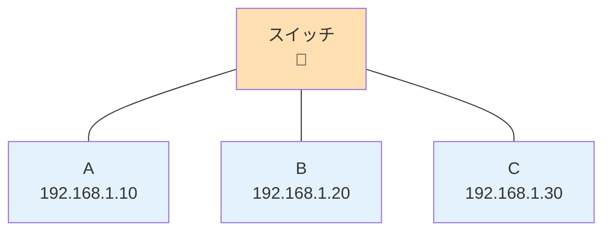
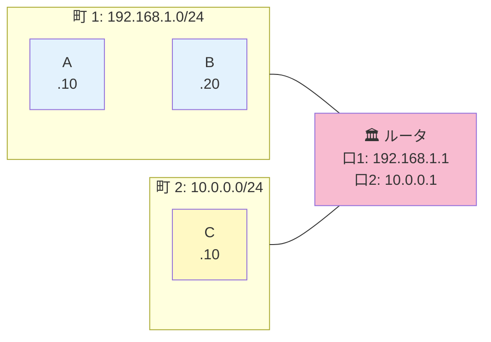
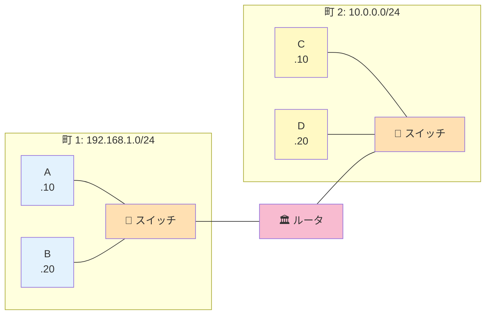

# 04. スイッチとルータの違い

## このページは何？

NetPractice で毎レベル出てくる **スイッチ** と **ルータ** の違いを、
**タコ足配線** と **郵便局** に例えて理解するページです。

---

## このページで学ぶこと

- スイッチ = 同じ町内のタコ足配線（全員同じサブネット）
- ルータ = 町と町を繋ぐ郵便局（各口は別サブネット）
- 「L2」「L3」という言葉の意味
- どっちを使うかで設計が変わる

---

## 👀 一言で言うと

| | スイッチ | ルータ |
|:---|:---|:---|
| **例え** | 🔌 タコ足配線 | 🏛️ 郵便局 |
| **繋ぐもの** | 同じ町の家同士 | 町と町 |
| **サブネット** | 配下は **全員同じ** | 各口が **別々** |
| **見るもの** | MAC アドレス | IP アドレス |
| **レイヤー** | L2（データリンク層） | L3（ネットワーク層） |

---

## 🔌 スイッチ (switch)

### メタファー: タコ足配線

!!! tip "スイッチ = LAN のタコ足配線"
    家で LAN ケーブルを延ばすとき、**1 本のケーブルを何本にも分岐** できる
    ハブ（USB タコ足のようなもの）を使う。それのスマート版がスイッチ。

    配下に繋がったパソコンは **みんな同じ町内の住人**。

**NetPractice での扱い**: スイッチの配下は **全員同じサブネット（同じ IP 帯・同じマスク）**。

### スイッチの仕組み

- **MAC アドレス**（ハードウェア ID、IP とは別）を見て転送する
- **IP アドレスは一切見ない**（= IP の設定を知らない）
- だから「同じ町の中」のやり取りしかできない（= 別の町に渡せない）

!!! info "💡 ここでつまずく人へ — スイッチとルータの違い"
    | | スイッチ | ルータ |
    |:---|:---|:---|
    | 見る情報 | MAC アドレス（機器の固有 ID） | IP アドレス |
    | 越えられる範囲 | **同じ町の中だけ** | 町をまたいで転送できる |
    | NetPractice の設定 | 特に何も書かない | route / gateway を書く |

    つまり「**同じサブネット = スイッチで OK**、**違うサブネット = ルータが必須**」
    と覚えると NetPractice はぐっと楽になります。

!!! info "MAC アドレス って何？"
    LAN カード（= ネットワーク機器）に物理的に刻まれた固有 ID。
    例: `aa:bb:cc:11:22:33`。IP は変わるが MAC は基本固定。

### L2 ってなに？

!!! info "OSI 参照モデル（ざっくり）"
    ネットワークの通信を **7 層** に分けて考える国際標準。よく聞くのは下 3 層:

    - **L1 物理層** = 電気・光ファイバー・ケーブル
    - **L2 データリンク層** = 隣同士のやり取り（スイッチ、MAC アドレス）
    - **L3 ネットワーク層** = 町を跨いだ転送（ルータ、IP アドレス）

    スイッチは L2、ルータは L3。

---

## 🏛️ ルータ (router)

### メタファー: 郵便局

!!! tip "ルータ = 町と町を繋ぐ郵便局"
    「別の町に手紙を送りたい！」というとき、
    まず **郵便局** に手紙を持ち込む。郵便局はそこから「次にどの郵便局に送るか」
    を判断して **別の町へ転送**。それがルータ。

### ルータの特徴

1. **複数の口（インターフェイス）** を持つ。各口が **別々の町** に属する
2. 受け取ったパケットの **宛先 IP** を見て「次にどの口から出すか」を判断
3. 「次にどこへ送るか」を **ルーティングテーブル** という表で管理（次ページ）

!!! warning "ルータの各インターフェイスは別サブネット"
    ルータには通常 2 つ以上の口があり、それぞれ **別のサブネット** に繋がる。
    NetPractice でも `R1`, `R2`, `R3` というインターフェイスが別の町に居るのが普通。

### L3 ってなに？

L3（ネットワーク層）は **IP アドレスを使って** 町を跨いだ転送をするレイヤー。
ルータは IP を見るから L3 機器。

---

## 🆚 両方が出てくる典型パターン

- **スイッチ S1 の配下**（A, B）: 全員 `192.168.1.x/24`
- **スイッチ S2 の配下**（C, D）: 全員 `10.0.0.x/24`
- **ルータ R**: 左の口は `192.168.1.x/24`、右の口は `10.0.0.x/24`

---

## 🎯 NetPractice での判断基準

!!! tip "スイッチが見えたら即断"
    スイッチ配下の **全インターフェイス** は
    **同じサブネット（同じ IP 帯 + 同じマスク）** にする。

!!! tip "ルータが見えたら各口を確認"
    ルータの **各インターフェイス (R1, R2, ...) は別サブネット**。
    一方の口を設定するときは、**繋がっている相手** と同じサブネットに合わせる。

---

## ⚠️ よくあるミス

!!! warning "スイッチ配下を別サブネットにする"
    スイッチの両側で違うマスクや違う IP 帯にすると **即通信失敗**。
    「タコ足配線の先は全員同じ町」と覚える。

!!! warning "ルータの両口を同じサブネットにする"
    ルータが 2 つの **別の町** を繋ぐのに、両側同じにしてしまうミス。
    **ルータ = 町と町の境界**。同じ町内にルータを置く意味はない。

---

## 🎯 まとめ

- **スイッチ**: 同じ町のタコ足配線。配下は全員同じサブネット。MAC だけ見る（L2）
- **ルータ**: 町と町を繋ぐ郵便局。各口は別サブネット。IP を見て転送（L3）
- NetPractice では「スイッチ配下は全員同じ」「ルータの各口は別」を徹底

---

## ▶️ 次に読むページ

[05. ゲートウェイって何？](gateway.md) — 町の外に出る「玄関」
