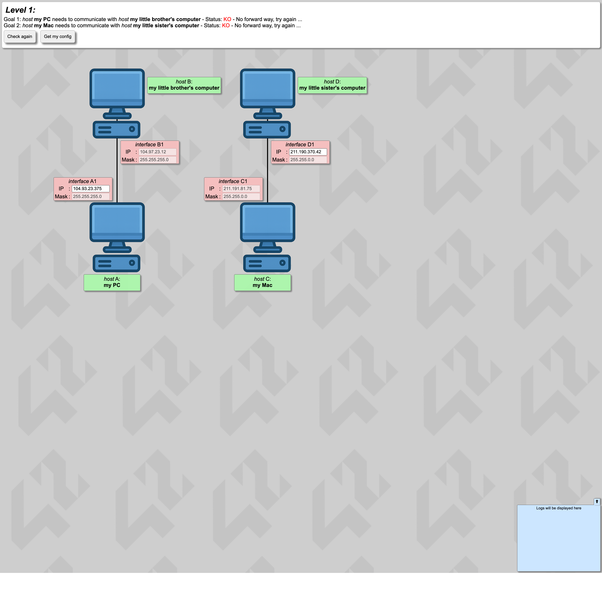
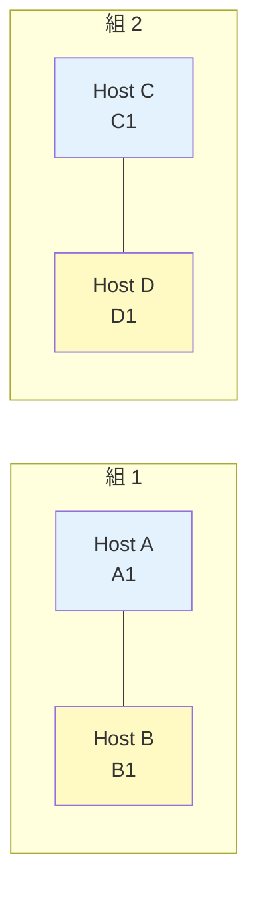

# Level 1 — 直結リンク

!!! warning "⚠️ 数値は毎回ランダムに変わります"
    このページに書かれた IP アドレス・マスク・ルートの値は **前回プレイした時の一例** です。
    あなたの画面では違う数値になっているはずなので、**そのままコピペしても絶対に解けません**。
    真似するのは「どう考えて解くか」の手順だけ。数値は自分の画面から読み取って計算してください。

## このページは何？

NetPractice 最初のレベル。**2 台のホストが直接ケーブルで繋がっているだけの問題** を解くページ。

---

## このレベルで学ぶこと

- 直結 = 同じサブネットにいる必要がある
- 固定された IP/マスクから「相手の町」を逆算する
- NetPractice の操作に慣れる

---

## 📷 問題画面

[](../images/screenshots/level1.png)

---

## 🗺️ トポロジー（構造）



**2 組のホスト** がそれぞれ直接繋がっている。ルータもスイッチもない。

---

## 🧩 ゴール

- A ↔ B が通信できる（両方緑）
- C ↔ D が通信できる（両方緑）

---

## 🔒 固定値（画面から読み取る）

あるサンプルアカウントの例:

| IF | IP | マスク | 編集可能 |
|:---|:---|:---|:-:|
| A1 | `104.93.23.313` ← 不正な数字 | `255.255.255.0` (/24) | IP だけ |
| B1 | `104.94.23.12` | `255.255.255.0` (/24) | なし |
| C1 | `211.191.62.75` | `255.255.0.0` (/16) | なし |
| D1 | `211.190.364.42` ← 不正な数字 | `255.255.0.0` (/16) | IP だけ |

!!! info "あなたの画面の数字は違うかもしれません"
    NetPractice は intra login ごとにランダムな IP を生成します。
    数値そのものではなく、**考え方** を合わせて読み替えてください。

---

## 🧠 考え方

### Step 1: 固定側の「町」を調べる

**B1: `104.94.23.12/24`** → B1 の町は `IP AND Mask` を計算して求める:

| | 10 進 | 2 進 |
|:---|:---|:---|
| B1 IP | `104.94.23.12` | `01101000.01011110.00010111.00001100` |
| マスク | `255.255.255.0` | `11111111.11111111.11111111.00000000` |
| **AND の結果 = 町** | **`104.94.23.0`** | `01101000.01011110.00010111.00000000` |

住人範囲: `104.94.23.1` 〜 `104.94.23.254`（B1 自身は `.12`）。

### Step 2: A1 を B1 の町に入れる

A1 の IP を `104.94.23.x`（x は 1〜254, 12 以外）にする。
例: **`104.94.23.13`**。

### Step 3: 同じことを C ↔ D にも

**C1: `211.191.62.75/16`** → 町は `211.191.0.0/16`（/16 なので第 3, 4 オクテット全部がホスト部）。

住人範囲: `211.191.0.1` 〜 `211.191.255.254`（C1 自身は `211.191.62.75`）。

D1 を `211.191.x.y` に入れる。例: **`211.191.62.76`**。

---

## ✅ 解答例

```
A1 IP → 104.94.23.13
D1 IP → 211.191.62.76
```

---

## 🎓 このレベルの抽象的な学び

!!! tip "転用できる考え方"
    **「固定された制約から逆算」** という思考パターン。
    プログラミングでも「引数の型が決まっている → 関数の中で何ができるかが決まる」のと同じ。
    NetPractice は **そのミニチュア版**。

---

## ⚠️ よくあるミス

!!! warning "マスクが違うのに同じ町だと思う"
    B1 が /24 なのに A1 を「100.94.23.0/16」と勘違いすると落ちる。
    **両側のマスクを確認** してから町を計算する。

!!! warning ".0 や .255 を使う"
    `104.94.23.0` や `104.94.23.255` は使えない。
    自動で弾かれるので、1〜254 の範囲で選ぶ。

---

## ▶️ 次に読むページ

[Level 2 — 不正マスクの修正](level2.md)
