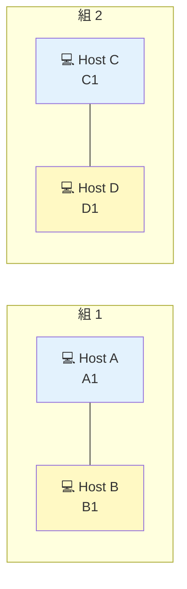

# Level 1 — 直結リンク

!!! warning "⚠️ 数値は毎回ランダムに変わります"
    このページに書かれた IP・マスク・ルートの値は **前回プレイした時の一例** です。
    あなたの画面では違う数値になっているはずなので、**そのままコピペしても絶対に解けません**。
    真似するのは「**どう考えて解くか**」の手順だけ。数値は自分の画面から読み取って計算してください。

> 🎯 **一言で言うと:** ケーブルで直結された 2 台のホストを **同じサブネット** に揃えるだけ。

## 📖 このページは何？

NetPractice の **最初のレベル**。
ホスト 2 台が直接ケーブルで繋がっている状況で、両方のホストを **同じ町（サブネット）の住人** にしてあげれば通信できます。

このレベルで身につくこと：

1. NetPractice の画面の操作に慣れる
2. **直結 = 同じサブネットでなければならない** という大原則
3. 固定された IP/マスクから「相手の町」を逆算する習慣

---

## 📷 問題画面

[](../images/screenshots/level1.png)

---

## 🗺️ トポロジー（構造）



→ **2 組のホストがそれぞれ直結**。ルータもスイッチもない、最もシンプルな構成。

---

## 🧩 ゴール

- ✅ A ↔ B が通信できる
- ✅ C ↔ D が通信できる

---

## 📺 画面の編集できる箇所

| 場所 | 何？ | 状態 | あなたが直すか？ |
|---|---|---|---|
| A1 IP | ホスト A のアドレス | 白 (編集可) | ✅ 直す |
| A1 Mask | ホスト A のマスク | 薄ピンク (固定) | ❌ そのまま |
| B1 IP/Mask | ホスト B のアドレス | 薄ピンク (固定) | ❌ そのまま |
| C1 IP/Mask | ホスト C のアドレス | 薄ピンク (固定) | ❌ そのまま |
| D1 IP | ホスト D のアドレス | 白 (編集可) | ✅ 直す |
| D1 Mask | ホスト D のマスク | 薄ピンク (固定) | ❌ そのまま |

→ つまりこのレベルでやることは「**A1 IP と D1 IP の 2 つを書き直す**」だけ。

---

## 🔒 固定値（あるサンプルアカウントの例）

| IF | IP | マスク | 編集可能 |
|:---|:---|:---|:-:|
| A1 | `104.93.23.313` ← **不正な数字** | `255.255.255.0` (/24) | IP のみ |
| B1 | `104.94.23.12` | `255.255.255.0` (/24) | なし |
| C1 | `211.191.62.75` | `255.255.0.0` (/16) | なし |
| D1 | `211.190.364.42` ← **不正な数字** | `255.255.0.0` (/16) | IP のみ |

!!! info "あなたの画面の数字は違うかもしれません"
    NetPractice は intra login ごとにランダムな IP を生成します。
    数値そのものではなく、**考え方** を合わせて読み替えてください。

---

## 🧠 考え方

### Step 1: 固定側の「町（サブネット）」を調べる

**B1 = `104.94.23.12/24`** から「B が住んでいる町」を計算します。

```
IP    : 104.94.23.12
Mask  : 255.255.255.0  (/24)

→ 町 = 104.94.23.0/24
→ 住人範囲: 104.94.23.1 〜 104.94.23.254
   (.0 はネットワークアドレス、.255 はブロードキャスト → 使えない)
```

### Step 2: A1 を B1 と同じ町に入れる

A1 の IP を `104.94.23.x`（`x` は 1〜254、12 以外）に変更。

例: **`104.94.23.13`**

### Step 3: 同じことを C ↔ D にも

**C1 = `211.191.62.75/16`** から町を計算：

```
IP    : 211.191.62.75
Mask  : 255.255.0.0  (/16)

→ 町 = 211.191.0.0/16
→ 住人範囲: 211.191.0.1 〜 211.191.255.254
```

D1 を `211.191.x.y` に。例: **`211.191.62.76`**

---

## 🎬 パケットの旅（郵便で例えると）

A から B へ手紙を出す（A↔B のゴール）：

```
1. A が手紙を書く
   宛先: 104.94.23.12 (B)
   差出人: 104.94.23.13 (A)

2. A が「B は同じ町の住人？」を確認
   A の町 = 104.94.23.0/24 (.1〜.254)
   B の住所 .12 はこの範囲？ → ✅ YES

3. A が B に手紙を直接渡す（ケーブル経由）
   ✅ 配達完了
```

→ **同じ町の住人なら、郵便屋さん（ルータ）を経由せず直接渡せる。**

---

## ✅ 解答例

```
A1 IP → 104.94.23.13
D1 IP → 211.191.62.76
```

---

## 🔗 関連概念

- 📺 [このガイドの使い方](../00-start-here.md) — 画面要素の説明含む
- 02 [サブネットマスクって何？](../01-basics/subnet-mask.md) — マスクの基礎
- 03 [CIDR 早見表](../01-basics/cidr.md) — `/24` の意味

---

## 🎓 このレベルの抽象的な学び

!!! tip "転用できる考え方 — 制約から逆算"
    **「固定された制約から逆算」** という思考パターン。
    プログラミングでも「引数の型が決まっている → 関数の中で何ができるかが決まる」のと同じ。
    NetPractice は **そのミニチュア版** で、制約に従って残りの値を埋めていく訓練です。

---

## ⚠️ よくあるミス

!!! warning "マスクが違うのに同じ町だと思う"
    B1 が /24 なのに A1 を「`100.94.23.0/16`」と勘違いすると落ちる。
    **両側のマスクを確認** してから町を計算する。

!!! warning ".0 や .255 を使う"
    `104.94.23.0` や `104.94.23.255` は使えない。
    自動で弾かれるので、**1〜254** の範囲で選ぶ。

!!! warning "不正な数字（256以上）に気づかない"
    `104.93.23.313` のように 256 以上の数字は **そもそも IP として無効**。
    これは「直してね」というヒント。

---

## ▶️ 次に読むページ

[Level 2 — 不正マスクの修正](level2.md)
