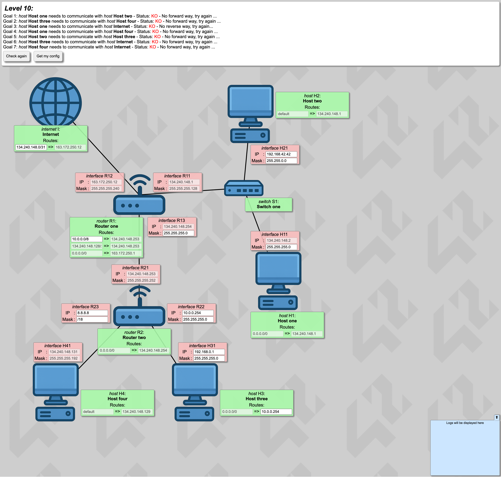
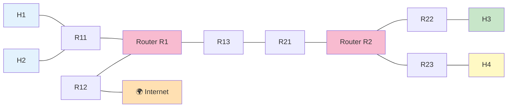

# Level 10 — 最終ボス（7 ゴール）

!!! warning "⚠️ 数値は毎回ランダムに変わります"
    このページに書かれた IP アドレス・マスク・ルートの値は **前回プレイした時の一例** です。
    あなたの画面では違う数値になっているはずなので、**そのままコピペしても絶対に解けません**。
    真似するのは「どう考えて解くか」の手順だけ。数値は自分の画面から読み取って計算してください。

## このページは何？

**7 つのゴール** と **固定値だらけ** のラストレベル。
逆説的に「自由度が低い = こうするしかない」という選択肢の絞り込みでサクッと解ける。

---

## このレベルで学ぶこと

- 固定値が多いレベルは **「こうするしかない」パズル**
- Internet の route に `0.0.0.0/0` を使って全戻り経路を 1 本でカバー
- NetPractice の知識を総合的に使う

---

## 📷 問題画面

[](../images/screenshots/level10.png)

---

## 🗺️ トポロジー



### ゴール
H1↔H2, H3↔H4, H1↔I, H1↔H4, H2↔H3, H3↔I, H4↔I（計 7 本）

---

## 🔒 固定値（ほぼ全て固定）

| | 値 | 意味 |
|:---|:---|:---|
| H1r1 gate | `165.115.174.1` | = R11 の IP |
| H4r1 gate | `165.115.174.129` | → **R23 = これ** |
| R11 | `165.115.174.1/25` | H1,H2 の LAN |
| H41 | `165.115.174.131/26` | H4 の LAN |
| R21 | `165.115.174.253/30` | ルータ間 |
| R13 | `165.115.174.254` | ルータ間 |
| R1r2 | `165.115.174.128/26 → .253` | H4 LAN を R2 経由 |

---

## 🧠 考え方

### Step 1: H1, H2 のサブネット (/25)

R11 = `.1/25` → 町 `.0/25`（住人 `.1〜.126`）。

- H11 mask → **`255.255.255.128`**（/25 に合わせる）
- H21 IP → **`165.115.174.3`**, mask → `/25`

### Step 2: ルータ間リンク (/30)

R21 = `.253/30` → ブロック `.252〜.255`（住人 `.253`, `.254`）。

- R13 mask → **`255.255.255.252`**（.254 は既に合っている）

### Step 3: H4 のサブネット (/26)

H4r1 gate = `.129` が固定 → R23 = `.129`。
H41 = `.131/26` → ブロック `.128/26`（住人 `.129〜.190`）。

- R23 IP → **`165.115.174.129`**, mask → **`255.255.255.192`**

### Step 4: H3 のサブネット

制約が少ないので自由に選ぶ。例: `10.0.0.0/24`。

- H31 IP → **`10.0.0.1`**, mask → **`255.255.255.0`**
- R22 IP → **`10.0.0.254`**, mask → `/24`
- H3 gate → **`10.0.0.254`**

### Step 5: ルーティング

R1 は既に固定:
- R1r1: `10.0.0.0/8` → R21 (H3 方面)
- R1r2: `.128/26` → R21 (H4 方面、固定)

**核心: Internet 側の route を 1 本で**

Ir1: **`0.0.0.0/0`** → gate: R12 の反対側 (Internet ルータ)

`0.0.0.0/0` は **全ての戻り道をカバー** するので、H1/H2/H3/H4 への帰りが全部ここで処理される。

---

## ✅ 解答例

```
H11 Mask → 255.255.255.128
H21 IP   → 165.115.174.3,    Mask → 255.255.255.128
R13 Mask → 255.255.255.252
R23 IP   → 165.115.174.129,  Mask → 255.255.255.192
H31 IP   → 10.0.0.1,         Mask → 255.255.255.0
R22 IP   → 10.0.0.254,       Mask → 255.255.255.0
H3 gate  → 10.0.0.254
R1r1     → 10.0.0.0/8
Ir1      → 0.0.0.0/0
```

---

## 🎓 このレベルの抽象的な学び

!!! tip "⭐ 自由度の逆説"
    **自由度が高い** → 選択が多すぎて迷う。
    **自由度が低い** → 「こうするしかない」が明確 → **実は簡単**。

    これは現実でも同じで、**制約がある状況ほど決断が早い**。
    アジャイル開発の「タイムボックス」や、アーティストの「制約アート」と同じ発想。

!!! tip "default route の威力"
    Internet 側に `0.0.0.0/0` を書くと、**全ての戻り経路** を 1 本でカバーできる。
    スイッチ文の default、例外処理の catch-all と同じ「包括的フォールバック」。

---

## ⚠️ よくあるミス

!!! warning "H3 を他と被るサブネットに置く"
    H3 の IP 範囲を自由に決められるが、**他の LAN と被らないように** 注意。
    `10.x` や `172.16.x` 等のプライベート範囲を使うのが無難。

!!! warning "Ir1 route に狭い範囲を書く"
    Internet の route に `10.0.0.0/24` だけ書くと、H1/H2/H4 の帰り道がない。
    **`0.0.0.0/0`** で全部まとめる方が楽。

---

## 🏁 全レベル完了！

お疲れ様でした。これで 10 レベル全て解けました。

次は **抽象化された学び** のセクションへ。
単なる NetPractice の攻略を超えた、**他の分野でも使える考え方** を整理します。

## ▶️ 次に読むページ

[なぜ 42 はこの課題を出す？](../03-learnings/why-this-exercise.md) — 出題意図を考える
