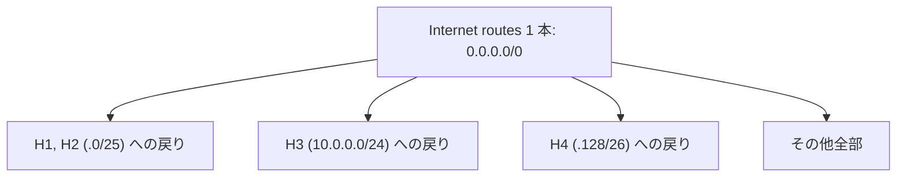

# Level 10 — 最終ボス（7 ゴール）

!!! warning "⚠️ 数値は毎回ランダムに変わります"
    このページに書かれた IP・マスク・ルートの値は **前回プレイした時の一例** です。
    あなたの画面では違う数値になっているはずなので、**そのままコピペしても絶対に解けません**。

> 🎯 **一言で言うと:** 7 ゴールでも怖くない。**ほぼ全て固定** なので「こうするしかない」が明確。Internet の routes は **`0.0.0.0/0` 1 本** で全戻り経路をカバー。

## 📖 このページは何？

**ラストレベル**。**7 つのゴール** と **大量の固定値** が特徴ですが、実は **「自由度が低い = こうするしかない」** という選択肢の絞り込みでサクッと解けます。
編集できる場所は数箇所しかないので、固定値の連鎖から **逆算で確定** させていきます。

!!! tip "🧭 解き方が分からない場合"
    このレベルも **「固定値マップ → 連鎖逆算 → 街を作る → routes → 検算」** の 5 Phase で解けます。
    詳しくは [🧭 共通の解き方 (どこから手を付けるか)](../00-how-to-solve.md)。
    Level 8 の [🎬 解く順 (絵で順番に追跡)](level8.md#step-by-step) も参考に。

このレベルで身につくこと：

1. **固定値が多いレベル = 制約パズル** として楽しむ
2. Internet の route に **`0.0.0.0/0`** を使って **全戻り経路を 1 本でカバー**
3. NetPractice の知識を総合的に使う

---

## 📷 問題画面

[](../images/screenshots/level10.png)

---

## 🗺️ トポロジー


### 7 つのゴール

H1↔H2, H3↔H4, H1↔I, H1↔H4, H2↔H3, H3↔I, H4↔I

---

## 📺 画面の編集できる箇所（数箇所だけ）

| 場所 | 状態 | 直すか？ |
|---|---|---|
| **H11 Mask** | 白 | **✅ /25 に** |
| **H21 IP / Mask** | 白 / 白 | **✅ H1 と同じ街に** |
| **R13 Mask** | 白 | **✅ /30 に** |
| **R23 IP / Mask** | 白 / 白 | **✅ /26、IP は固定値から逆算** |
| **H31 IP / Mask + R22 IP** | 白 | **✅ H3 街を作る** |
| **H3 gate** | 白 | **✅ R22 の IP** |
| **R1r1 route** | 白 | **✅ 10.0.0.0/8** |
| **Ir1 route** | 白 | **✅ 0.0.0.0/0** |
| その他 (大半) | 薄ピンク | ❌ 触らない |

→ ほぼ **全て固定** で、自由度は数箇所のみ。

---

## 🔒 固定値（ほぼ全部）

| | 値 | 意味 |
|:---|:---|:---|
| H1r1 gate | `165.115.174.1` | = R11 の IP |
| H4r1 gate | `165.115.174.129` | → **R23 の IP = これ** |
| R11 | `165.115.174.1/25` | H1, H2 の街 |
| H41 | `165.115.174.131/26` | H4 の街 |
| R21 | `165.115.174.253/30` | ルータ間 |
| R13 | `165.115.174.254` | ルータ間 |
| R1r2 | `165.115.174.128/26 → .253` | H4 街を R2 経由 |

---

## 🧠 考え方

### Step 1: H1, H2 のサブネット (/25)

R11 = `.1/25` → 街 `.0/25` (住人 `.1〜.126`)。

- H11 mask → **`255.255.255.128`** (/25 に合わせる)
- H21 IP → **`165.115.174.3`** (空き住人)
- H21 mask → /25

### Step 2: ルータ間リンク (/30)

R21 = `.253/30` → ブロック `.252〜.255`（住人 `.253`, `.254`）。

- R13 mask → **`255.255.255.252`** (/30、IP `.254` は既に合っている)

### Step 3: H4 のサブネット (/26)

H4r1 gate = `.129` 固定 → R23 IP = `.129`。
H41 = `.131/26` → ブロック `.128/26` (住人 `.129〜.190`)。

- R23 IP → **`165.115.174.129`**
- R23 mask → **`255.255.255.192`** (/26)

### Step 4: H3 のサブネット (制約少なめ)

H3 の街は自由に選ぶ。例: `10.0.0.0/24`。

- H31 IP → **`10.0.0.1`**
- H31 mask → **`255.255.255.0`** (/24)
- R22 IP → **`10.0.0.254`**
- R22 mask → /24
- H3 gate → **`10.0.0.254`**

### Step 5: ルーティング

R1 は既に固定:

```
R1r1: 10.0.0.0/8 → R21 (H3 方面)
R1r2: .128/26 → R21 (H4 方面、固定)
```

#### ⭐ 核心: Internet 側の route を 1 本で

```
Ir1: 0.0.0.0/0 → R12 の反対側 (Internet ルータ)
```

`0.0.0.0/0` は **全ての戻り道をカバー** するので、H1/H2/H3/H4 への帰りが全部ここで処理される。



---

## 🎬 パケットの旅（H1 → H4 のゴール）

```
🚀 行き: H1 (.2) → H4 (.131)

H1: default → R11 (.1) ✅

R1: routes 確認
   直結 .0/25 (H1,H2 街) → 該当なし (.131 はここにない)
   直結 .252/30 (R1-R2) → 該当なし
   R1r1 10.0.0.0/8 → 該当なし (.131 ≠ 10.x)
   R1r2 .128/26 → ✅ 該当 (.131 含まれる)
   → R21 (.253) へ

R2: routes 確認
   直結 .128/26 (H4 街) → ✅ → R23 (.129) 経由で H4 へ
   配達完了


📬 帰り: H4 → H1 も同じ流れで成立
```

---

## ✅ 解答例

```
H11 Mask → 255.255.255.128
H21 IP   → 165.115.174.3,    Mask → 255.255.255.128
R13 Mask → 255.255.255.252
R23 IP   → 165.115.174.129,  Mask → 255.255.255.192
H31 IP   → 10.0.0.1,         Mask → 255.255.255.0
R22 IP   → 10.0.0.254,       Mask → 255.255.255.0
H3 gate  → 10.0.0.254
R1r1     → 10.0.0.0/8
Ir1      → 0.0.0.0/0     ⭐ 全戻り経路を 1 本で
```

---

## 🔗 関連概念

- 06 [ルーティングテーブル](../01-basics/routing-table.md) — `0.0.0.0/0` の威力
- 07 [双方向到達性](../01-basics/bidirectional.md)

---

## 🎓 このレベルの抽象的な学び

!!! tip "⭐ 自由度の逆説"
    **自由度が高い** → 選択が多すぎて迷う。
    **自由度が低い** → 「こうするしかない」が明確 → **実は簡単**。

    これは現実でも同じで、**制約がある状況ほど決断が早い**。
    アジャイル開発の「タイムボックス」や、アーティストの「制約アート」と同じ発想。

!!! tip "default route の威力"
    Internet 側に `0.0.0.0/0` を書くと、**全ての戻り経路** を 1 本でカバーできる。
    スイッチ文の default、例外処理の catch-all と同じ「**包括的フォールバック**」。

---

## ⚠️ よくあるミス

!!! warning "H3 を他と被るサブネットに置く"
    H3 の IP 範囲を自由に決められるが、**他の LAN と被らないように** 注意。
    `10.x` や `172.16.x` 等のプライベート範囲を使うのが無難。

!!! warning "Ir1 route に狭い範囲を書く"
    Internet の route に `10.0.0.0/24` だけ書くと、H1/H2/H4 の帰り道がない。
    **`0.0.0.0/0`** で全部まとめる方が楽。

!!! warning "R23 の IP を H4 街と違う街に置く"
    H4r1 gate = `.129` が固定なので、**R23 IP = `.129`** でなければならない。
    勝手に他の値にすると H4 から R2 へ届かない。

---

## 🏁 全レベル完了！

お疲れ様でした！これで NetPractice 全 10 レベル踏破です 🎉

次は **抽象化された学び** のセクションへ。
単なる NetPractice の攻略を超えた、**他の分野でも使える考え方** を整理します。

## ▶️ 次に読むページ

[なぜ 42 はこの課題を出す？](../03-learnings/why-this-exercise.md)
