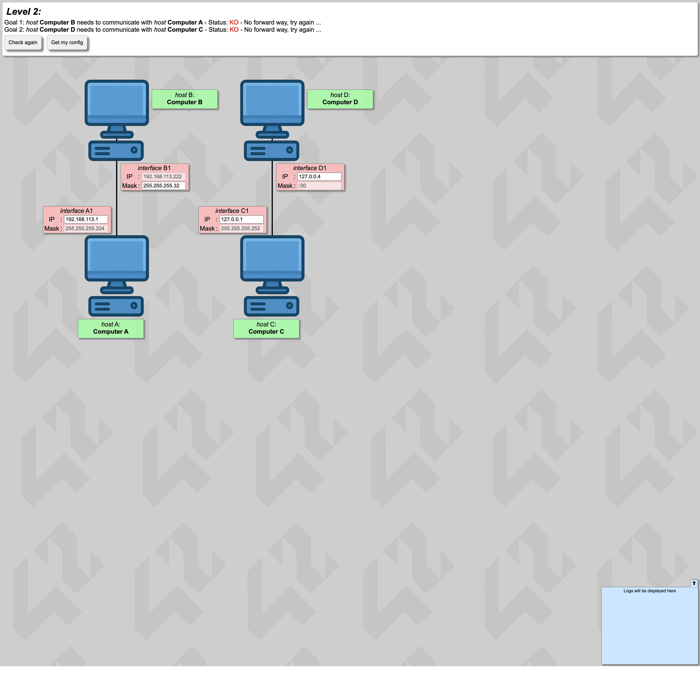
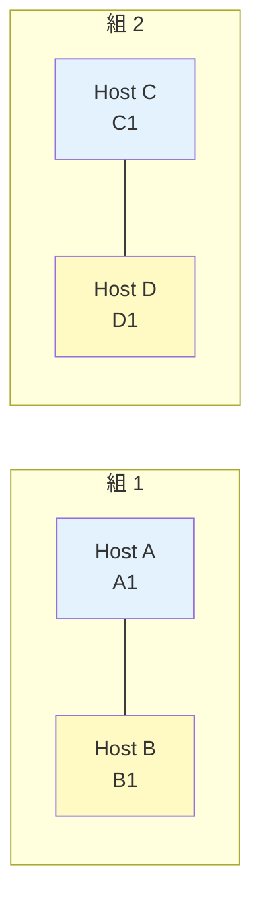

# Level 2 — 不正マスクの修正

!!! warning "⚠️ 数値は毎回ランダムに変わります"
    このページに書かれた IP アドレス・マスク・ルートの値は **前回プレイした時の一例** です。
    あなたの画面では違う数値になっているはずなので、**そのままコピペしても絶対に解けません**。
    真似するのは「どう考えて解くか」の手順だけ。数値は自分の画面から読み取って計算してください。

## このページは何？

**サブネットマスクが壊れた値** になっている問題を直します。
マスクが「1 が連続してから 0 が連続する」形でなければ無効、という重要な知識を使うレベル。

---

## このレベルで学ぶこと

- `255.255.255.32` のような **無効マスク** を見分ける
- 小さい CIDR (/27, /30) でのブロック計算
- /30 はルータ間リンクの定番

---

## 📷 問題画面

[](../images/screenshots/level2.png)

---

## 🗺️ トポロジー



---

## 🔒 固定値

| IF | IP | マスク | 編集可 |
|:---|:---|:---|:-:|
| A1 | `192.168.30.1` | `255.255.255.224` (/27) | IP のみ |
| B1 | `192.168.30.222` | `255.255.255.32` ← **不正！** | マスクのみ |
| C1 | `127.0.0.1` | `255.255.255.252` (/30) | IP のみ |
| D1 | `127.0.0.4` | `255.255.255.252` (/30) | IP のみ |

---

## 🚨 B1 のマスクが不正な理由

### `255.255.255.32` を 2 進数で見ると

```
255.255.255.32
 ↓
11111111.11111111.11111111.00100000
                          ├─ 1 が 1 個、間に挟まっている ─┤
```

!!! danger "マスクのルール違反"
    サブネットマスクは **先頭から 1 が連続して並び、その後 0 が続く** 形でなければならない。
    `.32` の 2 進は `00100000` → **0 の中に 1 が紛れ込んでいる** → 無効。

---

## 🧠 考え方

### Step 1: B1 のマスクを A1 に合わせて `/27` に

**`255.255.255.224`**（= /27）に修正。
これで A1 と B1 は「同じマスク」を持つことになり、正しく動く可能性が出てくる。

### Step 2: /27 で A1, B1 が同じブロックに居るか確認

`/27` のブロックサイズは 32（= 256 − 224）。`/24` の空間を 8 ブロックに分割できる。

| ブロック | 範囲 | 状態 |
|:---|:---|:---|
| `.0/27` | `.0〜.31` | A1 (`.1`) がここ |
| `.32/27` | `.32〜.63` | — |
| `.64/27` | `.64〜.95` | — |
| `.96/27` | `.96〜.127` | — |
| `.128/27` | `.128〜.159` | — |
| `.160/27` | `.160〜.191` | — |
| **`.192/27`** | **`.192〜.223`** | **B1 (`.222`) がここ** |
| `.224/27` | `.224〜.255` | — |

B1 `.222` は `.192/27` ブロック（住人 `.193〜.222`）に属する。

でも A1 `.1` は `.0/27` ブロックに属している → **別ブロック → 同じ町ではない**。

### Step 3: A1 を B1 と同じブロックに移動

A1 の IP を `.193〜.222` の範囲に変更（`.222` は B1 が使っているので避ける）。
例: **`192.168.30.193`**。

### Step 4: C1 ↔ D1 の /30 問題

`/30` のブロックサイズは 4。ルータ間リンクの定番サイズ。

| ブロック | 含む IP | 使える IP（住人） |
|:---|:---|:---|
| `.0/30` | `.0, .1, .2, .3` | `.1, .2` |
| `.4/30` | `.4, .5, .6, .7` | `.5, .6` |
| `.8/30` | `.8, .9, .10, .11` | `.9, .10` |
| … | … | … |

C1 `.1` は `.0/30` ブロック、D1 `.4` は `.4/30` ブロック → **別ブロック**。

同じブロックに入れるため **D1 を `.2` に変更**。

- C1 = `127.0.0.1`
- D1 = **`127.0.0.2`**

---

## ✅ 解答例

```
B1 Mask → 255.255.255.224
A1 IP   → 192.168.30.193
D1 IP   → 127.0.0.2
```

---

## 🎓 このレベルの抽象的な学び

!!! tip "転用できる考え方"
    **「形式が正しいか」のバリデーション**。マスクの「1 が連続してから 0」という形式は、
    プログラミングでいう **型・フォーマットの制約** と同じ。
    データの形を見てパッと「これ変」と気づけるのがエンジニアの感覚。

!!! tip "/30 はルータ間専用"
    /30 は住人が 2 人しか入らないので **ルータ同士を直結するリンク** で多用される。
    「/30 が見えたら 2 台直結」と覚えておく。

---

## ⚠️ よくあるミス

!!! warning "/27 を 224 と書くのを覚えられない"
    暗記するなら CIDR 早見表を見返す。`/27` は「**32 区切り**」と覚えると `256 − 32 = 224` と導ける。

!!! warning ".192 や .223 を住人にする"
    `.192` はネットワーク、`.223` はブロードキャスト → **住人には使えない**。
    範囲は `.193〜.222` だけ。

---

## ▶️ 次に読むページ

[Level 3 — スイッチで 3 台接続](level3.md)
