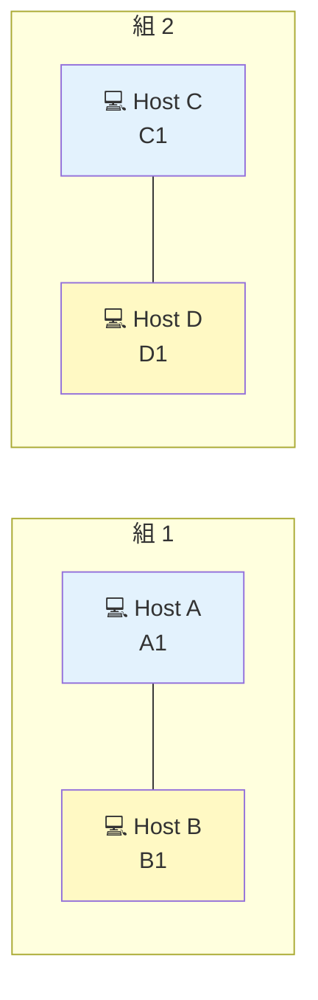

# Level 2 — 不正マスクの修正

!!! warning "⚠️ 数値は毎回ランダムに変わります"
    このページに書かれた IP・マスク・ルートの値は **前回プレイした時の一例** です。
    あなたの画面では違う数値になっているはずなので、**そのままコピペしても絶対に解けません**。
    真似するのは「**どう考えて解くか**」の手順だけ。

> 🎯 **一言で言うと:** 壊れたマスク（`255.255.255.32` のような無効値）を修正し、`/27` と `/30` のブロック境界に IP を合わせる。

## 📖 このページは何？

サブネットマスクが **「1 が連続してから 0 が連続」** というルールに違反した値（例: `.32`）になっている問題を直すレベル。
小さい CIDR (`/27`, `/30`) のブロック計算にも初めて触れます。

このレベルで身につくこと：

1. **無効マスク** を見分ける（`.32` `.96` などの「途中に 1 が紛れた値」）
2. `/27` (= 32 ずつ) のブロック計算
3. `/30` (= 4 ずつ、ルータ間リンク用) のブロック計算

---

## 📷 問題画面

[](../images/screenshots/level2.png)

---

## 🗺️ トポロジー



---

## 📺 画面の編集できる箇所

| 場所 | 何？ | 状態 | あなたが直すか？ |
|---|---|---|---|
| A1 IP | A の IP | 白 | ✅ 直す |
| A1 Mask | A のマスク | 薄ピンク | ❌ そのまま |
| B1 IP | B の IP | 薄ピンク | ❌ そのまま |
| **B1 Mask** | **B のマスク (壊れてる!)** | **白** | **✅ 直す** |
| C1 IP | C の IP | 白 | ❌ そのまま |
| C1 Mask | C のマスク (/30) | 薄ピンク | ❌ そのまま |
| D1 IP | D の IP | 白 | ✅ 直す |
| D1 Mask | D のマスク (/30) | 薄ピンク | ❌ そのまま |

→ 直すのは **B1 Mask + A1 IP + D1 IP の 3 箇所**。

---

## 🔒 固定値

| IF | IP | マスク | 編集可 |
|:---|:---|:---|:-:|
| A1 | `192.168.30.1` | `255.255.255.224` (/27) | IP のみ |
| B1 | `192.168.30.222` | `255.255.255.32` ← **不正！** | マスクのみ |
| C1 | `127.0.0.1` | `255.255.255.252` (/30) | IP のみ |
| D1 | `127.0.0.4` | `255.255.255.252` (/30) | IP のみ |

> ⚠️ **本来 `127.x.x.x` はループバック予約帯** で実機では NG。NetPractice では教育目的で使われている。
> 詳細: [04. スイッチとルータの違い](../01-basics/switch-router.md)

---

## 🚨 B1 のマスクが不正な理由

### `255.255.255.32` を 2 進数で見ると

```
255.255.255.32
   ↓ 2進変換
11111111.11111111.11111111.00100000
                          ↑↑
                          途中で 1 が紛れている!
```

!!! danger "マスクの大原則"
    サブネットマスクは **「先頭から 1 が連続して並び、その後 0 が続く」** 形でなければならない。
    `.32` の 2 進は `00100000` → **0 の中に 1 が紛れている** → 無効。

#### 正しいマスクの例（参考）

| 10進  | 2進        | CIDR | 妥当？ |
|:---|:---|:-:|:-:|
| `0`   | `00000000` | /24  | ✅ |
| `128` | `10000000` | /25  | ✅ |
| `192` | `11000000` | /26  | ✅ |
| `224` | `11100000` | /27  | ✅ |
| `240` | `11110000` | /28  | ✅ |
| `248` | `11111000` | /29  | ✅ |
| `252` | `11111100` | /30  | ✅ |
| **`32`**  | **`00100000`** | — | ❌ |
| **`96`**  | **`01100000`** | — | ❌ |

---

## 🧠 考え方

### Step 1: B1 のマスクを A1 と同じ `/27` に

A1 のマスクが `/27` で固定 → B1 もそれに合わせるしかない。

→ **B1 Mask = `255.255.255.224`**

### Step 2: /27 で A1, B1 が同じブロックに居るか確認

`/27` のブロックサイズは **32**（= `256 − 224`）。`/24` 空間を **8 ブロック** に分割：

<div class="subnet-ruler cols-8">
  <div class="subnet-block target-2">
    <span class="block-name">.0/27</span>
    <span class="block-range">.0〜.31</span>
    <span class="block-purpose">A1 (.1)</span>
  </div>
  <div class="subnet-block empty"><span class="block-name">.32/27</span><span class="block-range">.32〜.63</span></div>
  <div class="subnet-block empty"><span class="block-name">.64/27</span><span class="block-range">.64〜.95</span></div>
  <div class="subnet-block empty"><span class="block-name">.96/27</span><span class="block-range">.96〜.127</span></div>
  <div class="subnet-block empty"><span class="block-name">.128/27</span><span class="block-range">.128〜.159</span></div>
  <div class="subnet-block empty"><span class="block-name">.160/27</span><span class="block-range">.160〜.191</span></div>
  <div class="subnet-block target">
    <span class="block-name">.192/27</span>
    <span class="block-range">.192〜.223</span>
    <span class="block-purpose">B1 (.222)</span>
  </div>
  <div class="subnet-block empty"><span class="block-name">.224/27</span><span class="block-range">.224〜.255</span></div>
</div>

<div class="subnet-legend">
  <span class="legend-item"><span class="legend-swatch target-2"></span>A1 (.1) のブロック</span>
  <span class="legend-item"><span class="legend-swatch target"></span>B1 (.222) のブロック (こっちに合わせる)</span>
</div>

→ **A1 と B1 は別ブロックに居る！**
→ A1 を **`.192/27` ブロック (B1 と同じ街)** に引っ越す必要がある。
→ 住人は `.193〜.222` (`.222` は B1 が使うので避ける) → **A1 を `.193`** に。

### Step 3: A1 を B1 と同じブロックに移動

A1 の IP を `.193〜.222` の範囲に変更（`.222` は B1 が使うので避ける）。
例: **`192.168.30.193`**

### Step 4: C1 ↔ D1 の /30 問題

`/30` のブロックサイズは **4**（ルータ間リンクの定番サイズ）。

| ブロック | 含む IP | 住人 |
|:---|:---|:---|
| `.0/30` | `.0, .1, .2, .3` | `.1, .2` |
| `.4/30` | `.4, .5, .6, .7` | `.5, .6` |
| `.8/30` | `.8, .9, .10, .11` | `.9, .10` |

C1 `.1` は `.0/30`、D1 `.4` は `.4/30` → **別ブロック**。

→ D1 を `.2` に変更（`.0/30` の住人にする）。

- C1 = `127.0.0.1`（変更不要）
- D1 → **`127.0.0.2`**

---

## 🎬 パケットの旅（A → B のゴール）

修正後の世界で、A から B に手紙を出すと…

```
A (.193 / 27) のサブネット計算:
  .193 ÷ 32 = 6 余り 1
  6 × 32 = 192
  → A の町 = 192.168.30.192/27 (.192〜.223)

B (.222) はこの町の住人? → ✅ YES

→ A は B に直接手紙を渡す → 配達完了
```

---

## ✅ 解答例

```
B1 Mask → 255.255.255.224
A1 IP   → 192.168.30.193
D1 IP   → 127.0.0.2
```

---

## 🔗 関連概念

- 02 [サブネットマスクって何？](../01-basics/subnet-mask.md) — マスクの基本ルール
- 03 [CIDR 早見表](../01-basics/cidr.md) — `/27` `/30` のサイズ感

---

## 🎓 このレベルの抽象的な学び

!!! tip "形式バリデーションの感覚"
    マスクの「1 が連続してから 0」という形式は、プログラミングの **型・フォーマット制約** と同じ。
    データの形を見て「これ変」とパッと気づけるのがエンジニアの感覚。

!!! tip "/30 はルータ間リンク専用"
    /30 は住人が 2 人しか入らないので **ルータ同士を直結するリンク** で多用される。
    「/30 が見えたら 2 台直結」と覚える。

---

## ⚠️ よくあるミス

!!! warning "/27 を 224 と書くのを覚えられない"
    暗記するなら CIDR 早見表を見返す。`/27` は「**32 区切り**」と覚えると `256 − 32 = 224` と導ける。

!!! warning ".192 や .223 を住人にする"
    `.192` はネットワークアドレス、`.223` はブロードキャスト → **住人には使えない**。
    範囲は `.193〜.222` だけ。

!!! warning "/30 で .0 や .3 を使う"
    `.0/30` のブロックでは、住人になれるのは `.1` と `.2` だけ。`.0` (Net) と `.3` (Bcast) は予約。

---

## ▶️ 次に読むページ

[Level 3 — スイッチで 3 台接続](level3.md)
