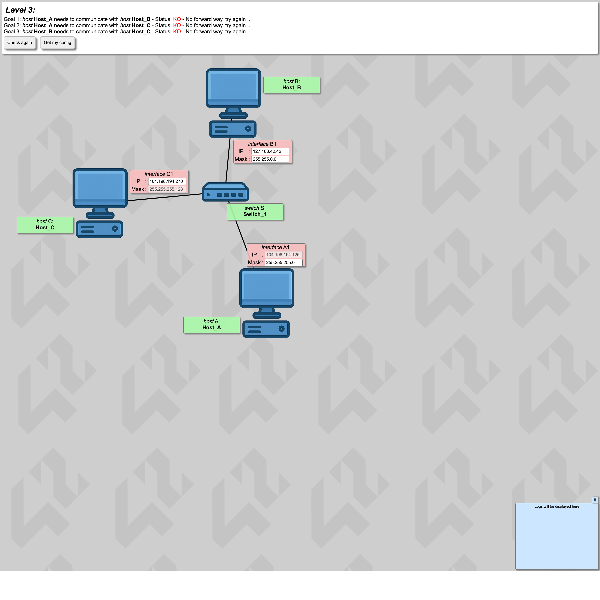
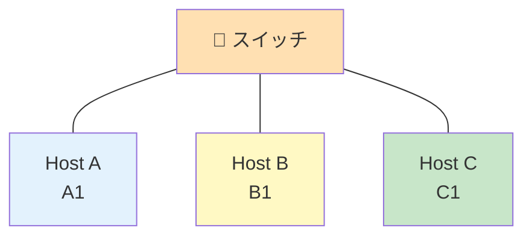

# Level 3 — スイッチで 3 台接続

!!! warning "⚠️ 数値は毎回ランダムに変わります"
    このページに書かれた IP アドレス・マスク・ルートの値は **前回プレイした時の一例** です。
    あなたの画面では違う数値になっているはずなので、**そのままコピペしても絶対に解けません**。
    真似するのは「どう考えて解くか」の手順だけ。数値は自分の画面から読み取って計算してください。

## このページは何？

初めて **スイッチ** が登場し、**3 台のホスト全員が同じサブネット** に居なければならないレベル。

---

## このレベルで学ぶこと

- スイッチ配下 = 全員同じサブネット
- 「3 台全員のマスクを合わせる」作業
- IP の重複を避ける

---

## 📷 問題画面

[](../images/screenshots/level3.png)

---

## 🗺️ トポロジー



---

## 🔒 固定値

| IF | IP | マスク | 編集可 |
|:---|:---|:---|:-:|
| A1 | `104.198.242.125` | `255.255.255.0` | マスクのみ |
| B1 | `127.168.42.42` | `255.255.0.0` | 両方 |
| C1 | `104.198.242.288` ← 不正 | `255.255.255.128` (/25) | IP のみ |

---

## 🧠 考え方

### Step 1: 固定されたマスクを見つける

C1 の **マスクが /25 で固定** なので、**全員 /25** に揃える必要がある
（スイッチ配下は全員同じマスク）。

### Step 2: A1 が /25 のどのブロックに居るか

`/25` のブロックサイズは 128。`/24` の空間を 2 ブロックに分割できる。

| ブロック | 範囲 | 使える IP（住人） | 状態 |
|:---|:---|:---|:---|
| **`.0/25`** | **`.0〜.127`** | `.1〜.126` | **A1 (`.125`) がここ** |
| `.128/25` | `.128〜.255` | `.129〜.254` | — |

A1 `.125` は `.0/25` ブロックに属する。

### Step 3: B1 と C1 を同じ町に入れる

- A1 のマスク → **`255.255.255.128`**
- B1 IP → `104.198.242.X`（X は 1〜126, 125 以外）、例: **`104.198.242.50`**
- B1 Mask → **`255.255.255.128`**
- C1 IP → `104.198.242.X`（同上、A1・B1 と重複回避）、例: **`104.198.242.100`**

---

## ✅ 解答例

```
A1 Mask → 255.255.255.128
B1 IP   → 104.198.242.50
B1 Mask → 255.255.255.128
C1 IP   → 104.198.242.100
```

---

## 🎓 このレベルの抽象的な学び

!!! tip "転用できる考え方"
    **「共有リソースの合意」**。
    スイッチ配下は全員同じネットワーク設定を共有する必要がある。
    プログラミングでも共有状態を持つ複数オブジェクトは **同じスキーマ** に合わせる必要がある、
    という発想と同じ。

---

## ⚠️ よくあるミス

!!! warning "マスクを A1 だけ変更して B1 を忘れる"
    **全員** のマスクを揃える必要がある。1 人でも違うと即通信失敗。

!!! warning "IP の値が不正（.288 など）"
    C1 の初期値 `.288` は 0〜255 を超えているので明らかに無効。画面に赤で警告が出る。

---

## ▶️ 次に読むページ

[Level 4 — ルータ登場](level4.md)
