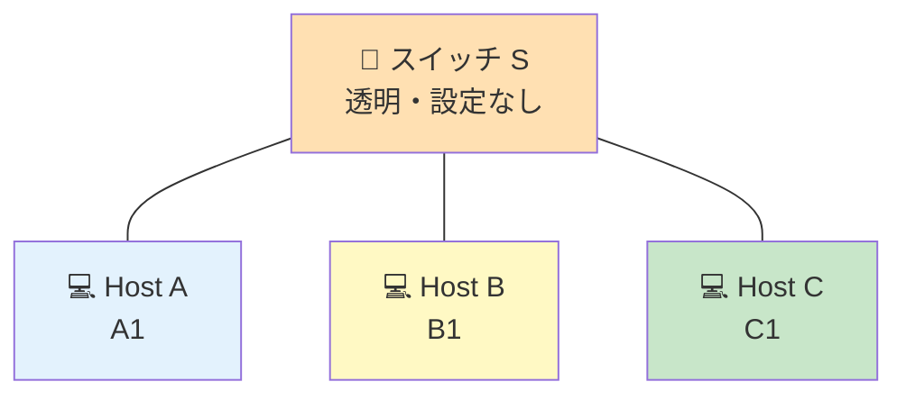

# Level 3 — スイッチで 3 台接続

!!! warning "⚠️ 数値は毎回ランダムに変わります"
    このページに書かれた IP・マスク・ルートの値は **前回プレイした時の一例** です。
    あなたの画面では違う数値になっているはずなので、**そのままコピペしても絶対に解けません**。

> 🎯 **一言で言うと:** スイッチに繋がる **3 台のホスト全員を同じサブネット** に揃えるだけ。固定マスクに合わせる。

## 📖 このページは何？

初めて **スイッチ** が登場します。スイッチは「同じ町の住人を集める **透明な廊下**」のような機器で、配下の全員が同じサブネットに居る必要があります。

このレベルで身につくこと：

1. **スイッチ = 同じサブネットの住人を繋ぐ透明な機器**
2. 「3 台全員のマスクを揃える」作業
3. IP の重複を避ける

---

## 📷 問題画面

[](../images/screenshots/level3.png)

---

## 🗺️ トポロジー



> 💡 **スイッチは IP も Mask も持たない**。配下の 3 台が同じサブネットになっていれば、スイッチが透明に橋渡ししてくれる。

---

## 📺 画面の編集できる箇所

| 場所 | 状態 | あなたが直すか？ |
|---|---|---|
| A1 IP | 薄ピンク | ❌ そのまま |
| **A1 Mask** | **白** | **✅ 直す** |
| B1 IP / Mask | 白 / 白 | ✅ 両方直す |
| **C1 IP** | **白 (不正値)** | **✅ 直す** |
| C1 Mask | 薄ピンク (/25) | ❌ そのまま |

→ 直すのは **A1 Mask + B1 IP/Mask + C1 IP の 4 箇所**。

---

## 🔒 固定値

| IF | IP | マスク | 編集可 |
|:---|:---|:---|:-:|
| A1 | `104.198.242.125` | `255.255.255.0` | マスクのみ |
| B1 | `127.168.42.42` | `255.255.0.0` | 両方 |
| C1 | `104.198.242.288` ← **不正** | `255.255.255.128` (/25) | IP のみ |

---

## 🧠 考え方

### Step 1: 固定されたマスクを見つける

C1 の **マスクが `/25` で固定** → 全員 `/25` に揃えるしかない。
（スイッチ配下は全員同じマスクが大原則）

### Step 2: A1 が `/25` のどのブロックに居るか確認

`/25` のブロックサイズは **128**（= `256 − 128`）。`/24` 空間を **真っ二つ** に分割：

<div class="subnet-ruler cols-2">
  <div class="subnet-block target">
    <span class="block-name">.0/25</span>
    <span class="block-range">.0〜.127</span>
    <span class="block-host-range">住人 .1〜.126</span>
    <span class="block-purpose">A1 (.125) がここ → ここに全員集める</span>
  </div>
  <div class="subnet-block empty">
    <span class="block-name">.128/25</span>
    <span class="block-range">.128〜.255</span>
    <span class="block-host-range">住人 .129〜.254</span>
    <span class="block-purpose">未使用</span>
  </div>
</div>

→ A1 (`.125`) は `.0/25` ブロックの中。**全員 (`.0〜.127` の住人) をこの街に揃える**。

### Step 3: B1 と C1 を同じ町に入れる

| 直す場所 | 値 | 理由 |
|---|---|---|
| A1 Mask | `255.255.255.128` | /25 に統一 |
| B1 IP | `104.198.242.50` | A の町 (`.0/25`) の住人になる、`.125` と被らない |
| B1 Mask | `255.255.255.128` | 同上 |
| C1 IP | `104.198.242.100` | 同上、A・B と被らない |

---

## 🎬 パケットの旅（A → C のゴール）

```
1. A (.125) が C (.100) 宛に手紙を書く

2. A が C のサブネットを確認
   A の町 = 104.198.242.0/25 (.1〜.126)
   C (.100) はこの中? → ✅ YES

3. A が手紙をスイッチに送る
   スイッチが「C のポート」へ転送
   ✅ 配達完了
```

→ **スイッチは透明に動くだけ**。設定不要。同じサブネットなら自動で動く。

---

## ✅ 解答例

```
A1 Mask → 255.255.255.128
B1 IP   → 104.198.242.50
B1 Mask → 255.255.255.128
C1 IP   → 104.198.242.100
```

---

## 🔗 関連概念

- 04 [スイッチとルータの違い](../01-basics/switch-router.md) — Switch と Router の役割
- 02 [サブネットマスクって何？](../01-basics/subnet-mask.md)

---

## 🎓 このレベルの抽象的な学び

!!! tip "共有リソースの合意"
    スイッチ配下は **全員同じネットワーク設定を共有する必要がある**。
    プログラミングでも共有状態を持つ複数オブジェクトは **同じスキーマ** に合わせる必要があるのと同じ発想。

!!! tip "スイッチは "受動的" な装置"
    スイッチは設定しない・できない。あくまで **物理的な集約器**。
    能動的な経路選択は次のレベル以降の **ルータ** の仕事。

---

## ⚠️ よくあるミス

!!! warning "マスクを A1 だけ変えて B1 を忘れる"
    **全員** のマスクを揃える必要がある。1 人でも違うと即通信失敗。

!!! warning "IP の値が不正 (.288 など)"
    C1 の初期値 `.288` は 0〜255 を超えているので明らかに無効。画面に赤で警告が出る。

!!! warning "ホスト範囲外を選ぶ"
    `/25` の `.0/25` ブロックでは住人 `.1〜.126`。`.0` (Net) と `.127` (Bcast) は使えない。

---

## ▶️ 次に読むページ

[Level 4 — ルータ登場](level4.md)
