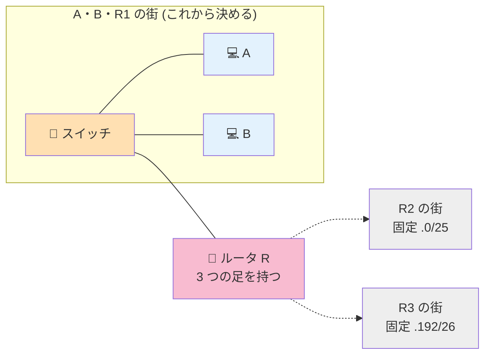

# Level 4 — ルータ登場

!!! warning "⚠️ 数値は毎回ランダムに変わります"
    このページに書かれた IP・マスク・ルートの値は **前回プレイした時の一例** です。
    あなたの画面では違う数値になっているはずなので、**そのままコピペしても絶対に解けません**。

> 🎯 **一言で言うと:** ルータは **複数の街にまたがる集配局**。R が他の街用に使っている範囲（R2, R3）を避けて、A, B, R1 を 1 つの街に収める。

## 📖 このページは何？

初めて **ルータ** が登場するレベル。
ルータは複数のインターフェース（足）を持ち、**それぞれ別の街（サブネット）に属する** 必要があります。今回 R は 3 つの足 (R1, R2, R3) を持っていて、R2 と R3 の街は固定済み。残った範囲を A, B, R1 で使います。

このレベルで身につくこと：

1. **ルータの各 IF は別サブネット** という大原則
2. サブネット同士は **重なってはいけない**
3. **固定値から「使える範囲」を逆算** する設計力

---

## 📷 問題画面

[](../images/screenshots/level4.png)

---

## 🗺️ トポロジー



---

## 📺 画面の編集できる箇所

| 場所 | 状態 | あなたが直すか？ |
|---|---|---|
| A1 IP | 薄ピンク (.132) | ❌ そのまま |
| **A1 Mask** | **白** | **✅ 直す → /28** |
| **R1 IP / Mask** | **白 / 白** | **✅ 両方直す** |
| **B1 IP / Mask** | **白 / 白** | **✅ 両方直す** |
| R2, R3 (IP / Mask) | 薄ピンク | ❌ 触らない (固定) |

→ 直すのは **A1 Mask + R1 IP/Mask + B1 IP/Mask の 5 箇所**。

---

## 🔒 固定値

| IF | IP | マスク | 編集可 |
|:---|:---|:---|:-:|
| A1 | `68.80.117.132` | `255.255.255.240` (/28) | マスクのみ |
| B1 | `68.80.127.193` | `255.255.0.0` | 両方 |
| R1 | `68.80.117.91` | /23 | 両方 |
| R2 | `68.80.117.1` | `255.255.255.128` (/25) | 不可 |
| R3 | `68.80.117.244` | `255.255.255.192` (/26) | 不可 |

---

## 🧠 考え方

### Step 1: 固定値を地図にする (どの範囲が占有されているか)

R2 と R3 が **固定で街を押さえている**。それぞれの占有範囲を計算：

#### R2 のブロック (`.1` / `/25`)

```
ブロックサイズ = 256 - 128 = 128
.1 ÷ 128 = 0 余り 1
0 × 128 = 0
→ R2 のサブネット = 68.80.117.0/25 (.0〜.127 を占有)
```

#### R3 のブロック (`.244` / `/26`)

<div class="step-flow">
  <div class="step"><span class="step-num">1</span>R3 の値<br><code>.244</code></div>
  <div class="step"><span class="step-num">2</span>マスク<br><code>/26</code><br>幅 64</div>
  <div class="step"><span class="step-num">3</span>244 ÷ 64<br>= 3 余り 52</div>
  <div class="step"><span class="step-num">4</span>3 × 64<br>= <b>192</b></div>
  <div class="step"><span class="step-num">5</span>ブロック先頭<br><code>.192/26</code></div>
</div>

→ R3 のサブネット = `.192/26` (`.192〜.255` を占有)

#### 占有マップ（視覚図）

`/24` を `/26` で 4 等分した時の占有状況：

<div class="subnet-ruler cols-4">
  <div class="subnet-block used">
    <span class="block-name">.0/26</span>
    <span class="block-range">.0〜.63</span>
    <span class="block-purpose">R2 占有</span>
  </div>
  <div class="subnet-block used">
    <span class="block-name">.64/26</span>
    <span class="block-range">.64〜.127</span>
    <span class="block-purpose">R2 占有</span>
  </div>
  <div class="subnet-block target">
    <span class="block-name">.128/26</span>
    <span class="block-range">.128〜.191</span>
    <span class="block-purpose">空き! ここを使う</span>
  </div>
  <div class="subnet-block used">
    <span class="block-name">.192/26</span>
    <span class="block-range">.192〜.255</span>
    <span class="block-purpose">R3 占有</span>
  </div>
</div>

<div class="subnet-legend">
  <span class="legend-item"><span class="legend-swatch used"></span>すでに他 IF が占有</span>
  <span class="legend-item"><span class="legend-swatch target"></span>A,B,R1 で使う空き</span>
</div>

→ R2 (`.0/25` = `.0〜.127`) と R3 (`.192/26` = `.192〜.255`) の間に **`.128〜.191`** が空いている。
→ ただしこの空きは **64 個分**。今回 A は `/28` (= 16 個ずつ) 固定なので、その中の **`.128/28`** (`.128〜.143`) を使う。

### Step 2: A1 (.132) の /28 ブロックを特定

A1 マスクが `/28` 固定なので、`.132` の `/28` ブロックを計算：

<div class="step-flow">
  <div class="step"><span class="step-num">1</span>A1 の値<br><code>.132</code></div>
  <div class="step"><span class="step-num">2</span>マスク<br><code>/28</code><br>幅 16</div>
  <div class="step"><span class="step-num">3</span>132 ÷ 16<br>= 8 余り 4</div>
  <div class="step"><span class="step-num">4</span>8 × 16<br>= <b>128</b></div>
  <div class="step"><span class="step-num">5</span>ブロック先頭<br><code>.128/28</code></div>
</div>

→ A1 は **`.128/28`** ブロック (`.128〜.143`、住人 `.129〜.142`) に居る。

### Step 3: 重ならないか確認

| ブロック | 占有 | 範囲 | A,B,R1 で使える？ |
|:---|:---|:---|:---|
| `.0/25` | R2 | `.0〜.127` | ❌ |
| **`.128/28`** | **A,B,R1 用** | **`.128〜.143`** | **✅ ここを使う** |
| `.144/28`〜 | 空き | `.144〜.191` | (今回は未使用) |
| `.192/26` | R3 | `.192〜.255` | ❌ |

`.128/28` は R2 (`.0〜.127`) とも R3 (`.192〜.255`) とも重ならない ✅

### Step 4: A, B, R1 を `.128/28` に揃える

| 直す場所 | 値 | 理由 |
|---|---|---|
| A1 Mask | `255.255.255.240` (/28) | 既に固定で OK |
| R1 IP | `68.80.117.129` | `.128/28` の住人 (.129〜.142) |
| R1 Mask | `255.255.255.240` (/28) | A と統一 |
| B1 IP | `68.80.117.130` | 同上 (重複避ける) |
| B1 Mask | `255.255.255.240` (/28) | 同上 |

---

## 🎬 パケットの旅（A → R1 のゴール）

```
A (.132) → R1 (.129)

A の街 = 68.80.117.128/28 (.128〜.143)
R1 (.129) はこの街の住人? → ✅ YES

→ A は R1 に手紙を直接渡す
   (スイッチ S が透明に橋渡し)
✅ 配達完了
```

---

## ✅ 解答例

```
A1 Mask → 255.255.255.240
R1 IP   → 68.80.117.129,  Mask → 255.255.255.240
B1 IP   → 68.80.117.130,  Mask → 255.255.255.240
```

---

## 🔗 関連概念

- 04 [スイッチとルータの違い](../01-basics/switch-router.md)
- 05 [ゲートウェイって何？](../01-basics/gateway.md)
- 03 [CIDR 早見表](../01-basics/cidr.md) — `/25` `/26` `/28` の幅

---

## 🎓 このレベルの抽象的な学び

!!! tip "リソース空間の分割と排他"
    1 つの大きな空間（`/24` = 256 個）を複数の用途（R2, R3, スイッチ配下）で **被らないように分ける**。
    メモリ管理、スケジューリング、データベースのシャード設計、全部同じ発想。

!!! tip "固定制約から逆算する設計"
    R2 と R3 が固定で範囲を押さえているので、**残った範囲を埋めるしかない**。
    エンジニアの「制約から始まる設計」の原型。

---

## ⚠️ よくあるミス

!!! warning "R2 や R3 と被る範囲を選ぶ"
    例: `.100/28` を選ぶと R2 (`.0〜.127`) と重なる → 通信失敗。
    **他の足の占有範囲を先に確認** してから使える範囲を決める。

!!! warning "R1 だけマスクを変えて A, B を忘れる"
    スイッチ配下は **全員同じマスク**。片方忘れて赤いまま、というのが頻出。

---

## ▶️ 次に読むページ

[Level 5 — ルーティング初登場](level5.md)
