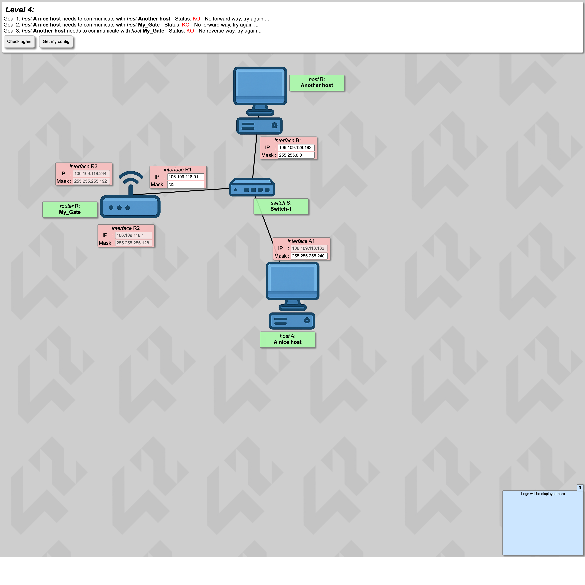
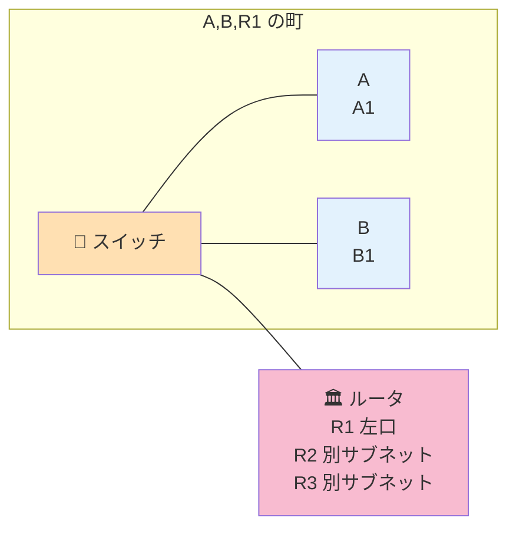

# Level 4 — ルータ登場

!!! warning "⚠️ 数値は毎回ランダムに変わります"
    このページに書かれた IP アドレス・マスク・ルートの値は **前回プレイした時の一例** です。
    あなたの画面では違う数値になっているはずなので、**そのままコピペしても絶対に解けません**。
    真似するのは「どう考えて解くか」の手順だけ。数値は自分の画面から読み取って計算してください。

## このページは何？

初めて **ルータ** が登場するレベル。A, B, R1 が同じスイッチ配下にいて、
R はさらに R2, R3 という別サブネット用の口も持っている。
**R2, R3 のサブネットと重ならない範囲** で A, B, R1 を同じ町に収める必要がある。

---

## このレベルで学ぶこと

- ルータの各インターフェイスは **別サブネット**
- サブネット同士は **重なってはいけない**
- 固定された他口の範囲から「使えない範囲」を除外する考え方

---

## 📷 問題画面

[](../images/screenshots/level4.png)

---

## 🗺️ トポロジー



---

## 🔒 固定値

| IF | IP | マスク | 編集可 |
|:---|:---|:---|:-:|
| A1 | `68.80.117.132` | `255.255.255.240` (/28) | マスクのみ |
| B1 | `68.80.127.193` | `255.255.0.0` | 両方 |
| R1 | `68.80.117.91` | /23 | 両方 |
| R2 | `68.80.117.1` | `255.255.255.128` (/25) | 不可 |
| R3 | `68.80.117.244` | `255.255.255.192` (/26) | 不可 |

---

## 🧠 考え方

### Step 1: A1 の /28 ブロックを特定

A1 の IP は第 4 オクテットが `.132`、マスクは `/28` で固定。`/28` の **ブロックサイズは 16**。

<div class="step-flow">
  <div class="step"><span class="step-num">1</span>A1 の値<br><code>.132</code></div>
  <div class="step"><span class="step-num">2</span>マスク<br><code>/28</code><br>幅 16</div>
  <div class="step"><span class="step-num">3</span>132 ÷ 16<br>= 8.25<br>切り捨て <b>8</b></div>
  <div class="step"><span class="step-num">4</span>8 × 16<br>= <b>128</b></div>
  <div class="step"><span class="step-num">5</span>ブロック先頭<br><code>.128/28</code></div>
</div>

→ A1 は `.128/28` ブロックに属する（範囲 `.128〜.143`、使える IP は `.129〜.142`）。

### Step 2: R2, R3 のサブネットを確認して被らないか見る

**R2 のブロック**: IP `.1` / マスク `/25`（幅 128）→ 先頭 `.0/25`、占有 `.0〜.127`。

**R3 のブロック**: IP `.244` / マスク `/26`（幅 64）→ 下の計算で先頭を求める。

<div class="step-flow">
  <div class="step"><span class="step-num">1</span>R3 の値<br><code>.244</code></div>
  <div class="step"><span class="step-num">2</span>マスク<br><code>/26</code><br>幅 64</div>
  <div class="step"><span class="step-num">3</span>244 ÷ 64<br>= 3.8…<br>切り捨て <b>3</b></div>
  <div class="step"><span class="step-num">4</span>3 × 64<br>= <b>192</b></div>
  <div class="step"><span class="step-num">5</span>ブロック先頭<br><code>.192/26</code></div>
</div>

A1 の `.128/28`（= `.128〜.143`）は R2 の `.0〜.127` とも R3 の `.192〜.255` とも **重ならない** ✓

全体を一覧で見ると:

| ブロック | 占有している人 | 範囲 | 状態 |
|:---|:---|:---|:---|
| `.0/25` | R2 | `.0〜.127` | 🟥 使用済み |
| **`.128/28`** | **A, B, R1（ここを使う）** | `.128〜.143` | 🟩 ここに収める |
| `.144/28`〜`.176/28` | — | `.144〜.191` | ⬜ 空き（今回は未使用） |
| `.192/26` | R3 | `.192〜.255` | 🟥 使用済み |

### Step 3: 全員 /28 に揃える

- A1 マスク → そのまま `/28` = **`255.255.255.240`**
- R1 IP → `.129〜.142` の空いている値、例 **`68.80.117.129`**、マスク **`255.255.255.240`**
- B1 IP → 同上、例 **`68.80.117.130`**、マスク **`255.255.255.240`**

---

## ✅ 解答例

```
A1 Mask → 255.255.255.240
R1 IP   → 68.80.117.129,  Mask → 255.255.255.240
B1 IP   → 68.80.117.130,  Mask → 255.255.255.240
```

---

## 🎓 このレベルの抽象的な学び

!!! tip "転用できる考え方"
    **「リソース空間の分割と排他」**。
    1 つの大きな空間（/24）を複数の用途（R2, R3, 今回のスイッチ配下）で **被らないように分ける**。
    メモリ管理、スケジューリング、データベースのシャード設計、全部同じ発想。

---

## ⚠️ よくあるミス

!!! warning "R2 や R3 のサブネットと被る範囲を選ぶ"
    例えば `.100/28` を選ぶと R2 の `.0/25` (`.0〜.127`) と重なる → 通信失敗。
    **他の口の占有範囲を先に確認** してから使える範囲を決める。

!!! warning "R1 だけマスクを変えて A, B のマスクを忘れる"
    スイッチ配下は **全員同じマスク**。片方忘れて赤いまま。

---

## ▶️ 次に読むページ

[Level 5 — ルーティング初登場](level5.md)
