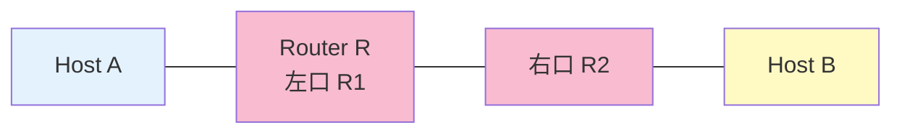

# Level 5 — ルーティング初登場

!!! warning "⚠️ 数値は毎回ランダムに変わります"
    このページに書かれた IP アドレス・マスク・ルートの値は **前回プレイした時の一例** です。
    あなたの画面では違う数値になっているはずなので、**そのままコピペしても絶対に解けません**。
    真似するのは「どう考えて解くか」の手順だけ。数値は自分の画面から読み取って計算してください。

## このページは何？

ルータを挟んで **異なるサブネットの A と B を通信させる** レベル。
**ゲートウェイ** と **ルーティング** を初めて明示的に書かされる問題。

---

## このレベルで学ぶこと

- ルータの両口は別サブネット → A と B は直接繋がらない
- A は default route で R1 に投げる
- B も default route で R2 に投げる
- ルータは **自動的に** 両サブネットを知っているので route 追加は不要

---

## 📷 問題画面

[](../images/screenshots/level5.png)

---

## 🗺️ トポロジー



---

## 🔒 固定値

| | 値 | 編集可 |
|:---|:---|:-:|
| A route | `10..0.0.0/8` ← typo | 両方 |
| A gate | `192.168.0.254` ← 暫定値 | 両方 |
| B route | `default` | gate のみ |
| B gate | `192.168.0.254` ← 暫定値 | gate のみ |
| A1 | `104.198.14.2` /24 | 両方 |
| B1 | `192.168.42.42` /29 | 両方 |
| R1 | `44.166.160.126` /25 | 不可 |
| R2 | `150.40.107.254` /18 | 不可 |

---

## 🧠 考え方

### Step 1: A の町を R1 に合わせる

R1 は `44.166.160.126/25` で固定。まず町の先頭を求める（`/25` はブロック幅 128）:

<div class="step-flow">
  <div class="step"><span class="step-num">1</span>R1 の値<br><code>.126</code></div>
  <div class="step"><span class="step-num">2</span>マスク<br><code>/25</code><br>幅 128</div>
  <div class="step"><span class="step-num">3</span>126 ÷ 128<br>= 0.98…<br>切り捨て <b>0</b></div>
  <div class="step"><span class="step-num">4</span>0 × 128<br>= <b>0</b></div>
  <div class="step"><span class="step-num">5</span>町の先頭<br><code>.0/25</code><br>住人 <code>.1〜.126</code></div>
</div>

A1 はこの町に入る必要がある。

- A1 IP → **`44.166.160.1`**（空いている住人）
- A1 Mask → **`255.255.255.128`**（/25）

### Step 2: A のゲートウェイ・ルート

- A の route → **`0.0.0.0/0`**（= default）: typo `10..0.0.0/8` を直す
- A の gate → **`44.166.160.126`**（R1 の IP、= 同じ町の玄関）

### Step 3: B の町を R2 に合わせる

R2 は `150.40.107.254/18` で固定。`/18` は第 3 オクテットの上位 2 ビットまでがネットワーク部:

<div class="step-flow">
  <div class="step"><span class="step-num">1</span>マスク<br><code>/18</code><br>= <code>255.255.192.0</code></div>
  <div class="step"><span class="step-num">2</span>第 3 オクテット<br><code>107 AND 192</code><br>= <b>64</b></div>
  <div class="step"><span class="step-num">3</span>町の先頭<br><code>150.40.64.0/18</code></div>
  <div class="step"><span class="step-num">4</span>使える IP<br><code>150.40.64.1</code><br>〜 <code>.127.254</code></div>
</div>

- B1 IP → **`150.40.64.1`**
- B1 Mask → **`255.255.192.0`**

### Step 4: B のゲートウェイ

- B の gate → **`150.40.107.254`**（R2 の IP）
- B の route は `default` 固定なので変えられない

---

## ✅ 解答例

```
A1 IP   → 44.166.160.1,     Mask → 255.255.255.128
A route → 0.0.0.0/0,        A gate → 44.166.160.126
B1 IP   → 150.40.64.1,      Mask → 255.255.192.0
B gate  → 150.40.107.254
```

---

## 🎓 このレベルの抽象的な学び

!!! tip "転用できる考え方"
    **「中継の存在を意識する」**。
    直接話せない相手とのやり取りには **中継人（ルータ）** が必要で、
    相手の最寄り中継人を知らないと届けられない。
    これは社内の稟議ルートや国際郵便と同じ発想。

!!! tip "default route の意味"
    「知らない宛先 = とりあえず玄関に投げる」は、
    「分からない問い合わせは受付に」「未定義エラーはログに吐く」等、
    全ての**ケースベースのフォールバック処理**と同じ構造。

---

## ⚠️ よくあるミス

!!! warning "A のゲートウェイに R2 の IP を書く"
    A は R1 の左口しか見えない。R2 は別サブネットなので到達不可。
    **自分と同じ町にいる玄関 = R1 の IP** を書く。

!!! warning "A1 を R1 の町と違う値にする"
    例えば A1 を `44.166.160.200` にすると `.128/25` ブロックに入ってしまい、R1 の `.0/25` と違う町になる。

---

## ▶️ 次に読むページ

[Level 6 — Internet 越しの通信](level6.md) — 帰り道の概念が初登場
