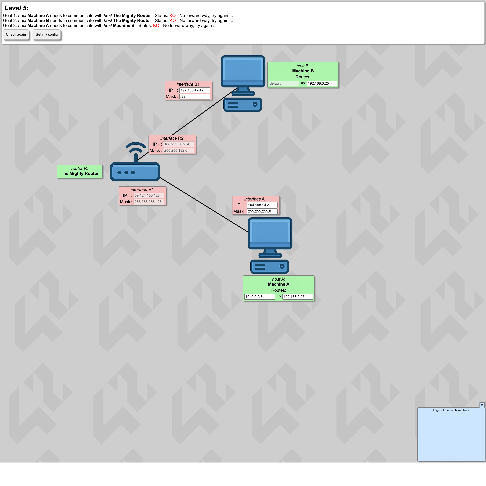
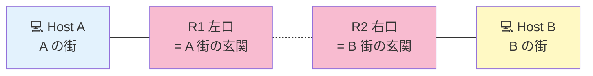

# Level 5 — ルーティング初登場

!!! warning "⚠️ 数値は毎回ランダムに変わります"
    このページに書かれた IP・マスク・ルートの値は **前回プレイした時の一例** です。
    あなたの画面では違う数値になっているはずなので、**そのままコピペしても絶対に解けません**。

> 🎯 **一言で言うと:** ルータ R を挟んで A と B が **別の街** に住む構成。A と B はそれぞれ「自分の街の玄関 = R の IF」を **gateway** に設定する。

## 📖 このページは何？

ルータが本格的に「**異なる街を繋ぐ集配局**」として動くレベル。
A と B は別の街に住んでいるので、直接話せない。**R 経由** で通信する必要があり、そのために **gateway** と **route** を初めて自分で書きます。

このレベルで身につくこと：

1. ルータの両足は **別サブネット** → A と B は直接繋がらない
2. ホストの **default route + gateway** = 「街の外行きはまずここに投げる」
3. ルータは **直結している街は自動で知っている** → 追加 routes は不要

---

## 📷 問題画面

[](../images/screenshots/level5.png)

---

## 🗺️ トポロジー



> 💡 R は **両方の街にまたがって立っている集配局**。R1 (左口) は A 街の住人、R2 (右口) は B 街の住人。

---

## 📺 画面の編集できる箇所

| 場所 | 状態 | あなたが直すか？ |
|---|---|---|
| **A1 IP / Mask** | **白 / 白** | **✅ 両方直す** |
| **A の route** | **白 (typo!)** | **✅ 直す → 0.0.0.0/0** |
| **A の gate** | **白** | **✅ 直す → R1 の IP** |
| R1 の IP / Mask | 薄ピンク | ❌ そのまま |
| **B1 IP / Mask** | **白 / 白** | **✅ 両方直す** |
| B の route | 薄ピンク (default 固定) | ❌ そのまま |
| **B の gate** | **白** | **✅ 直す → R2 の IP** |
| R2 の IP / Mask | 薄ピンク | ❌ そのまま |

---

## 🔒 固定値

| | 値 | 編集可 |
|:---|:---|:-:|
| A route | `10..0.0.0/8` ← typo | 両方 |
| A gate | `192.168.0.254` ← 暫定 | 両方 |
| B route | `default` | gate のみ |
| B gate | `192.168.0.254` ← 暫定 | gate のみ |
| A1 | `104.198.14.2` /24 | 両方 |
| B1 | `192.168.42.42` /29 | 両方 |
| R1 | `44.166.160.126` /25 | 不可 |
| R2 | `150.40.107.254` /18 | 不可 |

---

## 🧠 考え方

### Step 1: A の街を R1 に合わせる

R1 = `44.166.160.126/25` 固定。`/25` のブロック幅は 128：

<div class="step-flow">
  <div class="step"><span class="step-num">1</span>R1 の値<br><code>.126</code></div>
  <div class="step"><span class="step-num">2</span>マスク<br><code>/25</code><br>幅 128</div>
  <div class="step"><span class="step-num">3</span>126 ÷ 128<br>= 0 余り 126</div>
  <div class="step"><span class="step-num">4</span>0 × 128<br>= <b>0</b></div>
  <div class="step"><span class="step-num">5</span>町の先頭<br><code>.0/25</code><br>住人 <code>.1〜.126</code></div>
</div>

A1 をこの街に入れる：
- A1 IP → **`44.166.160.1`**（住人 .1〜.126 の中、.126 は R1 が使うので避ける）
- A1 Mask → **`255.255.255.128`** (/25)

### Step 2: A の route と gateway

- **A route → `0.0.0.0/0`** (= default route、typo `10..0.0.0/8` を修正)
- **A gate → `44.166.160.126`** (= R1 の IP、A と同じ街にある玄関)

### Step 3: B の街を R2 に合わせる

R2 = `150.40.107.254/18` 固定。`/18` は第 3 オクテットの上位 2 ビットがネットワーク部：

<div class="step-flow">
  <div class="step"><span class="step-num">1</span>マスク<br><code>/18</code><br>= <code>255.255.192.0</code></div>
  <div class="step"><span class="step-num">2</span>第3オクテ<br><code>107 AND 192</code><br>= <b>64</b></div>
  <div class="step"><span class="step-num">3</span>町の先頭<br><code>150.40.64.0/18</code></div>
  <div class="step"><span class="step-num">4</span>住人<br><code>150.40.64.1</code><br>〜 <code>.127.254</code></div>
</div>

- B1 IP → **`150.40.64.1`**
- B1 Mask → **`255.255.192.0`** (/18)

### Step 4: B の gateway

- **B gate → `150.40.107.254`** (= R2 の IP)
- B の route は `default` 固定なので変えられない

---

## 🎬 パケットの旅（A → B のゴール）

```
🚀 行き: A → B

Step 1: A (.1) が手紙を書く
   宛先: 150.40.64.1 (B)

Step 2: A が「B は同じ街？」を確認
   A の街 = 44.166.160.0/25
   B の住所 150.40.64.1 はこの街？ → ❌ NO (別の街)

Step 3: A は default route に従って R1 (=自分の街の玄関) に手紙を渡す
   ✅ 同じ街なので直接渡せる

Step 4: 集配局 R は手紙の宛先 (150.40.64.1) を見て:
   → 直結してる R2 側の街 (150.40.64.0/18) に該当
   → R2 経由で B に渡す
   ✅ 配達完了

📬 帰り: B → A も同じ流れで成立
```

---

## ✅ 解答例

```
A1 IP   → 44.166.160.1,    Mask → 255.255.255.128
A route → 0.0.0.0/0,        A gate → 44.166.160.126
B1 IP   → 150.40.64.1,      Mask → 255.255.192.0
B gate  → 150.40.107.254
```

---

## 🔗 関連概念

- 05 [ゲートウェイって何？](../01-basics/gateway.md)
- 06 [ルーティングテーブル](../01-basics/routing-table.md)
- 07 [双方向到達性](../01-basics/bidirectional.md)

---

## 🎓 このレベルの抽象的な学び

!!! tip "中継人（ルータ）の存在を意識"
    直接話せない相手とのやり取りには **中継人** が必要。
    相手の最寄り中継人を知らないと届けられない。
    社内稟議ルートや国際郵便と同じ発想。

!!! tip "default route = 「分からなければ受付に」"
    「知らない宛先 = とりあえず玄関に投げる」は、
    「分からない問い合わせは受付に」「未定義エラーはログに吐く」と同じ
    **ケースベースのフォールバック処理**。

---

## ⚠️ よくあるミス

!!! warning "A の gateway に R2 の IP を書く"
    A は R1 (= 自分の街の玄関) しか見えない。R2 は別の街なので到達不可。
    **自分と同じ街にいる玄関 = R1 の IP** を書く。

!!! warning "A1 を R1 の街と違うブロックに置く"
    例: A1 を `44.166.160.200` にすると `.128/25` ブロックに入る → R1 の `.0/25` と別の街 → 通信失敗。

!!! warning "A の route が typo のままで気づかない"
    `10..0.0.0/8` のドット 2 個や、`0.0.0.0./0` のような余計なドットに注意。

---

## ▶️ 次に読むページ

[Level 6 — Internet 越しの通信](level6.md) — 帰り道の概念が初登場！
