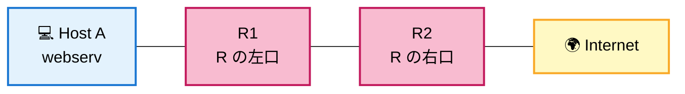
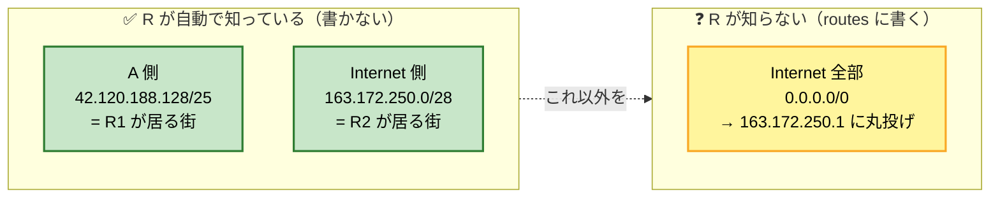
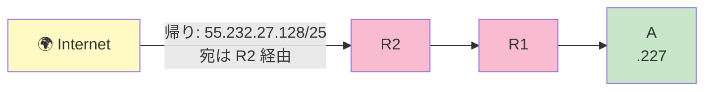

# Level 6 — Internet 越しの通信

!!! warning "⚠️ 数値は毎回ランダムに変わります"
    このページに書かれた IP・マスク・ルートの値は **前回プレイした時の一例** です。
    あなたの画面では違う数値になっているはずなので、**そのままコピペしても絶対に解けません**。

> 🎯 **一言で言うと:** **行き** は default route で R へ、**帰り** は Internet 側の routes に「自分の街への戻り道」を必ず書く。"No reverse way" が出たら帰り道の不備を疑う。

## 📖 このページは何？

初めて **Internet** が登場し、**帰りの route を自分で書く** ことを強制されるレベル。
NetPractice の最重要概念 **「双方向通信」** の入門編です。

このレベルで身につくこと：

1. Internet 側にも route 設定が必要 (= 帰り道)
2. 行きだけ通っても帰り道が無いと通信失敗 ("No reverse way")
3. /31 のような狭すぎる route は相手のサブネットを包含できない

---

## 🌟 このレベルで腑に落ちる 5 つの核心

L6 はネットワーク設計の **「双方向性」と「Internet 接続の作法」** が一気に見えるレベル。先に答えだけ並べると：

1. **通信は双方向、行きと帰りで別々に routes が必要** — A→Internet の行き道 (R の `0.0.0.0/0`) だけでは不十分。Internet→A の帰り道も Internet の routes に必ず書く
2. **ルータが直結で知っているサブネットには routes を書かない** ⭐ — R は自分のインターフェース R1 / R2 が繋がっているサブネット 2 つを **自動で**知っている。手書きするのは「**自分が直結していない宛先**」だけ — ここでは Internet 全部 (`0.0.0.0/0`) の 1 行で済む
3. **Internet 接続側はパブリック IP — プライベート IP は使えない** ⭐ — L6 のすべての IP が `42.x.x.x` / `55.x.x.x` / `163.x.x.x` のようなパブリック IP。`192.168.x.x` のようなプライベート IP は ISP で破棄され Internet には出られない（後述）
4. **routes の範囲は相手の街全体を包含する** — `/31` は `.0` と `.1` の 2 個だけ。A の街 `.128/25`（128 軒）の `.227` には届かない。**街の住所**（ネットワークアドレス + 適切なマスク）を書く
5. **エラーメッセージを読む** — "No forward way" = 行き道がない（R の routes 不足）、"No reverse way" = 帰り道がない（Internet の routes が狭すぎ）。**どっちが詰まっているかをエラーが教えてくれる**

---

## 📷 問題画面

[](../images/screenshots/level6.png)

---

## 🗺️ トポロジー



---

## 📺 画面の編集できる箇所

| 場所 | 何？ | 状態 | あなたが直すか？ |
|---|---|---|---|
| **A1 Mask** | A のマスク | 白 | ✅ 直す → /25 |
| **A の gate** | A のゲートウェイ | 白 | ✅ 直す → R1 の IP |
| A の route | A の route | 薄ピンク (0.0.0.0/0 固定) | ❌ そのまま |
| **R の route 左** | R の route 条件 | 白 (10.0.0.0/8) | ✅ 直す → 0.0.0.0/0 |
| R の route 右 | R の next hop | 薄ピンク | ❌ そのまま |
| R1 IP | R の左口 IP | 白 | (既に正しい場合多し) |
| **I の route 左** | Internet の戻り道 | 白 (狭すぎる!) | ✅ 直す → .128/25 |
| I の route 右 | next hop | 薄ピンク | ❌ そのまま |

→ 直すのは主に **A1 Mask, A gate, R の route 左, I の route 左** の 4 箇所。

---

## 🔒 固定値（抜粋）

| | 値 | 編集可 |
|:---|:---|:-:|
| A route | `0.0.0.0/0` | 両方 |
| A gate | `55.232.27.1` ← 暫定 | 両方 |
| R route | `10.0.0.0/8` → `163.172.250.1` | route のみ |
| **I route** | **`55.232.27.0/31`** ← 狭すぎる！ | route のみ |
| A1 | `55.232.27.227` | マスクのみ |
| R1 | `55.232.27.254` /25 | IP のみ |
| R2 | `163.172.250.12` /28 | 不可 |

---

## 🧠 考え方

### Step 1: A1 と R1 を同じ街に

R1 = `55.232.27.254/25` → 街 = `.128/25` (`.128〜.255`、住人 `.129〜.254`)。
A1 (`.227`) はこの範囲？ → ✅ YES

- **A1 Mask → `255.255.255.128`** (/25 に揃える)
- **A gate → `55.232.27.254`** (= R1 の IP)

### Step 2: 行き道 — R の route を `0.0.0.0/0` に

#### 🔍 先に「R が直結で知っているサブネット」を整理

R は **インターフェース R1（A 側）と R2（Internet 側）** を持っています。インターフェースを持っているサブネットは、**routes 欄に書かなくても自動で知っている**（直結ルート）。書く必要があるのは「**自分が直結していない宛先**」だけ。



→ つまり R の routes 欄に書くのは **`0.0.0.0/0` の 1 行だけ** で十分。「A 側の街」「Internet 直結の街」は **書く欄が無い**（自動扱い）。

!!! tip "鉄則"
    ルータの routes 欄に書くのは「**自分が直結で見えていない宛先**」のみ。
    直結している隣の街は黙っていても届けられる。

#### 行き道のロジック

`10.0.0.0/8` のままだと `8.8.8.8` (Internet) は該当しない → R が次にどこに送ればいいか分からず破棄 → **"No forward way"**。

→ **R route → `0.0.0.0/0`** (どんな宛先でも `163.172.250.1` に送る)

### Step 3: ⭐ 核心 — Internet の route を直す

!!! danger "なぜ I route が `.0/31` のままだとダメか"
    `/31` がカバーするのは **`.0` と `.1` の 2 つだけ**。
    A1 は `.227` なので **この範囲の外**。
    → Internet から A 宛てに返そうとしても「どこに送ればいいか分からない」 → 破棄
    → **"No reverse way"** エラー

修正: I route を **A の街 (`.128/25`) 全体** をカバーする範囲に変更。

→ **I route → `55.232.27.128/25`**

これで Internet は「`.128〜.255` 宛は R2 経由で送る」と判断できる。



---

## 🎬 パケットの旅（A → 8.8.8.8 のゴール）

郵便配達のアナロジーで簡略版を追ってみます：

```
🚀 行き: A (.227) → 8.8.8.8

A: default route → R1 (.254) ✅ 直接渡せる
R: routes 確認 → 0.0.0.0/0 にマッチ → 163.172.250.1 へ ✅
ISP → Internet → 8.8.8.8 (NetPractice 範囲外)


📬 帰り: 8.8.8.8 → A (.227)

Internet: routes 確認 → 55.232.27.128/25 にマッチ (.227 含まれる) → R2 へ ✅
R: .227 は直結の街 .128/25 → R1 経由で A へ ✅
配達完了
```

---

## ✅ 解答例

```
A1 Mask  → 255.255.255.128
A gate   → 55.232.27.254
R route  → 0.0.0.0/0          ⭐ 行き道の修正
I route  → 55.232.27.128/25   ⭐ 帰り道の修正 (核心)
```

---

## 🔗 関連概念

- 06 [ルーティングテーブル](../01-basics/routing-table.md)
- 07 [双方向到達性](../01-basics/bidirectional.md) — 最重要！
- 03 [CIDR 早見表](../01-basics/cidr.md) — `/25` `/31` のサイズ感

---

## 🎓 このレベルの抽象的な学び

!!! tip "⭐ 最重要: 通信は双方向"
    A→Internet の行きだけでなく、Internet→A の帰り道も設計する必要がある。
    これは **API 設計で request/response 両方を考える** のと同じ。
    「投げた後何が返ってくるか」まで設計しないと機能は完成しない。

!!! tip "route の範囲を相手に合わせる"
    route は **広すぎても狭すぎてもダメ**。
    狭いと相手を含まず、広いと他の LAN を巻き込んで誤配送。
    「ちょうどいい粒度」を選ぶ感覚は、例外キャッチや正規表現の指定と同じ。

---

## 🚫 プライベート IP を Internet 越しで使ってはいけない（このレベル特有）

L6 の **すべての IP が意図的にパブリック IP**（`42.x.x.x` / `55.x.x.x` / `163.x.x.x`）。
もし誰かが Internet 側で `192.168.x.x` のようなプライベート IP を使ったらどうなるか？

| IP の種類 | 例 | Internet 越しで使える？ |
|---|---|:-:|
| **パブリック IP** | `42.120.188.227`（L6 の A1） | ✅ 使える |
| **プライベート IP** | `192.168.0.1`, `10.0.0.5`, `172.16.0.1` | ❌ **ISP で破棄** |
| ループバック | `127.0.0.1` | ❌ 自分の中だけ |

### なぜプライベート IP は Internet に出られないのか

プライベート IP は **「世界中の家庭・社内 LAN で重複して使い回されている」** から：

- あなたの家の Wi-Fi ルータ: `192.168.0.1`
- 隣の家の Wi-Fi ルータ: 同じく `192.168.0.1`
- 数百万軒で同じ `192.168.0.1` が並走

→ もし `192.168.0.1` 宛のパケットが Internet に流れ出したら、**数百万件のうちどれが宛先か特定不能**。だから ISP のルータは「プライベート IP 宛・プライベート IP 発のパケットは Internet には流さない」ルール（**RFC 1918**）を持つ。

→ L6 のように **Internet 接続が前提のレベル**では、すべての IP に**パブリック IP** を使うのが必然。逆に L7 のような閉じた LAN だと `192.168.0.0/24` のようなプライベート IP も登場します。

詳しい解説 → [01. IP アドレスって何？](../01-basics/ip-address.md#private-vs-public)

---

## ⚠️ よくあるミス

!!! warning "Internet 側の route を変え忘れる"
    A 側だけ直して「行けない！」と詰まるパターンの最頻出。
    **Internet の route が A を含むか** を必ず確認。

!!! warning "A を R1 と違う /25 ブロックに入れる"
    例: A1 を `.100` にすると R1 (`.254`) と別ブロック。同じ /25 ブロックに入れる必要がある。

!!! warning "R の route が `10.0.0.0/8` のまま"
    `8.8.8.8` 宛は `10.x.x.x` ではないのでマッチしない → "No forward way"。
    `0.0.0.0/0` にすれば全宛先カバー。

---

## ▶️ 次に読むページ

[Level 7 — サブネット分割設計](level7.md)
