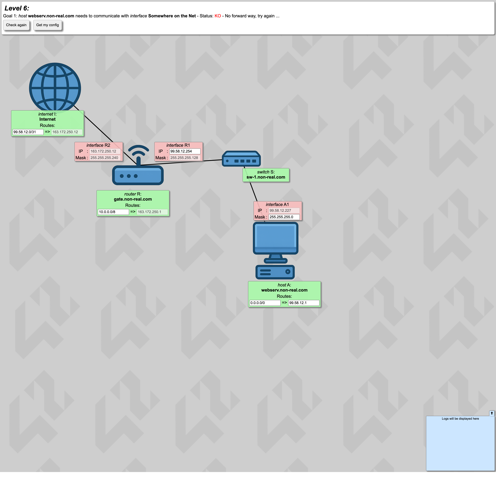
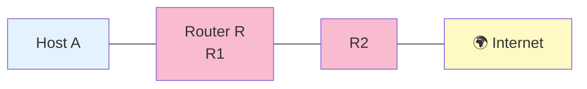
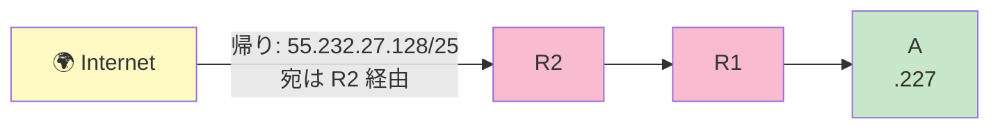

# Level 6 — Internet 越しの通信

!!! warning "⚠️ 数値は毎回ランダムに変わります"
    このページに書かれた IP アドレス・マスク・ルートの値は **前回プレイした時の一例** です。
    あなたの画面では違う数値になっているはずなので、**そのままコピペしても絶対に解けません**。
    真似するのは「どう考えて解くか」の手順だけ。数値は自分の画面から読み取って計算してください。

## このページは何？

初めて **Internet** が登場し、**帰りの route を自分で書く** ことを強制されるレベル。
NetPractice 最重要概念「**双方向到達性**」の入門編。

---

## このレベルで学ぶこと

- Internet 側にも route 設定が必要
- 行きだけ設定しても帰りが無ければ通信失敗
- /31 のような狭すぎる route は相手を包含できない

---

## 📷 問題画面

[](../images/screenshots/level6.png)

---

## 🗺️ トポロジー



---

## 🔒 固定値（抜粋）

| | 値 | 編集可 |
|:---|:---|:-:|
| A route | `0.0.0.0/0` | 両方 |
| A gate | `55.232.27.1` ← 暫定 | 両方 |
| R route | `10.0.0.0/8` → `163.172.250.1` | route のみ |
| **I route** | **`55.232.27.0/31`** ← 狭すぎる！ | gate のみ |
| A1 | `55.232.27.227` | マスクのみ |
| R1 | `55.232.27.254` /25 | IP のみ |
| R2 | `163.172.250.12` /28 | 不可 |

---

## 🧠 考え方

### Step 1: A1 と R1 を同じ町に

R1 = `55.232.27.254/25` → 町は `.128/25`（`.128〜.255`、住人 `.129〜.254`）。
A1 `.227` はこの範囲に入っている ✓

- A1 Mask → **`255.255.255.128`**（/25 に合わせる）
- A gate → **`55.232.27.254`**（R1 の IP）

### Step 2: 核心 — Internet の route を直す ⭐

**I route が `55.232.27.0/31`** のままだと何が起きる？

```
/31 → 住人 .0 と .1 しかカバーしない
A1 は .227 → /31 の範囲外

→ Internet から A 宛ての返信パケットが
  「どこに送ればいいか分からない」 → 失われる
```

**修正**: I route を **A の町 (`.128/25`) 全体** をカバーする範囲に変更。

→ **I route = `55.232.27.128/25`**

これで Internet は「`.128〜.255` への返信は R2 経由で送る」と判断できる。



---

## ✅ 解答例

```
A1 Mask  → 255.255.255.128
A gate   → 55.232.27.254
I route  → 55.232.27.128/25     ⭐ ここが核心
R1 IP    → 55.232.27.254 (変更なし)
R route  → 10.0.0.0/8 (変更なし)
```

---

## 🎓 このレベルの抽象的な学び

!!! tip "⭐ 最重要: 通信は双方向"
    A→Internet の行きだけでなく、Internet→A の帰り道も設計する必要がある。
    これは **API 設計で request/response 両方を考える** のと同じ。
    「投げた後何が返ってくるか」まで設計しないと機能は完成しない。

!!! tip "route の範囲を相手に合わせる"
    route は **広すぎても狭すぎてもダメ**。
    狭いと相手を含まず、広いと他の LAN を巻き込んで誤配送する。
    「ちょうどいい粒度」を選ぶ感覚は、例外キャッチや正規表現の指定と同じ。

---

## ⚠️ よくあるミス

!!! warning "Internet 側の route を変え忘れる"
    A 側だけ直して「行けない！」と詰まるパターンの最頻出。
    **Internet の route が A を含むか** を必ず確認。

!!! warning "A を R1 と違う /25 ブロックに入れる"
    例えば A1 を `.100` にすると R1 (`.254`) と別ブロック。同じ /25 に入れる必要がある。

---

## ▶️ 次に読むページ

[Level 7 — サブネット分割設計](level7.md)
