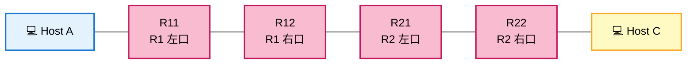
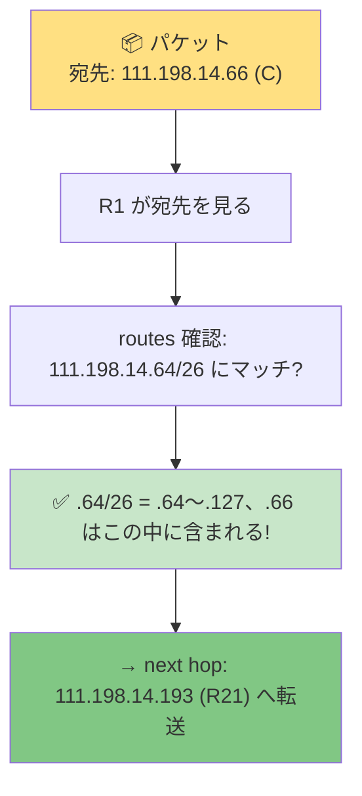
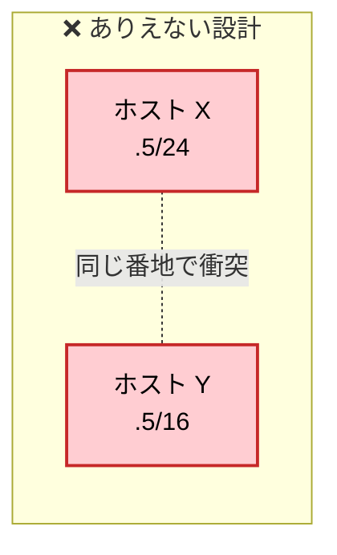

# Level 7 — サブネット分割設計

!!! warning "⚠️ 数値は毎回ランダムに変わります"
    このページに書かれた IP・マスク・ルートの値は **前回プレイした時の一例** です。
    あなたの画面では違う数値になっているはずなので、**そのままコピペしても絶対に解けません**。

> 🎯 **一言で言うと:** 1 つの `/24` を **3 つの `/26`** に分割。固定 IP の位置から「どのブロックがどのリンク用か」を逆算する。

## 📖 このページは何？

1 つの `/24` アドレス空間を **3 つの独立したリンク** に分割するレベル。
全インターフェースが `111.198.14.X/24` で、A↔R1、R1↔R2、R2↔C の 3 つのリンクをそれぞれ別のサブネットにする必要があります。

このレベルで身につくこと：

1. 1 つの `/24` を複数の `/26` に **分割** する
2. **固定 IP の位置** から「このブロックに属する」と逆算
3. ルータ間リンクも 1 つの **独立したサブネット**

---

## 🌟 このレベルで腑に落ちる 5 つの核心

L7 はネットワーク設計の **本質** が一気に見えるレベル。先に「答え」だけ並べると：

1. **3 つのサブネット設計が必須** — 1 本の `/24` を **A 側 LAN / ルータ間 / C 側 LAN** の **3 つに切る**。スイッチが無く全部ルータ越しなので、各リンクは別サブネットになる
2. **routes は「最終宛先 + 直近で渡せる相手」** の 2 点セットで書く — 「C の街宛 (`.64/26`) → 隣人ルータ (`.193`) に渡せ」のように、**ホストの IP**ではなく **街の住所**（ネットワークアドレス）を左に、**自分の直結内**にいる隣人ルータの IP を右に書く
3. **スイッチ＝同サブネット内、ルータ＝サブネット跨ぎ** — このレベルにスイッチは無いので、各リンクは「ルータの 2 口を直接ケーブルで結んだ」状態。**両端のサブネットは必ず別** に設計する
4. **IP は同じネットワーク内で一意** — `.1` も `.254` も全体で 1 個ずつ。ルータを跨いでも同じネットワーク内で IP の重複は不可。「マスクが違えば同じ IP でも区別できるのでは？」というよくあるもやもやも、後の「🆔 IP の一意性」セクションで完全に解消します
5. **行きと帰りで別々に routes が必要** — R1 に「C の街への道」、R2 に「A の街への道」を **両方** 書かないと片道通信になり Goal が緑にならない

詳細は下の「🧠 考え方」で順番に解いていきます。

---

## 📷 問題画面

[](../images/screenshots/level7.png)

---

## 🗺️ トポロジー



**3 つの独立リンク**:

1. A ↔ R11 (A 側 LAN)
2. R12 ↔ R21 (ルータ間)
3. R22 ↔ C (C 側 LAN)

---

## 📺 画面の編集できる箇所

| 場所 | 状態 | あなたが直すか？ |
|---|---|---|
| **全 IF Mask** | 大半が白 | **✅ 全て /26 に揃える** |
| **A1, C1, R21, R22 の IP** | 白 | **✅ 各リンクに合うように決める** |
| R11 IP (.1) | 薄ピンク | ❌ そのまま |
| R12 IP (.254) | 薄ピンク | ❌ そのまま |
| **A, C の routes (default)** | 白 | **✅ default + gate 設定** |
| **R1, R2 の routes** | 白 | **✅ 反対側 LAN への route 追加** |

---

## 🔒 固定値

| IF | IP | マスク | 編集可 |
|:---|:---|:---|:-:|
| R11 | `111.198.14.1` | /24 | マスクのみ |
| R12 | `111.198.14.254` | /24 | マスクのみ |

→ 全 IF の IP/Mask が `111.198.14.X/24`。同じ /24 を **3 分割** する必要がある。

---

## 🧠 考え方

### Step 1: /24 をピザのように 4 等分する

このレベルでは **3 つの独立したリンク** が必要だけど、全 IF が同じ `111.198.14.x/24` 帯を共有している。
→ **1 つの `/24` ピザを切り分けて、各リンクに 1 切れずつ配る** のが解法。

#### 「`/24`」って何個分のアドレス？

```
/24 = 256 個のアドレス (.0 〜 .255)
```

これを **何切れに切るか** はマスクの長さで決まります：

<div class="step-flow">
  <div class="step"><span class="step-num">1</span>/25 で切る<br>= 2 等分<br>(128 ずつ)</div>
  <div class="step"><span class="step-num">2</span>/26 で切る<br>= <strong>4 等分</strong><br>(64 ずつ)</div>
  <div class="step"><span class="step-num">3</span>/27 で切る<br>= 8 等分<br>(32 ずつ)</div>
  <div class="step"><span class="step-num">4</span>/28 で切る<br>= 16 等分<br>(16 ずつ)</div>
</div>

**今回は 3 リンクが必要 → 4 等分すれば 1 つ余裕を持って配れる → `/26` が最適**

#### `/24` を `/26` で 4 等分するとこうなる（視覚図）

<div class="subnet-ruler cols-4">
  <div class="subnet-block empty">
    <span class="block-name">.0/26</span>
    <span class="block-range">.0〜.63</span>
    <span class="block-host-range">住人 .1〜.62</span>
  </div>
  <div class="subnet-block empty">
    <span class="block-name">.64/26</span>
    <span class="block-range">.64〜.127</span>
    <span class="block-host-range">住人 .65〜.126</span>
  </div>
  <div class="subnet-block empty">
    <span class="block-name">.128/26</span>
    <span class="block-range">.128〜.191</span>
    <span class="block-host-range">住人 .129〜.190</span>
  </div>
  <div class="subnet-block empty">
    <span class="block-name">.192/26</span>
    <span class="block-range">.192〜.255</span>
    <span class="block-host-range">住人 .193〜.254</span>
  </div>
</div>

→ **これら 4 切れから、3 つのリンク用に 3 切れを選ぶ**。

### Step 2: 固定 IP から「どの切れがどのリンク？」を決める

固定値が **どのブロックに入るか** で各リンクの場所が確定します：

- **R11 = `.1`** → `.0/26` ブロック (`.0〜.63` の中) → **A 側 LAN がここ**
- **R12 = `.254`** → `.192/26` ブロック (`.192〜.255` の中) → **ルータ間リンクがここ**

残りの 2 切れ (`.64/26` と `.128/26`) のどちらかを **C 側 LAN** に。今回は `.64/26` を使う。

#### 割当後の地図

<div class="subnet-ruler cols-4">
  <div class="subnet-block target">
    <span class="block-name">.0/26</span>
    <span class="block-range">.0〜.63</span>
    <span class="block-purpose">A 側 LAN</span>
    <span class="block-host-range">R11=.1, A1=.2</span>
  </div>
  <div class="subnet-block target-2">
    <span class="block-name">.64/26</span>
    <span class="block-range">.64〜.127</span>
    <span class="block-purpose">C 側 LAN</span>
    <span class="block-host-range">R22=.65, C1=.66</span>
  </div>
  <div class="subnet-block empty">
    <span class="block-name">.128/26</span>
    <span class="block-range">.128〜.191</span>
    <span class="block-purpose">未使用</span>
  </div>
  <div class="subnet-block target">
    <span class="block-name">.192/26</span>
    <span class="block-range">.192〜.255</span>
    <span class="block-purpose">ルータ間</span>
    <span class="block-host-range">R12=.254, R21=.193</span>
  </div>
</div>

<div class="subnet-legend">
  <span class="legend-item"><span class="legend-swatch target"></span>A 側 LAN (緑)</span>
  <span class="legend-item"><span class="legend-swatch target-2"></span>C 側 LAN (黄)</span>
  <span class="legend-item"><span class="legend-swatch empty"></span>未使用 (グレー)</span>
</div>

### Step 3: 全員のマスクを /26 に

`255.255.255.192` で統一。

### Step 4: ルーティング

!!! info "🤔 ここで初めて見る人が必ず疑問に思うこと"
    routes に書く `.0/26` や `.64/26` の **`.0` `.64` っていったい何？**
    なんでホストの IP（`.66` とか）じゃなくて、こんな数字を書くの？

    → これを **完全に解消するセクション** が次の「💡 routes の書き方の正体」です。

#### 💡 routes の書き方の正体 — 「街の住所」を書く欄

routes の左側は「**特定のホストの住所**」じゃなくて、**「街全体の住所」** を書く欄です。
街の住所 = **そのブロックの先頭アドレス（= ネットワークアドレス）**。

##### 各街の「先頭アドレス」とは？

Step 2 で作った地図をもう一度見てみます。各ブロックの **左端の数字** が「街の住所」：

<div class="subnet-ruler cols-4">
  <div class="subnet-block target">
    <span class="block-name">⬇️ .0</span>
    <span class="block-range">.0/26<br>(.0〜.63)</span>
    <span class="block-purpose">A の街<br>住所 = .0</span>
  </div>
  <div class="subnet-block target-2">
    <span class="block-name">⬇️ .64</span>
    <span class="block-range">.64/26<br>(.64〜.127)</span>
    <span class="block-purpose">C の街<br>住所 = .64</span>
  </div>
  <div class="subnet-block empty">
    <span class="block-name">⬇️ .128</span>
    <span class="block-range">.128/26<br>(.128〜.191)</span>
    <span class="block-purpose">未使用</span>
  </div>
  <div class="subnet-block target">
    <span class="block-name">⬇️ .192</span>
    <span class="block-range">.192/26<br>(.192〜.255)</span>
    <span class="block-purpose">ルータ間<br>住所 = .192</span>
  </div>
</div>

→ **A の街の住所 = `.0`**、**C の街の住所 = `.64`**、**ルータ間の街の住所 = `.192`**。

これらが routes に出てくる「マジックな数字」の正体！

##### routes 表記の構造

```
[街の住所] / [マスク] => [次に渡す相手のIP]
   ↑           ↑              ↑
 .0 とか      /26          R21 の IP とか
 .64 とか
```

**例の解読:**

| routes の表記 | 意味 |
|---|---|
| `111.198.14.0/26 => 111.198.14.254` | 「**A の街宛 (.0/26)** のパケットは **R12 (.254) に渡せ**」 |
| `111.198.14.64/26 => 111.198.14.193` | 「**C の街宛 (.64/26)** のパケットは **R21 (.193) に渡せ**」 |

→ **64** は **C の街の先頭アドレス**。C のホスト IP `.66` を書くんじゃなくて、**C が住んでる街の住所** を書く。

#### 🎯 ルータ視点での処理イメージ

R1 が「C のホスト (`.66`) 宛」のパケットを受け取った時の動き：



> 💡 **要点:** ルータは「**ホスト 1 軒ずつ**」を覚えるんじゃなくて、「**街単位**」で覚える。
> だから routes には街の住所 (`.64/26`) を書き、ルータは届いたパケットの宛先がその街に含まれるかを判定する。

#### では、各 routes を埋めていく

##### A 側ホストの routes (default で R11 へ丸投げ)

```
A route → 0.0.0.0/0       (= 全部の宛先)
A gate  → 111.198.14.1    (= R11)
```

→ A は自分の街 (`.0/26`) の外への通信は全部 R11 (玄関) に投げる。

##### C 側ホストの routes (同様に default で R22 へ)

```
C route → 0.0.0.0/0
C gate  → 111.198.14.65   (= R22)
```

##### R1 のルート (C の街への道を教える) ⭐

R1 は **直結している A の街 (.0/26)** と **ルータ間 (.192/26)** は知っているけど、**C の街 (.64/26) は知らない**。
→ 「C の街 (.64/26) は R21 (.193) 経由」と教えてあげる：

```
R1 route → 111.198.14.64/26 → gate: 111.198.14.193 (R21)
              ↑                          ↑
        C の街の住所               R21 の IP (R1 の隣人)
```

##### R2 のルート (A の街への道を教える) ⭐

R2 は **C の街 (.64/26)** と **ルータ間 (.192/26)** は直結で知っているけど、**A の街 (.0/26) は知らない**。
→ 「A の街 (.0/26) は R12 (.254) 経由」と教えてあげる：

```
R2 route → 111.198.14.0/26 → gate: 111.198.14.254 (R12)
              ↑                         ↑
        A の街の住所              R12 の IP (R2 の隣人)
```

---

## 🆔 寄り道：IP の一意性と「マスクが違えば同じでもいい？」のもやもや

L7 を解いていて、こんな疑問が湧きませんか：

- 「**同じネットワーク内で、同じ IP が 2 個あってもいいの？**」
- 「**マスクが違えば、同じ `.5` を 2 箇所で使い分けられる？**」

結論を先に書くと：

!!! tip "この章の鉄則"
    **同じネットワーク内では、IP アドレスは一意でなければならない**。
    マスクが違っても、**同じ IP を別の場所に振ることはできない**（NAT を挟まない限り）。

### なぜ一意性が必要？

ホスト A が「`.66` 宛にパケットを送りたい」と思ったとき：

- もし `.66` が複数あったら、ルータは **どの `.66` に送ればいいか判断できない**
- パケットの宛先は **IP 1 つ**。同じ番地の家が 2 軒あったら配達不能

ローカル LAN（同じスイッチ配下）でも、ルータを跨いだ別サブネットでも、**同じ IP** が 2 箇所にあれば配達は失敗します。

### 「マスクで切る = 同じ IP でも区別できる」のではない

マスクの役割は **IP 空間の中で「ここから ここまでが 1 つの街」と区切る**こと。
マスクは「**街の境界線**」を決める道具で、「**個々の住所**」を別物にする魔法ではありません。



→ ルータは「`.5` 宛のパケットをどっちに送るか」判断できず、配達失敗。

### じゃあ、マスクが違うと何が変わるの？

マスクが変わると **「街の境界線が動く」** だけ。同じ `.66` でも、所属する街は変わります：

| マスク | `.66` が住む街 | 街の範囲 |
|---|---|---|
| `/24` | `.0/24` | `.0〜.255`（256 軒の大都市） |
| `/26` | `.64/26` | `.64〜.127`（64 軒の街） |
| `/28` | `.64/28` | `.64〜.79`（16 軒の小さな街） |

→ **同じ `.66`** がマスクによって**属する街は変わる**。でも **`.66` という個人の住所そのものは 1 つ**。

**「番地」と「街」は別の概念**。これが核心。

### このレベルでの実例

L7 では、`.1` (R11)、`.2` (A1)、`.66` (C1)、`.65` (R22)、`.193` (R21)、`.254` (R12) と **全部の IP が違う**。これは偶然ではなく、**設計上必然**：

- R11 と R12 は別サブネット同士のルータ → IP は別（`.1` vs `.254`）
- A1 と R11 は同じ A 側 LAN の住人 → サブネット内で別 IP（`.2` vs `.1`）
- どこにも `.X` の重複はない → **ネットワーク全体での一意性**

### NetPractice での確認方法

NetPractice は IP の **書式エラーや明らかな重複は自動で検出して赤く警告** します。Goal が緑にならない場合の半分はこの「うっかり重複」が原因。固定値が `.1` のところに自分で `.1` を入れていないか、**他の IF と同じ IP を書いていないか** を真っ先に確認してください。

---

## 🎬 パケットの旅（A → C のゴール）

```
🚀 行き: A → C

A: 自分の街 = .0/26、宛先 (C: .66) は .64/26 → 別の街
   → default route で R11 へ

R1: routes 確認
   直結: .0/26 (A 側) → 該当しない (宛先は .66)
   直結: .192/26 (ルータ間) → 該当しない
   追加 route: .64/26 → R21 → ✅ 該当
   → R21 へ

R2: routes 確認
   直結: .192/26 → 該当しない
   直結: .64/26 → ✅ 該当 (C のいる街)
   → R22 経由で C へ
   ✅ 配達完了


📬 帰り: C → A は同じ流れで成立
```

---

## ✅ 解答例

```
全マスク → 255.255.255.192 (/26)
A1  IP → 111.198.14.2
C1  IP → 111.198.14.66
R21 IP → 111.198.14.193
R22 IP → 111.198.14.65
A  route → 0.0.0.0/0,         gate → 111.198.14.1   (R11)
C  route → 0.0.0.0/0,         gate → 111.198.14.65  (R22)
R1 route → 111.198.14.64/26,  gate → 111.198.14.193 (R21)
R2 route → 111.198.14.0/26,   gate → 111.198.14.254 (R12)
```

---

## 🔗 関連概念

- 03 [CIDR 早見表](../01-basics/cidr.md) — `/26` のサイズ感
- 06 [ルーティングテーブル](../01-basics/routing-table.md)
- 07 [双方向到達性](../01-basics/bidirectional.md) — R1 と R2 両方に route 必要

---

## 🎓 このレベルの抽象的な学び

!!! tip "限られた空間を用途別に切り分ける"
    メモリを stack / heap / static に切るのと同じ。
    データベースのテーブル分割、マイクロサービスの境界設計でも同じ考え方。

!!! tip "固定値を手がかりに空間を埋める"
    R11 = `.1` と R12 = `.254` という **離れた 2 点** が決まっていると、
    「この 2 点が同じブロックでは成立しない → 別のサブネット」と逆算できる。
    制約を手がかりに残りを推理するのは **制約充足問題** と同じ。

---

## ⚠️ よくあるミス

!!! warning "ルータ間リンクを別マスクにする"
    3 つのサブネット全部を **同じマスク /26** で揃えるのが基本。
    違うマスクでも理論上は動くが設計がややこしい。

!!! warning "R1 と R2 のルーティングを片方だけ設定"
    R1 に「C 側への route」、R2 に「A 側への route」が **両方** 必要。
    片方だけだと双方向到達性が崩れる ("No reverse way" になる)。

---

## ▶️ 次に読むページ

[Level 8 — 2 つの LAN + Internet](level8.md)
