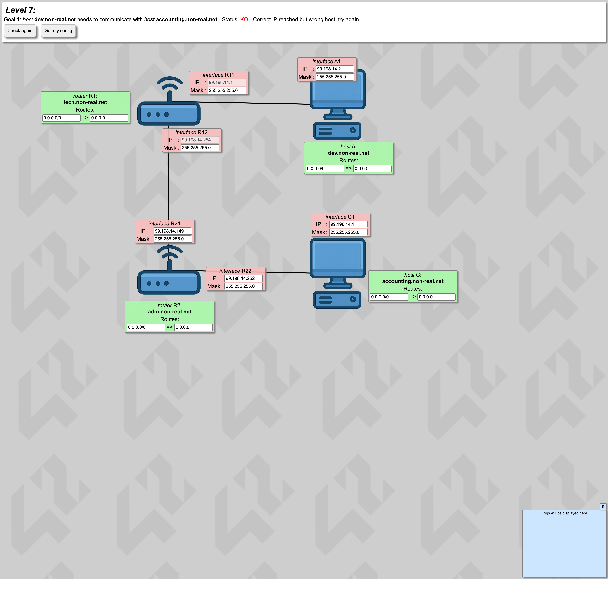
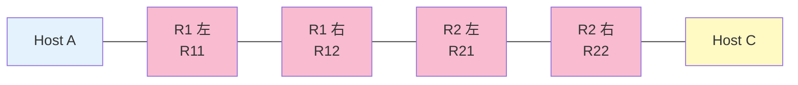

# Level 7 — サブネット分割設計

!!! warning "⚠️ 数値は毎回ランダムに変わります"
    このページに書かれた IP アドレス・マスク・ルートの値は **前回プレイした時の一例** です。
    あなたの画面では違う数値になっているはずなので、**そのままコピペしても絶対に解けません**。
    真似するのは「どう考えて解くか」の手順だけ。数値は自分の画面から読み取って計算してください。

## このページは何？

1 つの `/24` アドレス空間を **3 つの独立したリンク** に分割して割り当てるレベル。
サブネット設計力が試される。

---

## このレベルで学ぶこと

- 1 つの /24 を複数の /26 に分割する
- 固定 IP から「このブロックに属する」と逆算
- ルータ間リンクも 1 つのサブネット

---

## 📷 問題画面

[](../images/screenshots/level7.png)

---

## 🗺️ トポロジー



**3 つの独立リンク**:
1. A ↔ R11 (A 側 LAN)
2. R12 ↔ R21 (ルータ間)
3. R22 ↔ C (C 側 LAN)

---

## 🔒 固定値

| IF | IP | マスク | 編集可 |
|:---|:---|:---|:-:|
| R11 | `111.198.14.1` | /24 | マスクのみ |
| R12 | `111.198.14.254` | /24 | マスクのみ |

全ての IF の IP/Mask が `111.198.14.X/24`。同じ /24 を **3 分割** する必要がある。

---

## 🧠 考え方

### Step 1: /24 を /26 で 4 分割

/26 はブロックサイズ 64 → 4 ブロックに分割できる。

```
.0/26   → .0〜.63    (住人 .1〜.62)
.64/26  → .64〜.127  (住人 .65〜.126)
.128/26 → .128〜.191 (住人 .129〜.190)
.192/26 → .192〜.255 (住人 .193〜.254)
```

### Step 2: 固定 IP から各ブロックを割り当てる

- R11 = `.1` → **`.0/26` ブロック**（A 側 LAN）
- R12 = `.254` → **`.192/26` ブロック**（ルータ間リンク）

残り `.64/26` または `.128/26` を **C 側 LAN** に割り当てる。ここでは `.64/26` を使う。

| サブネット | 用途 | 含まれる IF |
|:---|:---|:---|
| `.0/26` | A 側 LAN | R11 (.1), A1 (.2) |
| `.64/26` | C 側 LAN | R22 (.65), C1 (.66) |
| `.192/26` | ルータ間 | R12 (.254), R21 (.193) |

### Step 3: 全員のマスクを /26 に

`255.255.255.192`。

### Step 4: ルーティング

A 側: A は default で R11 へ。

R1 は C 側 (`.64/26`) を **R21 経由** で送る:
```
R1 route: 111.198.14.64/26 → gate: 111.198.14.193 (R21)
```

C 側: C は default で R22 へ。

R2 は A 側 (`.0/26`) を **R12 経由** で送る:
```
R2 route: 111.198.14.0/26 → gate: 111.198.14.254 (R12)
```

---

## ✅ 解答例

```
全マスク → 255.255.255.192 (/26)
A1  IP → 111.198.14.2
C1  IP → 111.198.14.66
R21 IP → 111.198.14.193
R22 IP → 111.198.14.65
A  route → 0.0.0.0/0,         gate → 111.198.14.1   (R11)
C  route → 0.0.0.0/0,         gate → 111.198.14.65  (R22)
R1 route → 111.198.14.64/26,  gate → 111.198.14.193 (R21)
R2 route → 111.198.14.0/26,   gate → 111.198.14.254 (R12)
```

---

## 🎓 このレベルの抽象的な学び

!!! tip "転用できる考え方"
    **「限られた空間を用途別に切り分ける」**。
    メモリを stack / heap / static に切るのと同じ。
    データベースのテーブル分割、マイクロサービスの境界設計でも同じ考え方。

!!! tip "固定値を手がかりに空間を埋める"
    R11 = `.1` と R12 = `.254` という **離れた 2 点** が既に決まっていると、
    「この 2 点が同じブロックでは成立しない → 別のサブネット」と逆算できる。
    制約を手がかりに残りを推理するのは **制約充足問題** と同じ思考法。

---

## ⚠️ よくあるミス

!!! warning "ルータ間リンクを別マスクにする"
    3 つのサブネット全部を **同じマスク /26** で揃えるのが基本（違うマスクでも理論上は動くが設計がややこしい）。

!!! warning "R1 と R2 のルーティングを片方だけ設定"
    R1 に「C 側への route」、R2 に「A 側への route」が **両方** 必要。
    片方だけだと双方向到達性が崩れる。

---

## ▶️ 次に読むページ

[Level 8 — 2 つの LAN + Internet](level8.md)
