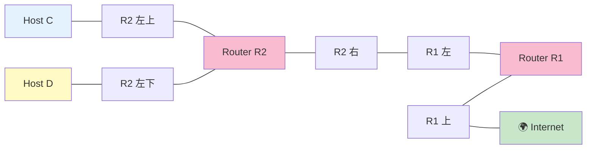

# Level 8 — 2 つの LAN + Internet

## このページは何？

**ルート集約 (route summarization / supernetting)** を使って、
**編集可能ルートが 1 本しかない** 制約の中で 2 つの LAN 両方への戻り経路を作るレベル。

---

## このレベルで学ぶこと

- **ルート集約** = 隣接する複数のサブネットを 1 つの広いプレフィックスで表す
- 固定値の制約から IP 配置を逆算する
- C と D を **隣接ブロック** に配置して /27 で包む技

---

## 📷 問題画面


---

## 🗺️ トポロジー



---

## 🔒 固定値（抜粋）

| | 値 | 意味 |
|:---|:---|:---|
| R2r1 gate | `161.138.113.62` **固定** | → **R13 の IP = これ** |
| Ir1 route | `161.138.113.0/26` **固定** | → R1-R2 間は /26 |
| D1 | `7.9.10.11/28` **固定** | → D の町 = `7.9.10.0/28` |
| R12 | `163.178.250.12/28` **固定** | ルータ-Internet 間 |

---

## 🧠 考え方の核心

### Step 1: 制約の連鎖を読む

!!! tip "逆算の出発点"
    **R2r1 gate = `161.138.113.62`** が固定 → R2 がパケットを投げる先は R13。
    よって **R13 の IP は `161.138.113.62`**。
    さらに Ir1 route = `161.138.113.0/26` が固定 → R1-R2 間のリンクは /26。

### Step 2: R13 と R21 を同じ /26 に

```
Ir1 route: 161.138.113.0/26 → 住人 .1〜.62
R13 = .62 (← R2r1 gate 固定値)
R21 = .1  (住人範囲内で空いている値)
全員マスク = 255.255.255.192 (/26)
```

### Step 3: D と C を隣接ブロックに配置 ⭐

問題: **R1 の編集可能ルートは 1 本のみ**。でも C と D の **両方への戻り道** が必要。

解決策: C と D を **隣り合った /28 ブロック** に配置 → **/27 でまとめて** 1 本のルートで包む。

```
D: 7.9.10.0/28   (住人 .1〜.14)  ─┐
                                    ├── 7.9.10.0/27 で包める (住人 .1〜.30)
C: 7.9.10.16/28  (住人 .17〜.30) ─┘
```

- D1 = `7.9.10.11` (固定)、D 町 = `.0/28`、R23 = `.1`
- C の町 = `.16/28`、R22 = `.17`、C1 = `.18`

### Step 4: R1 のルート

```
R1r2 route: 7.9.10.0/27 → gate: 161.138.113.1 (R21)
```

このルートが C (`.16〜.30`) と D (`.0〜.14`) **両方** をカバーする。

---

## ✅ 解答例

```
R13 IP → 161.138.113.62,  Mask → 255.255.255.192
R21 IP → 161.138.113.1,   Mask → 255.255.255.192
R23 IP → 7.9.10.1,        Mask → 255.255.255.240
D1  IP → 7.9.10.11         (変更なし)
D gate → 7.9.10.1
R22 IP → 7.9.10.17,       Mask → 255.255.255.240
C1  IP → 7.9.10.18,       Mask → 255.255.255.240
C gate → 7.9.10.17
R2r1 route → 0.0.0.0/0    (Internet 向けデフォルト)
R1r2 route → 7.9.10.0/27, gate → 161.138.113.1
Ir1 gate   → 163.178.250.12 (R12 の IP)
```

---

## 🎓 このレベルの抽象的な学び

!!! tip "⭐ ルート集約（supernetting）"
    隣接する複数のサブネットを **1 つの広いプレフィックス** で表現する技。
    **実世界の応用**:

    - クラウドの VPC ルートテーブル（リージョン単位で /16 集約）
    - 巨大 CDN のルート広告（複数 AS を 1 つのプレフィックスで外に見せる）
    - プログラムの case 文を **範囲で書く**（`if 0 <= x <= 15` を `if x & ~0xF == 0` で表現）

!!! tip "制約の連鎖を辿る"
    「固定値 A → したがって B が決まる → したがって C が決まる…」と
    **1 つの固定値から連鎖的に他の値を導く**。
    数独のマス埋めや論理パズルと同じ思考法。

---

## ⚠️ よくあるミス

!!! warning "C と D を離れた位置に配置して集約できなくなる"
    C を `.100/28` に置くと、D の `.0/28` と離れすぎて /27 で包めない。
    **常に「隣のブロックに置ける？」を意識**。

!!! warning "集約を /28 でやろうとする"
    /28 では 16 アドレスしかカバーできず、C と D のどちらか片方しか入らない。
    **2 ブロック = 32 アドレス = /27** が正解。

---

## ▶️ 次に読むページ

[Level 9 — 大ボス（6 ゴール）](level9.md)
