# Level 8 — 2 つの LAN + Internet

!!! warning "⚠️ 数値は毎回ランダムに変わります"
    このページに書かれた IP・マスク・ルートの値は **前回プレイした時の一例** です。
    あなたの画面では違う数値になっているはずなので、**そのままコピペしても絶対に解けません**。

> 🎯 **一言で言うと:** R1 で書ける routes が **1 本だけ**。C と D を **隣接 /28 ブロック** に置いて、**`/27` で集約** すれば 1 本で両方カバーできる。

---

## 📷 実際のスクリーンショットで解く（具体例）

!!! tip "💡 このセクションの目的"
    「**自分の画面を見ながら、どこに何を入れればいいか**」が分からない人向け。
    あるユーザーの **実際のスクリーンショット** に基づいて、**画面と同じ名前と数字で** 解説します。
    あなたの画面では数字が違いますが、**まったく同じ手順** で解けます。

### 📋 実例の固定値 (薄ピンク背景の値)

このユーザーの画面では：

| 場所 | 固定値 (薄ピンク) | 意味 |
|---|---|---|
| **interface D1** (= host home.non-real.com) | IP `7.9.10.11`, Mask `255.255.255.240` (/28) | D が住んでる街 = `7.9.10.0/28` |
| **interface R12** (= R1 の Internet 側口) | IP `163.221.250.12`, Mask `255.255.255.240` (/28) | R1-Internet 間の街 |
| **router R2 の routes 右側** (gate) | `149.152.234.62` | **R13 の IP はこれと一致しなきゃダメ** |
| **internet I の routes 左側** (route) | `149.152.234.0/26` | **R1-R2 間の街は /26 サイズ** |

→ この **4 つの固定値** が、他の全部を決めてくれる。

---

### 🛠️ 直す順 (画面の白い欄を順に埋める)

!!! info "👀 自分の画面の数字に置き換え方"
    - **`149.152.234.X`** が出てきたら → あなたの画面の **R2 の routes 右側 (gate)** の数字
    - **`7.9.10.X`** が出てきたら → あなたの画面の **interface D1 の IP の最初の 3 オクテット**
    - **`163.221.250.X`** が出てきたら → あなたの画面の **interface R12 の IP の最初の 3 オクテット**

#### ✏️ Step 1 — interface R13 の IP を直す

📍 **画面の場所:** R1 の左口 (`interface R13`)

| 項目 | あなたが入力する値 | 理由 |
|---|---|---|
| **IP** | `149.152.234.62` | R2 の routes の右側 (gate) と一致させる |
| **Mask** | `255.255.255.192` (= /26) | Internet の routes の左側 `.../26` と一致 |

#### ✏️ Step 2 — interface R21 の IP を直す

📍 **画面の場所:** R2 の右口 (`interface R21`)

| 項目 | あなたが入力する値 | 理由 |
|---|---|---|
| **IP** | `149.152.234.1` | R13 (`.62`) と同じ街の住人。`.62` 以外の `.1〜.61` から好きに選べる、`.1` が楽 |
| **Mask** | `255.255.255.192` (= /26) | R13 と同じマスク |

#### ✏️ Step 3 — interface R23 と D の gate を直す

📍 **画面の場所:** R2 の左下口 (`interface R23`) と host D (`home.non-real.com`) の Routes

D は街 `7.9.10.0/28` (.0〜.15) に住んでる (D1=.11 から逆算)。R23 もこの街の住人にする。

| 項目 | あなたが入力する値 | 理由 |
|---|---|---|
| **R23 IP** | `7.9.10.1` | D の街の空き住人 |
| **R23 Mask** | `255.255.255.240` (= /28) | D と同じ |
| **D の gate** (Routes 右側) | `7.9.10.1` | = R23 (D の玄関) |

#### ✏️ Step 4 — ⭐ C を D の隣に引っ越す（最重要）

📍 **画面の場所:** R2 の左上口 (`interface R22`)、interface C1、host C (`office.non-real.com`)

D の街 `7.9.10.0/28` (.0〜.15) **のすぐ隣** = `7.9.10.16/28` (.16〜.31) に C を置く。
こうすると後で `/27` 1 本で両方カバーできる。

| 項目 | あなたが入力する値 | 理由 |
|---|---|---|
| **R22 IP** | `7.9.10.17` | C の新しい街の住人 |
| **R22 Mask** | `255.255.255.240` (= /28) |  |
| **C1 IP** | `7.9.10.18` | R22 と同じ街 |
| **C1 Mask** | `255.255.255.240` (= /28) |  |
| **C の gate** (Routes 右側) | `7.9.10.17` | = R22 (C の玄関) |

#### ✏️ Step 5 — routes を直す

📍 **画面の場所:** R1 の Routes、R2 の Routes、Internet の Routes

| 場所 | 入力する値 | 理由 |
|---|---|---|
| **R1 の routes 1 行目 左** | `7.9.10.0/27` | C と D 両方カバー (集約!) |
| **R1 の routes 1 行目 右** | `149.152.234.1` | = R21 (R1 の隣人) |
| **R1 の routes 2 行目** | そのまま (`0.0.0.0/0` => `163.221.250.1`) | Internet 行き default、固定値 |
| **R2 の routes 左** | `0.0.0.0/0` (旧 `10.0.0.0/8` を書き換え) | Internet 行き default |
| **R2 の routes 右** | `149.152.234.62` (固定) | そのまま |
| **Internet の routes 右** (gate) | `163.221.250.12` | = R12 の IP |

→ 全部入れたら **Check Again** ボタン → 全 Goal が緑になればクリア 🎉

---

### 📊 直す前 vs 直した後 (このユーザーの場合)

| 場所 | 直す前 (あなたの画面) | 直した後 (正解) |
|---|---|---|
| R13 IP | ❌ `10.0.0.1` | ✅ `149.152.234.62` |
| R13 Mask | ❌ `255.255.255.0` (/24) | ✅ `255.255.255.192` (/26) |
| R21 IP | ❌ `10.0.0.2` | ✅ `149.152.234.1` |
| R21 Mask | ❌ `255.255.0.0` (/16) | ✅ `255.255.255.192` (/26) |
| R23 IP | ❌ `7.8.9.10` | ✅ `7.9.10.1` |
| R23 Mask | ❌ `/18` | ✅ `255.255.255.240` (/28) |
| R22 IP | ❌ `192.168.0.254` | ✅ `7.9.10.17` |
| R22 Mask | ❌ `255.255.255.0` (/24) | ✅ `255.255.255.240` (/28) |
| C1 IP | ❌ `192.168.0.1` | ✅ `7.9.10.18` |
| C1 Mask | ❌ `255.255.255.0` (/24) | ✅ `255.255.255.240` (/28) |
| C の gate | ❌ `10.0.0.254` | ✅ `7.9.10.17` |
| D の gate | ❌ `9.9.9.9` | ✅ `7.9.10.1` |
| R1 routes 1 左 | ❌ `192.168.0.0/26` | ✅ `7.9.10.0/27` |
| R1 routes 1 右 | ❌ `10.0.0.2` | ✅ `149.152.234.1` |
| R2 routes 左 | ❌ `10.0.0.0/8` | ✅ `0.0.0.0/0` |
| Internet routes 右 | ❌ `163.221.250.254` | ✅ `163.221.250.12` |

→ **薄ピンクの固定値 (D1, R12, R2 routes 右, Internet routes 左)** だけを残して、白い欄を全部上書き。

!!! warning "⚠️ あなたの画面の数字は違う"
    上の表は **このスクリーンショットの個別事例**。あなたの画面では：

    - `149.152.234.X` は別の数字 (R2 routes の右側を見て確認)
    - `7.9.10.X` は別の数字 (D1 の IP の最初 3 オクテットを見て確認)
    - `163.221.250.X` は別の数字 (R12 の IP の最初 3 オクテットを見て確認)

    でも **「どこに何を入れるか」のロジック は同じ**。

---

## 📖 このページは何？

NetPractice の **応用問題**。**ルート集約 (route summarization / supernetting)** という実務で必須のテクニックが登場します。
固定値が連鎖していて、それを起点に逆算で全体を組み立てる思考力が試されます。

このレベルで身につくこと：

1. **ルート集約** = 隣接する複数のサブネットを 1 つの広い `/N` で表す
2. 固定値の **制約の連鎖** から IP 配置を逆算
3. C と D を **隣接ブロック** に意図的に配置して `/27` で包む技

---

## 📷 問題画面

[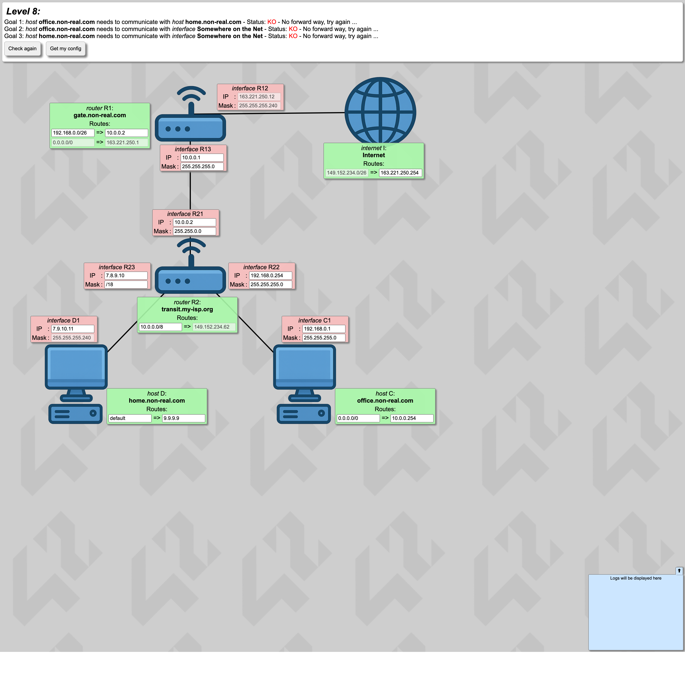](../images/screenshots/level8.png)

---

## 🗺️ トポロジー

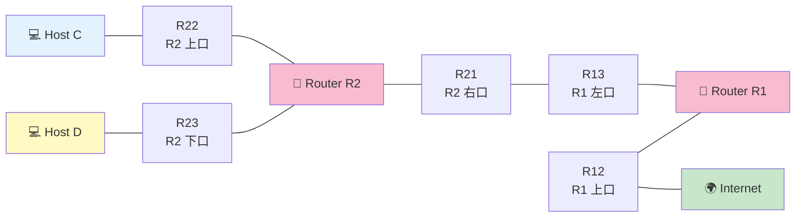

---

## 📺 画面の編集できる箇所

| 場所 | 状態 | 直すか？ |
|---|---|---|
| **R13, R21 の IP/Mask** | 大半が白 | **✅ /26 で揃える** |
| **C, D の周辺 (R22, R23, C1)** | 白 | **✅ 隣接ブロックに配置** |
| D1 (.11/28) | 薄ピンク | ❌ 触らない |
| R12 (Internet 側) | 薄ピンク | ❌ 触らない |
| **R2r1 route** | 白 | **✅ default に** |
| **R1r2 route** | 白 | **✅ /27 集約** |
| **Ir1 gate** | 白 | **✅ R12 の IP に** |

---

## 🔒 固定値（抜粋）

| | 値 | 意味 |
|:---|:---|:---|
| R2r1 gate | `161.138.113.62` 固定 | → **R13 の IP = これ** |
| Ir1 route | `161.138.113.0/26` 固定 | → R1-R2 間は /26 |
| D1 | `7.9.10.11/28` 固定 | → D の街 = `7.9.10.0/28` |
| R12 | `163.178.250.12/28` 固定 | ルータ-Internet 間 |

---

## 🧭 解く順 — 「穴埋め」の進め方（絵で順番に追跡） {#step-by-step}

!!! tip "💡 このセクションの目的"
    Level 8 は固定値が多くて「**どこから手を付けたらいいか分からない**」と固まる人が多い。
    でも実は **固定値が "答えへの矢印"** になっていて、**順番通りに埋めるだけのパズル** です。
    ここでは「**今どの箱の何欄を埋めるか**」を **絵 (Mermaid 図)** で 1 ステップずつ実況します。

### 🎨 図の色の意味

各ステップで全体図を出します。色で進捗が分かります：

- 🟫 **グレー** = 固定値（最初から埋まってる、変えられない）
- 🟢 **緑** = **今このステップで埋めた** (注目！)
- 🟦 **青** = 既に埋めた（前のステップで埋めた）
- ⬜ **白** = まだ未着手 (`?`)

---

### 🟫 Phase 0 — 開始時: 固定値だけがある状態

まず画面を見渡して、**動かせない固定値（薄ピンク）** を全部マークします。

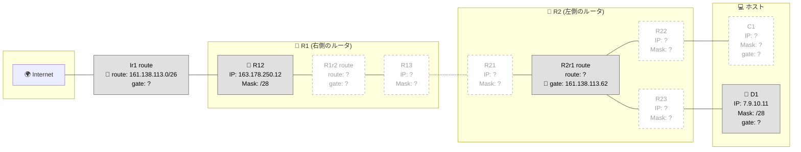

📌 = 固定値。**5 個の手がかり** があります：

| 固定値 | 何を教えてくれる？ |
|---|---|
| **D1 = .11/28** | D の街は `7.9.10.0/28` |
| **R12 = .250.12/28** | R1-Internet 間は /28 |
| **R2r1 gate = .62** | **R13 の IP はこれと同じでなければならない** |
| **Ir1 route = .0/26** | **R1-R2 間の街は /26 サイズ** |

---

### 🟢 Step 1 — R13 IP を埋める

**今、ここを埋めています:** ★ R13 (R1 の左口) の **IP**

**理由:** R2r1 gate (固定 `.62`) は「R2 が R1 に渡す時の宛先 = `.62`」。**R13 IP はこの値と一致** していなければ届かない。

→ ✏️ **R13 IP = `161.138.113.62`**

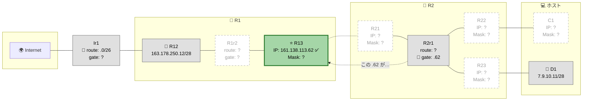

---

### 🟢 Step 2 — R13 と R21 の Mask を埋める

**今、ここを埋めています:** ★ R13 と R21 の **Mask** (両方とも /26)

??? question "🤔 なんで R13 と R21 を "同じ /26" にしなきゃいけないの？(クリックで展開)"
    これ、めちゃくちゃ大事な質問です！

    **理由 ① — 直結 = 同じ街じゃないと話せない**

    R13 (R1 の左口) と R21 (R2 の右口) は **1 本のケーブルで直結** している。
    ケーブル直結 = 「**同じ街の住人** じゃないと話せない」というのがネットワークの大原則。

    ```
    R1 ─[R13]──ケーブル──[R21]─ R2

    → R13 と R21 は同じ街の住人でなきゃダメ
    → 同じ街と判定されるには「同じ IP プレフィックス + 同じマスク」
    ```

    **理由 ② — マスクが揃ってないと "片思い" になる**

    もし R13 が /26、R21 が /28 だったら:

    - R13 から見ると: 街は `.0/26` (.0〜.63)、R21 (.1) は同じ街 → 話せると思う
    - R21 から見ると: 街は `.0/28` (.0〜.15)、R13 (.62) は別の街 → 話せないと思う

    → **R21 が R13 を「別人」扱いするので返事しない** → 通信失敗。

    **理由 ③ — `/26` という具体的な数字は固定値 `Ir1 route` から決まる**

    Internet の routes に `Ir1 route = .0/26` (固定) と書いてある。
    これは「**R1-R2 間の街は /26 サイズ**」を Internet が前提にしているという意味。

    もし R13/R21 を `/28` にすると:
    - 実際の街 = .0/28 (.0〜.15) で 16 個分
    - でも Internet は「ここは /26 (.0〜.63) で 64 個分」だと思ってる
    - 矛盾 → ルーティング失敗

    → **だから /26 にしなきゃいけない**。これは [🎓 ルール 1: 同じ街 = 同じマスク](../00-rules.md#1) と [連鎖の論理](../00-rules.md#2) の組み合わせ。

**短くまとめ:** Ir1 route (固定 `.0/26`) が「R1-R2 間の街は /26」と言ってるので、R13 と R21 の Mask は両方 /26 にする。

→ ✏️ **R13 Mask = `255.255.255.192` (/26)**
→ ✏️ **R21 Mask = `255.255.255.192` (/26)**

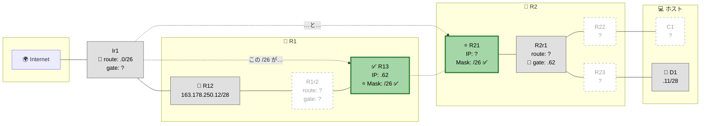

---

### 🟢 Step 3 — R21 IP を埋める

**今、ここを埋めています:** ★ R21 の **IP**

**理由:** R13 (`.62`) と同じ街 (`.0/26`、住人 `.1〜.62`) の住人にする必要がある。`.62` は R13 が使うので、空いてる `.1` を選ぶ（任意 OK）。

→ ✏️ **R21 IP = `161.138.113.1`**

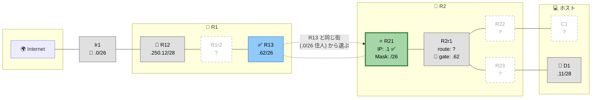

✨ **これで R1-R2 間のリンクが完成！** (R13 と R21 が同じ街にいて通信可)

---

### 🟢 Step 4 — D 周辺 (R23 と D の gate) を埋める

**今、ここを埋めています:** ★ R23 IP/Mask + D の gate

**理由:** D1 = `.11/28` 固定 → D の街 = `7.9.10.0/28` (`.0〜.15`、住人 `.1〜.14`)。
R23 (D の街の "玄関") はこの街の住人でなきゃダメ。

→ ✏️ **R23 IP = `7.9.10.1`** (空きの住人)
→ ✏️ **R23 Mask = `255.255.255.240` (/28)**
→ ✏️ **D の gate = `7.9.10.1`** (= R23)

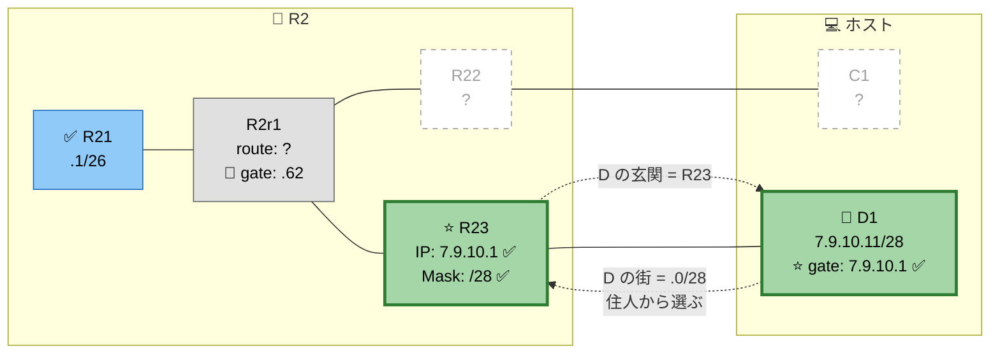

✨ **D の街が完成！** (R23 ↔ D1 が同じ街、D は R23 経由で外に出られる)

---

### 🟢 Step 5 — ⭐ 山場: C を「D の隣」に置く

**今、ここを埋めています:** ★ R22, C1 IP/Mask + C gate

**理由:** R1 で書ける routes は **1 本だけ**。C と D 両方への戻り道を 1 本でカバーするには、**C の街を D の隣 (`7.9.10.16/28`)** に置く。

そうすれば `.0/28` (D) と `.16/28` (C) を **`/27` で集約** できる！

```
D の街:  7.9.10.0/28  (.0〜.15)   ──┐
                                    ├─ 合体すると 7.9.10.0/27 (.0〜.31)
C の街:  7.9.10.16/28 (.16〜.31)  ──┘
```

→ ✏️ **R22 IP = `7.9.10.17`** (C の街の住人)
→ ✏️ **R22 Mask = `255.255.255.240` (/28)**
→ ✏️ **C1 IP = `7.9.10.18`** (R22 と同じ街)
→ ✏️ **C1 Mask = `255.255.255.240` (/28)**
→ ✏️ **C の gate = `7.9.10.17`** (= R22)

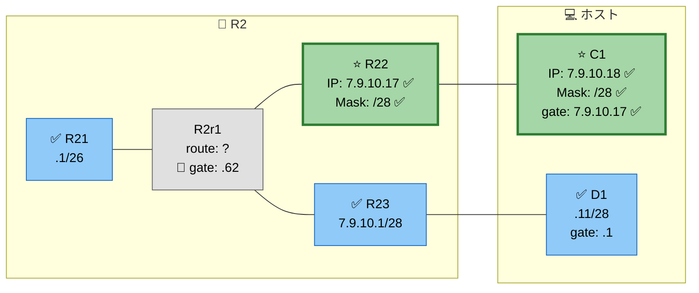

✨ **C の街も完成！しかも D の隣だから後で 1 本にまとめられる** 💡

---

### 🟢 Step 6 — R2r1 route を埋める (Internet 行き)

**今、ここを埋めています:** ★ R2r1 の **route** (gate は固定の `.62` のまま)

**理由:** R2 から見て、自分が知らない宛先 (= Internet 全部) は **R1 経由** で投げる。

→ ✏️ **R2r1 route = `0.0.0.0/0`** (default、全宛先カバー)

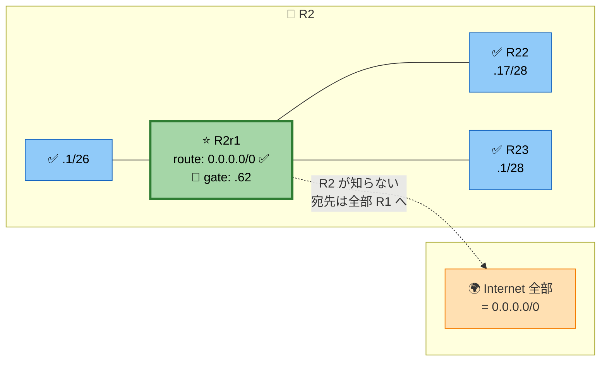

---

### 🟢 Step 7 — ⭐ 集約: R1r2 route で C と D 両方を 1 本でカバー

**今、ここを埋めています:** ★ R1r2 の **route + gate**

**理由:** Step 5 で C を D の隣に置いたおかげで、`/27` (= 32 個) 1 本で両方カバーできる！

→ ✏️ **R1r2 route = `7.9.10.0/27`** ⭐ 集約魔法
→ ✏️ **R1r2 gate = `161.138.113.1`** (= R21、R1 から見た隣人)

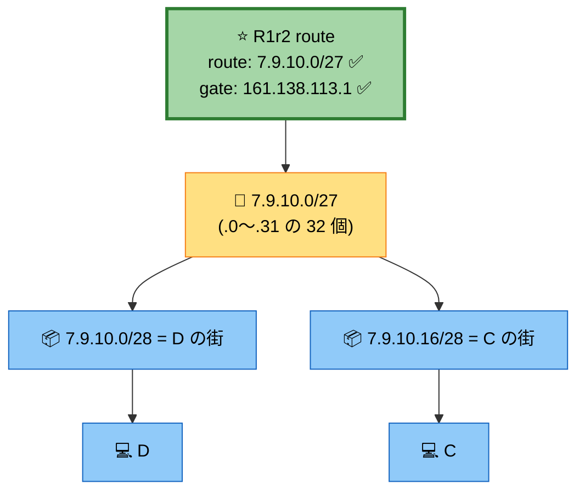

✨ **これがルート集約 (supernetting) の威力！** 1 本の routes で 2 つの街を覆える。

---

### 🟢 Step 8 — Ir1 gate を埋める (Internet → R1 への入り口)

**今、ここを埋めています:** ★ Ir1 の **gate** (route は `.0/26` 固定)

**理由:** Internet 側が「R1-R2 間の街宛は誰に投げる？」 → **R12** (R1 の Internet 側口)。

→ ✏️ **Ir1 gate = `163.178.250.12`** (= R12 の IP、固定値)

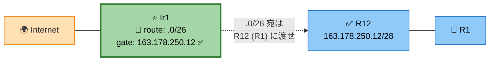

---

### 🎉 完成！ 全部 ✅ になった状態

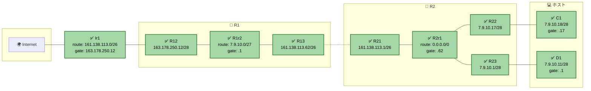

→ Check again ボタン → 全 Goal が 🟢 緑になればクリア！ 🎉

---

### 📝 全 8 ステップ コピペ用早見表

スクリーン上で **この順番に上から埋める** だけ：

| # | 埋める場所 | 入れる値 |
|:-:|---|---|
| 1 | R13 IP | `161.138.113.62` |
| 2 | R13 Mask, R21 Mask | `255.255.255.192` |
| 3 | R21 IP | `161.138.113.1` |
| 4 | R23 IP | `7.9.10.1` |
| 4 | R23 Mask | `255.255.255.240` |
| 4 | D の gate | `7.9.10.1` |
| 5 | R22 IP | `7.9.10.17` |
| 5 | R22 Mask | `255.255.255.240` |
| 5 | C1 IP | `7.9.10.18` |
| 5 | C1 Mask | `255.255.255.240` |
| 5 | C の gate | `7.9.10.17` |
| 6 | R2r1 route | `0.0.0.0/0` |
| 7 | R1r2 route | `7.9.10.0/27` ⭐ |
| 7 | R1r2 gate | `161.138.113.1` |
| 8 | Ir1 gate | `163.178.250.12` |

---

## 🧠 考え方の核心 (1 ステップずつ「今どこを考えているか」を見る)

!!! tip "💡 このセクションの読み方"
    各ステップの上に **「📍 今ここに注目」** というトポロジー図が出ます。
    🟡 黄色く光ってる箱が **「今このステップで考えている対象」** です。
    これで「**今どこの話をしてるんだっけ？**」と迷子になりません。

---

### Step 1: 制約の連鎖を読む (固定値だけに注目)

#### 📍 今ここに注目

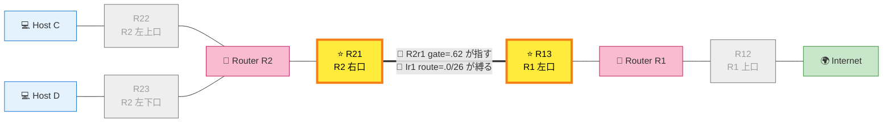

→ 🟡 光ってる **R13** と **R21** が今の注目箱。

#### 何を考えるか

固定値の中で「**他の値を強制する**」ものを見つけ出します。Level 8 では：

!!! info "🔥 逆算の出発点"
    **R2r1 gate = `161.138.113.62`** (固定) → これは **R2 が R1 にパケットを投げる時の宛先** という意味。
    つまり **R13 (R1 の R2 側口) の IP は必ず `161.138.113.62`**。

    さらに **Ir1 route = `161.138.113.0/26`** (固定) → Internet が「**R1-R2 間の街は /26 サイズ**」と前提にしている。
    だから R13 と R21 の **マスクは両方 /26** にしないと矛盾する。

#### 📊 この時点で確定したこと

| 箱 | 値 | 確定理由 |
|:---|:---|:---|
| ✅ R13 IP | `161.138.113.62` | R2r1 gate の固定値が指してる |
| ✅ R13 Mask | `/26` | Ir1 route の /26 と一致させる |
| ✅ R21 Mask | `/26` | 同上 (R13 と直結だから同じマスク) |

---

### Step 2: R21 IP を埋める (R13 と同じ街にする)

#### 📍 今ここに注目

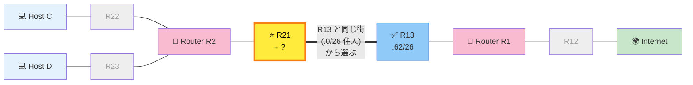

→ 🟡 光ってる **R21** だけが今の対象。R13 はもう確定したので 🟦 青。

#### 何を考えるか

R13 の街 = `.0/26` (`.0〜.63`、住人 `.1〜.62`)。
R21 はこの街の中で **`.62` 以外の空き住人** を選ぶ。

→ **R21 IP = `161.138.113.1`** (任意、`.1` が一番楽)

#### 📊 この時点で確定したこと (累積)

| 箱 | 値 |
|:---|:---|
| ✅ R13 IP / Mask | `.62 / /26` |
| ✅ R21 IP | `.1` |
| ✅ R21 Mask | `/26` |

---

### Step 3: D 周辺を埋める (D の街を完成させる)

#### 📍 今ここに注目

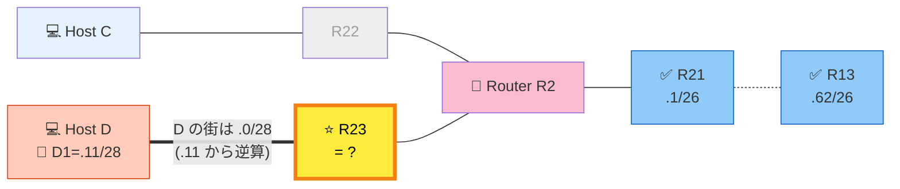

→ 🟡 光ってる **R23 (R2 左下口)** が今の対象。
→ 🟧 オレンジの **D1** は固定値ヒント。

#### 何を考えるか

D1 = `7.9.10.11/28` 固定 → D の街 = `7.9.10.0/28`（`.0〜.15`、住人 `.1〜.14`）。
R23 はこの街の住人にする。

→ **R23 IP = `7.9.10.1`** (空き住人の中で `.1` を選ぶ)
→ **R23 Mask = `/28`** (D と同じマスク)
→ **D の gate = `7.9.10.1`** (= R23、D の街の玄関)

---

### Step 4: ⭐ 山場! C を「D の隣」に置く (集約のための配置)

#### 📍 今ここに注目

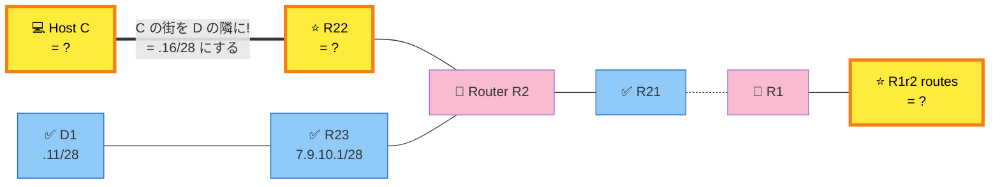

→ 🟡 **C, R22, R1r2** が同時に光ってます (これらが連動して決まる)。

#### 何を考えるか — このレベル最大の罠

!!! danger "🚨 制約: R1 で編集できる routes は 1 本だけ"
    R1 から見て、C も D も「R2 経由で行く街」。
    でも R1 の routes は **1 本しか書けない** (他は固定で動かせない)。
    → C と D を **1 本でカバーする方法** を考えるしかない！

#### 解決: C を D の隣 (`.16/28`) に置く

D の街 (`.0/28` = `.0〜.15`) のすぐ隣が `.16/28` (`.16〜.31`)。
この **2 つを合わせると `.0〜.31` = `/27` 1 つ分**！

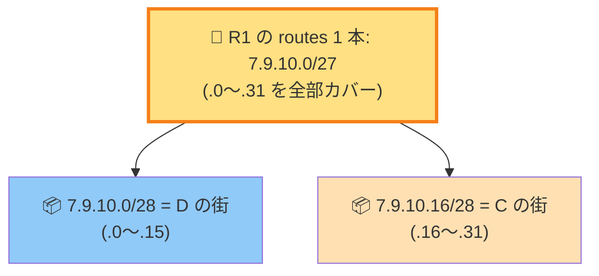

#### 配置の決定

→ **R22 IP = `7.9.10.17`** (C の街の住人)
→ **R22 Mask = `/28`**
→ **C1 IP = `7.9.10.18`** (R22 と同じ街)
→ **C1 Mask = `/28`**
→ **C の gate = `7.9.10.17`** (= R22)

> 💡 **これがルート集約 (supernetting)**。Level 8 が「**C の街を自由に決められる**」を逆手に取った設計問題なんです！

---

### Step 5: routes を埋める (経路を書く)

#### 📍 今ここに注目

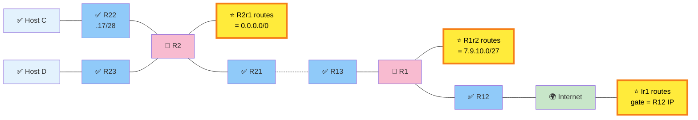

→ 🟡 光ってる **R2r1, R1r2, Ir1** の 3 つの routes 欄を埋めていく。

#### それぞれの役割と値

| routes 欄 | 何を書く？ | 値 |
|:---|:---|:---|
| **R2r1 route** | R2 から外に出る道 (= Internet 行き default) | `0.0.0.0/0` |
| **R1r2 route** | R1 から C と D 両方への戻り道 (集約!) | `7.9.10.0/27` ⭐ |
| **R1r2 gate** | R1 から見た R2 の入口 | `161.138.113.1` (= R21) |
| **Ir1 gate** | Internet が R1 に渡す相手 | `163.178.250.12` (= R12) |

---

### 🎉 全部埋まった完成図

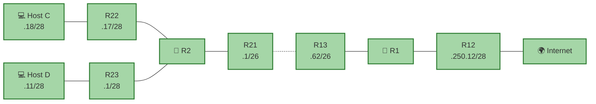

→ Check Again ボタン → 🎉 **全 Goal 緑になればクリア！**

---

## 🎬 パケットの旅（C → Internet のゴール）

```
🚀 行き: C (.18) → 8.8.8.8

C: default route → R22 (.17) ✅
R2: routes 確認
   直結 .0/28 (D) → 該当なし
   直結 .16/28 (C 自身の街) → 該当なし
   直結 .0/26 (R1 側) → 該当なし
   default (0.0.0.0/0) → R13 (.62) へ ✅
R1: default route → Internet ✅
配達完了


📬 帰り: Internet → C (.18)

Internet: routes → R12 経由
R1: routes 確認
   直結 .128/26 (R1-R2 間) → 該当なし
   集約 7.9.10.0/27 → ✅ 該当 (.18 含まれる)
   → R21 へ
R2: 直結 7.9.10.16/28 (C の街) → ✅ → R22 経由で C へ
配達完了
```

---

## ✅ 解答例

```
R13 IP → 161.138.113.62,  Mask → 255.255.255.192
R21 IP → 161.138.113.1,   Mask → 255.255.255.192
R23 IP → 7.9.10.1,        Mask → 255.255.255.240
D1  IP → 7.9.10.11        (変更なし)
D gate → 7.9.10.1
R22 IP → 7.9.10.17,       Mask → 255.255.255.240
C1  IP → 7.9.10.18,       Mask → 255.255.255.240
C gate → 7.9.10.17
R2r1 route → 0.0.0.0/0   (Internet 向けデフォルト)
R1r2 route → 7.9.10.0/27, gate → 161.138.113.1   ⭐ 集約!
Ir1 gate   → 163.178.250.12 (R12 の IP)
```

---

## 🔗 関連概念

- 06 [ルーティングテーブル](../01-basics/routing-table.md) — longest prefix match
- 03 [CIDR 早見表](../01-basics/cidr.md) — `/27` `/28` のサイズ感
- 07 [双方向到達性](../01-basics/bidirectional.md)

---

## 🎓 このレベルの抽象的な学び

!!! tip "⭐ ルート集約 (supernetting)"
    隣接する複数のサブネットを **1 つの広いプレフィックス** で表現する技。

    **実世界の応用**:

    - クラウドの VPC ルートテーブル（リージョン単位で /16 集約）
    - 巨大 CDN のルート広告（複数 AS を 1 つのプレフィックスで外に見せる）
    - プログラムの case 文を **範囲で書く**（`if 0 <= x <= 15` を `if x & ~0xF == 0` で表現）

!!! tip "制約の連鎖を辿る"
    「固定値 A → したがって B が決まる → したがって C が決まる…」と
    **1 つの固定値から連鎖的に他の値を導く**。
    数独のマス埋めや論理パズルと同じ思考法。

---

## ⚠️ よくあるミス

!!! warning "C と D を離れた位置に配置して集約できなくなる"
    C を `.100/28` に置くと、D の `.0/28` と離れすぎて /27 で包めない。
    **常に「隣のブロックに置ける？」を意識**。

!!! warning "集約を /28 でやろうとする"
    /28 では 16 アドレスしかカバーできず、C と D のどちらか片方しか入らない。
    **2 ブロック = 32 アドレス = /27** が正解。

!!! warning "Ir1 gate を R13 にしようとする"
    Internet → R は R12 経由。Ir1 gate は **R12 の IP** (= `163.178.250.12`)。

---

## ▶️ 次に読むページ

[Level 9 — 大ボス（6 ゴール）](level9.md)
