# Level 8 — 2 つの LAN + Internet

!!! warning "⚠️ 数値は毎回ランダムに変わります"
    このページに書かれた IP・マスク・ルートの値は **前回プレイした時の一例** です。
    あなたの画面では違う数値になっているはずなので、**そのままコピペしても絶対に解けません**。

> 🎯 **一言で言うと:** R1 で書ける routes が **1 本だけ**。C と D を **隣接 /28 ブロック** に置いて、**`/27` で集約** すれば 1 本で両方カバーできる。

## 📖 このページは何？

NetPractice の **応用問題**。**ルート集約 (route summarization / supernetting)** という実務で必須のテクニックが登場します。
固定値が連鎖していて、それを起点に逆算で全体を組み立てる思考力が試されます。

このレベルで身につくこと：

1. **ルート集約** = 隣接する複数のサブネットを 1 つの広い `/N` で表す
2. 固定値の **制約の連鎖** から IP 配置を逆算
3. C と D を **隣接ブロック** に意図的に配置して `/27` で包む技

---

## 📷 問題画面

[](../images/screenshots/level8.png)

---

## 🗺️ トポロジー

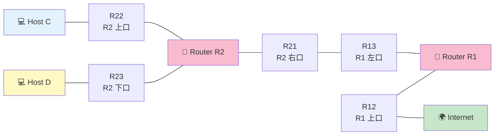

---

## 📺 画面の編集できる箇所

| 場所 | 状態 | 直すか？ |
|---|---|---|
| **R13, R21 の IP/Mask** | 大半が白 | **✅ /26 で揃える** |
| **C, D の周辺 (R22, R23, C1)** | 白 | **✅ 隣接ブロックに配置** |
| D1 (.11/28) | 薄ピンク | ❌ 触らない |
| R12 (Internet 側) | 薄ピンク | ❌ 触らない |
| **R2r1 route** | 白 | **✅ default に** |
| **R1r2 route** | 白 | **✅ /27 集約** |
| **Ir1 gate** | 白 | **✅ R12 の IP に** |

---

## 🔒 固定値（抜粋）

| | 値 | 意味 |
|:---|:---|:---|
| R2r1 gate | `161.138.113.62` 固定 | → **R13 の IP = これ** |
| Ir1 route | `161.138.113.0/26` 固定 | → R1-R2 間は /26 |
| D1 | `7.9.10.11/28` 固定 | → D の街 = `7.9.10.0/28` |
| R12 | `163.178.250.12/28` 固定 | ルータ-Internet 間 |

---

## 🧭 解く順 — 「穴埋め」の進め方（絵で順番に追跡）

!!! tip "💡 このセクションの目的"
    Level 8 は固定値が多くて「**どこから手を付けたらいいか分からない**」と固まる人が多い。
    でも実は **固定値が "答えへの矢印"** になっていて、**順番通りに埋めるだけのパズル** です。
    ここでは「**今どの箱の何欄を埋めるか**」を **絵 (Mermaid 図)** で 1 ステップずつ実況します。

### 🎨 図の色の意味

各ステップで全体図を出します。色で進捗が分かります：

- 🟫 **グレー** = 固定値（最初から埋まってる、変えられない）
- 🟢 **緑** = **今このステップで埋めた** (注目！)
- 🟦 **青** = 既に埋めた（前のステップで埋めた）
- ⬜ **白** = まだ未着手 (`?`)

---

### 🟫 Phase 0 — 開始時: 固定値だけがある状態

まず画面を見渡して、**動かせない固定値（薄ピンク）** を全部マークします。

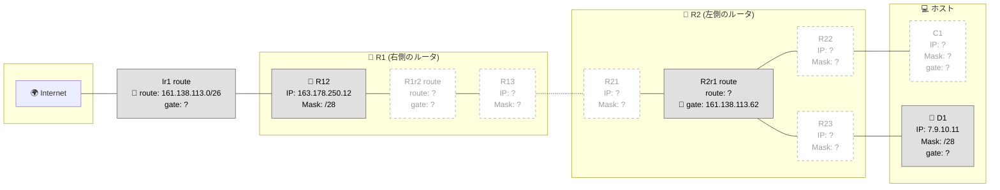

📌 = 固定値。**5 個の手がかり** があります：

| 固定値 | 何を教えてくれる？ |
|---|---|
| **D1 = .11/28** | D の街は `7.9.10.0/28` |
| **R12 = .250.12/28** | R1-Internet 間は /28 |
| **R2r1 gate = .62** | **R13 の IP はこれと同じでなければならない** |
| **Ir1 route = .0/26** | **R1-R2 間の街は /26 サイズ** |

---

### 🟢 Step 1 — R13 IP を埋める

**今、ここを埋めています:** ★ R13 (R1 の左口) の **IP**

**理由:** R2r1 gate (固定 `.62`) は「R2 が R1 に渡す時の宛先 = `.62`」。**R13 IP はこの値と一致** していなければ届かない。

→ ✏️ **R13 IP = `161.138.113.62`**

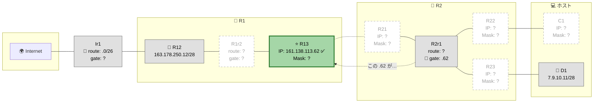

---

### 🟢 Step 2 — R13 と R21 の Mask を埋める

**今、ここを埋めています:** ★ R13 と R21 の **Mask** (両方とも /26)

**理由:** Ir1 route (固定 `.0/26`) は「R1-R2 間の街は /26 サイズ」を意味する。両端 (R13 と R21) の Mask は両方 /26 でなきゃダメ。

→ ✏️ **R13 Mask = `255.255.255.192` (/26)**
→ ✏️ **R21 Mask = `255.255.255.192` (/26)**

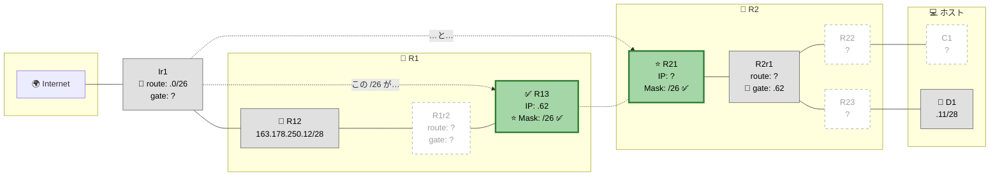

---

### 🟢 Step 3 — R21 IP を埋める

**今、ここを埋めています:** ★ R21 の **IP**

**理由:** R13 (`.62`) と同じ街 (`.0/26`、住人 `.1〜.62`) の住人にする必要がある。`.62` は R13 が使うので、空いてる `.1` を選ぶ（任意 OK）。

→ ✏️ **R21 IP = `161.138.113.1`**

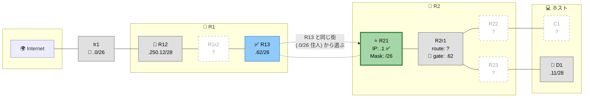

✨ **これで R1-R2 間のリンクが完成！** (R13 と R21 が同じ街にいて通信可)

---

### 🟢 Step 4 — D 周辺 (R23 と D の gate) を埋める

**今、ここを埋めています:** ★ R23 IP/Mask + D の gate

**理由:** D1 = `.11/28` 固定 → D の街 = `7.9.10.0/28` (`.0〜.15`、住人 `.1〜.14`)。
R23 (D の街の "玄関") はこの街の住人でなきゃダメ。

→ ✏️ **R23 IP = `7.9.10.1`** (空きの住人)
→ ✏️ **R23 Mask = `255.255.255.240` (/28)**
→ ✏️ **D の gate = `7.9.10.1`** (= R23)

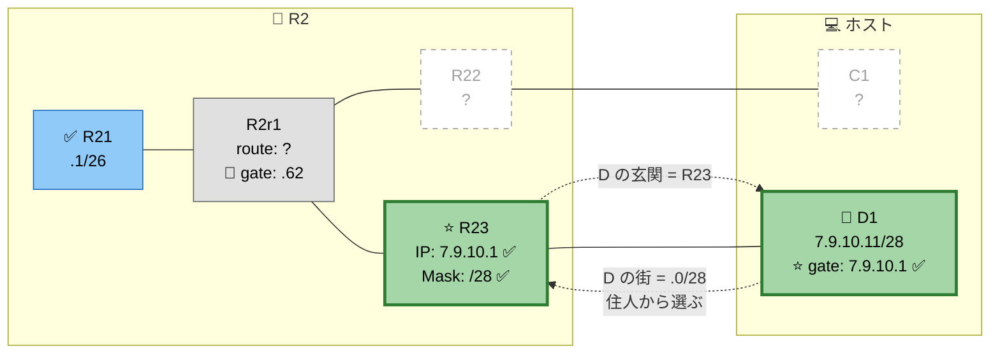

✨ **D の街が完成！** (R23 ↔ D1 が同じ街、D は R23 経由で外に出られる)

---

### 🟢 Step 5 — ⭐ 山場: C を「D の隣」に置く

**今、ここを埋めています:** ★ R22, C1 IP/Mask + C gate

**理由:** R1 で書ける routes は **1 本だけ**。C と D 両方への戻り道を 1 本でカバーするには、**C の街を D の隣 (`7.9.10.16/28`)** に置く。

そうすれば `.0/28` (D) と `.16/28` (C) を **`/27` で集約** できる！

```
D の街:  7.9.10.0/28  (.0〜.15)   ──┐
                                    ├─ 合体すると 7.9.10.0/27 (.0〜.31)
C の街:  7.9.10.16/28 (.16〜.31)  ──┘
```

→ ✏️ **R22 IP = `7.9.10.17`** (C の街の住人)
→ ✏️ **R22 Mask = `255.255.255.240` (/28)**
→ ✏️ **C1 IP = `7.9.10.18`** (R22 と同じ街)
→ ✏️ **C1 Mask = `255.255.255.240` (/28)**
→ ✏️ **C の gate = `7.9.10.17`** (= R22)

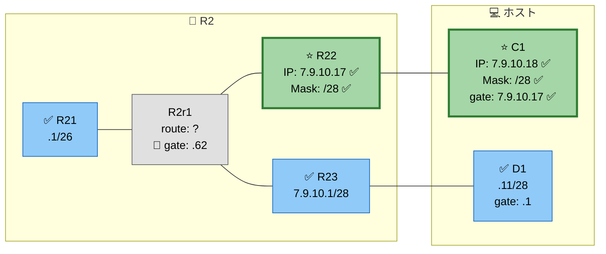

✨ **C の街も完成！しかも D の隣だから後で 1 本にまとめられる** 💡

---

### 🟢 Step 6 — R2r1 route を埋める (Internet 行き)

**今、ここを埋めています:** ★ R2r1 の **route** (gate は固定の `.62` のまま)

**理由:** R2 から見て、自分が知らない宛先 (= Internet 全部) は **R1 経由** で投げる。

→ ✏️ **R2r1 route = `0.0.0.0/0`** (default、全宛先カバー)

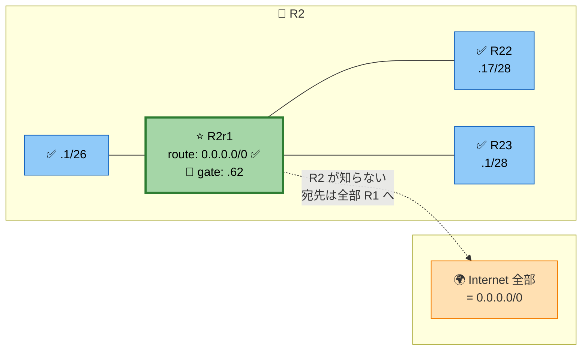

---

### 🟢 Step 7 — ⭐ 集約: R1r2 route で C と D 両方を 1 本でカバー

**今、ここを埋めています:** ★ R1r2 の **route + gate**

**理由:** Step 5 で C を D の隣に置いたおかげで、`/27` (= 32 個) 1 本で両方カバーできる！

→ ✏️ **R1r2 route = `7.9.10.0/27`** ⭐ 集約魔法
→ ✏️ **R1r2 gate = `161.138.113.1`** (= R21、R1 から見た隣人)

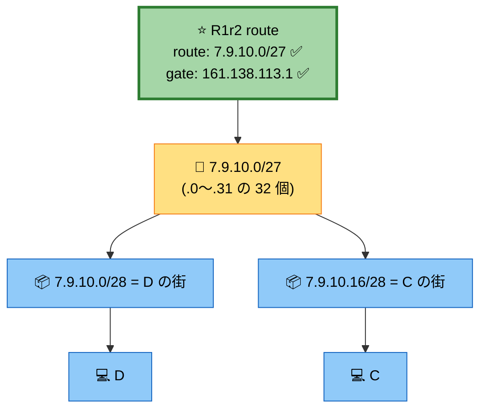

✨ **これがルート集約 (supernetting) の威力！** 1 本の routes で 2 つの街を覆える。

---

### 🟢 Step 8 — Ir1 gate を埋める (Internet → R1 への入り口)

**今、ここを埋めています:** ★ Ir1 の **gate** (route は `.0/26` 固定)

**理由:** Internet 側が「R1-R2 間の街宛は誰に投げる？」 → **R12** (R1 の Internet 側口)。

→ ✏️ **Ir1 gate = `163.178.250.12`** (= R12 の IP、固定値)

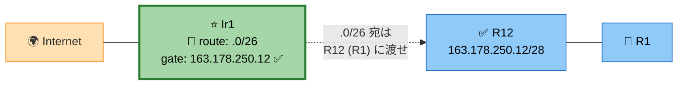

---

### 🎉 完成！ 全部 ✅ になった状態

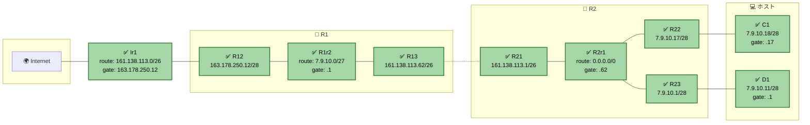

→ Check again ボタン → 全 Goal が 🟢 緑になればクリア！ 🎉

---

### 📝 全 8 ステップ コピペ用早見表

スクリーン上で **この順番に上から埋める** だけ：

| # | 埋める場所 | 入れる値 |
|:-:|---|---|
| 1 | R13 IP | `161.138.113.62` |
| 2 | R13 Mask, R21 Mask | `255.255.255.192` |
| 3 | R21 IP | `161.138.113.1` |
| 4 | R23 IP | `7.9.10.1` |
| 4 | R23 Mask | `255.255.255.240` |
| 4 | D の gate | `7.9.10.1` |
| 5 | R22 IP | `7.9.10.17` |
| 5 | R22 Mask | `255.255.255.240` |
| 5 | C1 IP | `7.9.10.18` |
| 5 | C1 Mask | `255.255.255.240` |
| 5 | C の gate | `7.9.10.17` |
| 6 | R2r1 route | `0.0.0.0/0` |
| 7 | R1r2 route | `7.9.10.0/27` ⭐ |
| 7 | R1r2 gate | `161.138.113.1` |
| 8 | Ir1 gate | `163.178.250.12` |

---

## 🧠 考え方

### Step 1: 制約の連鎖を読む

!!! tip "逆算の出発点"
    **R2r1 gate = `161.138.113.62`** が固定 → R2 がパケットを投げる先は R13。
    よって **R13 の IP は `161.138.113.62`** でなければならない。
    さらに **Ir1 route = `161.138.113.0/26` 固定** → R1-R2 間のリンクは /26。

### Step 2: R13 と R21 を同じ /26 に

ブロック `161.138.113.0/26` の住人は `.1〜.62`。

| 項目 | 値 | 備考 |
|:---|:---|:---|
| R13 IP | `161.138.113.62` | R2r1 gate の固定値 |
| R21 IP | `161.138.113.1` | 空いている住人 |
| マスク | `255.255.255.192` (/26) | R13 と R21 で同じ |

### Step 3: ⭐ C と D を隣接ブロックに配置

**問題**: R1 で編集できる routes は 1 本のみ。でも C と D の **両方への戻り道** が必要。

**解決策**: C と D を **隣り合った `/28` ブロック** に配置して、**`/27` でまとめて 1 本** で包む。

#### `/27` で半分に切ると `/28` 2 つに分かれる

`7.9.10.0/27` (.0〜.31) を更に `/28` (= 16 ずつ) で割ると 2 つに分かれます：

<div class="subnet-ruler cols-2">
  <div class="subnet-block target">
    <span class="block-name">.0/28</span>
    <span class="block-range">.0〜.15</span>
    <span class="block-purpose">D の街</span>
    <span class="block-host-range">D1=.11 (固定)</span>
  </div>
  <div class="subnet-block target-2">
    <span class="block-name">.16/28</span>
    <span class="block-range">.16〜.31</span>
    <span class="block-purpose">C の街</span>
    <span class="block-host-range">R22=.17, C1=.18</span>
  </div>
</div>

→ **これら 2 つを合わせると `.0〜.31` の 32 個** = `/27` 1 つ分

#### ⭐ 集約 (supernetting) の魔法

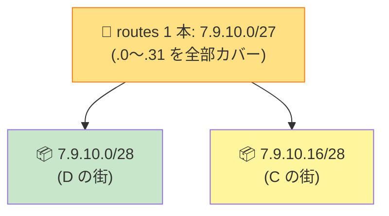

> 💡 **1 本の routes (`.0/27`)** で 2 つのサブネット (`.0/28` と `.16/28`) **両方** を包める。
> これが **「ルート集約 (supernetting)」** の威力。R1 のルートスロットが 1 本でも何とかなる！

| ブロック | 用途 | 範囲（住人） |
|:---|:---|:---|
| `7.9.10.0/28` | D の街 | `.1〜.14` |
| `7.9.10.16/28` | C の街 | `.17〜.30` |
| **`7.9.10.0/27`** | **集約 → 1 本の routes** | `.1〜.30`（両方含む） |

#### 各 IF の割り当て

- **D 側**: D1 = `7.9.10.11` (固定)、R23 = `7.9.10.1`
- **C 側**: R22 = `7.9.10.17`、C1 = `7.9.10.18`

### Step 4: R1 のルート

```
R1r2 route: 7.9.10.0/27 → gate: 161.138.113.1 (R21)
```

このルート **1 本で C と D 両方** をカバー。

---

## 🎬 パケットの旅（C → Internet のゴール）

```
🚀 行き: C (.18) → 8.8.8.8

C: default route → R22 (.17) ✅
R2: routes 確認
   直結 .0/28 (D) → 該当なし
   直結 .16/28 (C 自身の街) → 該当なし
   直結 .0/26 (R1 側) → 該当なし
   default (0.0.0.0/0) → R13 (.62) へ ✅
R1: default route → Internet ✅
配達完了


📬 帰り: Internet → C (.18)

Internet: routes → R12 経由
R1: routes 確認
   直結 .128/26 (R1-R2 間) → 該当なし
   集約 7.9.10.0/27 → ✅ 該当 (.18 含まれる)
   → R21 へ
R2: 直結 7.9.10.16/28 (C の街) → ✅ → R22 経由で C へ
配達完了
```

---

## ✅ 解答例

```
R13 IP → 161.138.113.62,  Mask → 255.255.255.192
R21 IP → 161.138.113.1,   Mask → 255.255.255.192
R23 IP → 7.9.10.1,        Mask → 255.255.255.240
D1  IP → 7.9.10.11        (変更なし)
D gate → 7.9.10.1
R22 IP → 7.9.10.17,       Mask → 255.255.255.240
C1  IP → 7.9.10.18,       Mask → 255.255.255.240
C gate → 7.9.10.17
R2r1 route → 0.0.0.0/0   (Internet 向けデフォルト)
R1r2 route → 7.9.10.0/27, gate → 161.138.113.1   ⭐ 集約!
Ir1 gate   → 163.178.250.12 (R12 の IP)
```

---

## 🔗 関連概念

- 06 [ルーティングテーブル](../01-basics/routing-table.md) — longest prefix match
- 03 [CIDR 早見表](../01-basics/cidr.md) — `/27` `/28` のサイズ感
- 07 [双方向到達性](../01-basics/bidirectional.md)

---

## 🎓 このレベルの抽象的な学び

!!! tip "⭐ ルート集約 (supernetting)"
    隣接する複数のサブネットを **1 つの広いプレフィックス** で表現する技。

    **実世界の応用**:

    - クラウドの VPC ルートテーブル（リージョン単位で /16 集約）
    - 巨大 CDN のルート広告（複数 AS を 1 つのプレフィックスで外に見せる）
    - プログラムの case 文を **範囲で書く**（`if 0 <= x <= 15` を `if x & ~0xF == 0` で表現）

!!! tip "制約の連鎖を辿る"
    「固定値 A → したがって B が決まる → したがって C が決まる…」と
    **1 つの固定値から連鎖的に他の値を導く**。
    数独のマス埋めや論理パズルと同じ思考法。

---

## ⚠️ よくあるミス

!!! warning "C と D を離れた位置に配置して集約できなくなる"
    C を `.100/28` に置くと、D の `.0/28` と離れすぎて /27 で包めない。
    **常に「隣のブロックに置ける？」を意識**。

!!! warning "集約を /28 でやろうとする"
    /28 では 16 アドレスしかカバーできず、C と D のどちらか片方しか入らない。
    **2 ブロック = 32 アドレス = /27** が正解。

!!! warning "Ir1 gate を R13 にしようとする"
    Internet → R は R12 経由。Ir1 gate は **R12 の IP** (= `163.178.250.12`)。

---

## ▶️ 次に読むページ

[Level 9 — 大ボス（6 ゴール）](level9.md)
