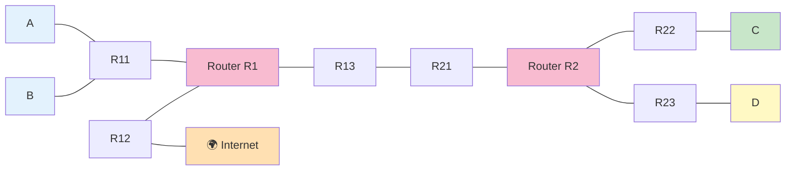

# Level 9 — 大ボス（6 ゴール）

## このページは何？

**6 つのゴール** を同時に満たす複雑なレベル。A, B, C, D と Internet の間で
複数のルートを設計する必要がある。

---

## このレベルで学ぶこと

- 多くの固定値から連鎖的に答えを導く
- Internet 側に **複数の route** を書いて複数 LAN への帰り道を作る
- 複雑性を「ブロックごと」に分解して考える

---

## 📷 問題画面


---

## 🗺️ トポロジー



### ゴール
A↔B, C↔D, A↔I, A↔D, B↔C, C↔I（計 6 本）

---

## 🔒 固定値（重要）

| | 値 | 固定？ |
|:---|:---|:-:|
| Dr1 gate | `32.30.74.78` | **固定** |
| R23 mask | `/18` | **固定** |
| R11 mask | `/25` | **固定** |
| R21 mask | `/30` | **固定** |
| R1r3 | `0.0.0.0/0 → 163.172.250.1` | **固定** |
| R2r1 | route `0.0.0.0/0` | gate のみ可 |

---

## 🧠 考え方（制約の連鎖）

### Step 1: D 側を決める

- Dr1 gate = `32.30.74.78` → **R23 の IP = これ**
- R23 mask = /18 → 町 = `32.30.74.78` の /18 ネットワーク

/18 計算:
```
マスク = 255.255.192.0
第 3 オクテット: 74 AND 192 = 64
→ 町: 32.30.64.0/18 (住人 32.30.64.1 〜 32.30.127.254)
```

- D1 IP → **`32.30.64.1`**, Mask → **`255.255.192.0`**
- D gate → **`32.30.74.78`**

### Step 2: ルータ間リンクを決める

R21 = `31.203.18.253/30` で固定。

/30 計算:
```
253 ÷ 4 切り捨て 63 → 63 × 4 = 252
→ ブロック .252/30 (.252, .253, .254, .255)
→ 住人 .253 と .254
```

- R13 IP → **`31.203.18.254`**, Mask → **`255.255.255.252`**

### Step 3: A, B 側を決める

R11 = `192.168.45.1/25` → 町 `192.168.45.0/25`（住人 `.1〜.126`）。

- A1 IP → **`192.168.45.2`**, Mask → `/25`
- B1 IP → **`192.168.45.3`**, Mask → `/25`
- A, B gate → **`192.168.45.1`**

### Step 4: C 側（比較的自由）

C の町は他と被らないように選ぶ。例: `10.0.0.0/24`。

- C1 IP → `10.0.0.1`, Mask → `/24`
- R22 IP → `10.0.0.254`
- C gate → `10.0.0.254`

### Step 5: ルーティング設定

**R1** のルート:
- `10.0.0.0/8` → `31.203.18.253` (R21 へ、C 方面)
- `32.30.64.0/18` → `31.203.18.253` (R21 へ、D 方面)
- `default` → `163.172.250.1` (Internet、固定)

**R2** のルート:
- default gate → **`31.203.18.254`** (R13 へ)

**Internet** の route（帰り道）:
- Ir1: **`192.168.45.0/25`** → A, B の帰り
- Ir2: **`10.0.0.0/24`** → C の帰り
- Ir3: **`default`** → それ以外

---

## ✅ 解答例

```
R23 IP → 32.30.74.78
D1  IP → 32.30.64.1,      Mask → 255.255.192.0
R13 IP → 31.203.18.254,   Mask → 255.255.255.252
A1  IP → 192.168.45.2,    Mask → 255.255.255.128
B1  IP → 192.168.45.3,    Mask → 255.255.255.128
A,B gate → 192.168.45.1
Dr1 route → 0.0.0.0/0
R1r1 → 10.0.0.0/8,       gate → 31.203.18.253
R1r2 → 32.30.64.0/18,    gate → 31.203.18.253
R2r1 gate → 31.203.18.254
Ir1 → 192.168.45.0/25
Ir2 → 10.0.0.0/24
Ir3 → default
```

---

## 🎓 このレベルの抽象的な学び

!!! tip "複雑性の分割統治"
    6 つのゴールを **一度に考えると破綻する**。
    「D 側 → ルータ間 → A/B 側 → C 側 → 全体ルーティング」と
    **独立サブセットに分けて順に解く** のが正攻法。

    プログラミングの **モジュール分割**、
    大きな機能を **スプリント単位に切る** のと全く同じ発想。

!!! tip "固定値は「ヒント」"
    一見厄介な固定値は、実は **選択肢を絞ってくれる手がかり**。
    自由度が高いと逆に迷うもの。数学の証明問題で「〇〇が与えられている」が強力なヒントなのと同じ。

---

## ⚠️ よくあるミス

!!! warning "R2 の default gate を R12 にする"
    R2 の defaultは R13（R1 の左口）に送るべき。
    R12 は Internet 側の口で、R2 から直接は到達不可。

!!! warning "Internet の route を 1 本に集約しすぎる"
    `.0.0.0.0/0` を Ir1 に書くと、自分自身 (`163.172.250.0/28`) まで含んでしまい変な循環。
    **具体的な LAN ごとに書く** のが安全。

---

## ▶️ 次に読むページ

[Level 10 — 最終ボス（7 ゴール）](level10.md)
