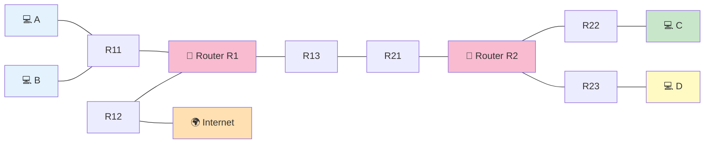

# Level 9 — 大ボス（6 ゴール）

!!! warning "⚠️ 数値は毎回ランダムに変わります"
    このページに書かれた IP・マスク・ルートの値は **前回プレイした時の一例** です。
    あなたの画面では違う数値になっているはずなので、**そのままコピペしても絶対に解けません**。

> 🎯 **一言で言うと:** 6 ゴールに圧倒されないこと。**「D 側 → ルータ間 → A/B 側 → C 側 → ルーティング」** の順で固定値を起点に分割統治する。

## 📖 このページは何？

NetPractice の **大ボス**。**6 つのゴール** を同時に満たす複雑なレベルで、4 つのホスト + 2 つのルータ + Internet が絡みます。
固定値が多いので、それを起点に **連鎖的に逆算** して全体を組み立てます。

!!! tip "🧭 解き方が分からない場合"
    このレベルも **「固定値マップ → 連鎖逆算 → 街を作る → routes → 検算」** の 5 Phase で解けます。
    詳しくは [🧭 共通の解き方 (どこから手を付けるか)](../00-how-to-solve.md)。
    Level 8 の [🎬 解く順 (絵で順番に追跡)](level8.md#step-by-step) も参考に。

このレベルで身につくこと：

1. 多くの固定値から **連鎖的** に答えを導く力
2. Internet 側に **複数の routes** を書いて複数 LAN への帰り道を作る
3. 複雑性を **「サブセット」** に分けて考える分割統治

---

## 📷 問題画面

[](../images/screenshots/level9.png)

---

## 🗺️ トポロジー



### 6 つのゴール

A↔B, C↔D, A↔I, A↔D, B↔C, C↔I

---

## 📺 画面の編集できる箇所（多数）

| エリア | 主な編集箇所 |
|---|---|
| **D 側** | R23 IP/Mask, D1 IP/Mask, D の gate |
| **ルータ間 (R1↔R2)** | R13 IP/Mask |
| **A/B 側** | A1, B1 の IP/Mask, A/B の gate |
| **C 側** | C1, R22 の IP/Mask, C の gate |
| **R1 routes** | C 方面・D 方面への 2 本 |
| **R2 routes** | default の gate |
| **Internet routes** | A/B 方面、C 方面、Internet 方面 |

---

## 🔒 固定値（重要）

| | 値 | 固定？ |
|:---|:---|:-:|
| Dr1 gate | `32.30.74.78` | **固定** |
| R23 mask | `/18` | **固定** |
| R11 mask | `/25` | **固定** |
| R21 mask | `/30` | **固定** |
| R1r3 | `0.0.0.0/0 → 163.172.250.1` | **固定** |
| R2r1 | route `0.0.0.0/0` | gate のみ可 |

---

## 🧠 考え方（5 ステップに分割統治）

### Step 1: D 側を決める

- Dr1 gate = `32.30.74.78` → **R23 の IP = これ** (固定値の連鎖)
- R23 mask = `/18` → 街は `.78` を `/18` で切った先頭

`/18` は第 3 オクテットの上位 2 ビットがネットワーク部、ブロック幅は **64**：

<div class="step-flow">
  <div class="step"><span class="step-num">1</span>マスク<br><code>/18</code><br>= <code>255.255.192.0</code></div>
  <div class="step"><span class="step-num">2</span>第3オクテ<br><code>74 AND 192</code><br>= <b>64</b></div>
  <div class="step"><span class="step-num">3</span>町の先頭<br><code>32.30.64.0/18</code></div>
  <div class="step"><span class="step-num">4</span>住人<br><code>32.30.64.1</code><br>〜 <code>.127.254</code></div>
</div>

- R23 IP → **`32.30.74.78`**, Mask → **`255.255.192.0`**
- D1 IP → **`32.30.64.1`** (空き住人)
- D gate → **`32.30.74.78`** (= R23)

### Step 2: ルータ間リンク (R1↔R2) を決める

R21 = `31.203.18.253/30` 固定。`/30` のブロック幅は **4**：

<div class="step-flow">
  <div class="step"><span class="step-num">1</span>R21 値<br><code>.253</code></div>
  <div class="step"><span class="step-num">2</span>253 ÷ 4<br>= 63 余り 1</div>
  <div class="step"><span class="step-num">3</span>63 × 4<br>= <b>252</b></div>
  <div class="step"><span class="step-num">4</span>ブロック<br><code>.252/30</code><br>(.252-.255)</div>
  <div class="step"><span class="step-num">5</span>住人<br><code>.253</code> と <code>.254</code></div>
</div>

- R13 IP → **`31.203.18.254`** (もう 1 つの住人)
- R13 Mask → **`255.255.255.252`** (/30)

### Step 3: A, B 側を決める

R11 = `192.168.45.1/25` → 街 `192.168.45.0/25`（住人 `.1〜.126`）。

- A1 IP → **`192.168.45.2`**, Mask → /25
- B1 IP → **`192.168.45.3`**, Mask → /25
- A, B gate → **`192.168.45.1`** (= R11)

### Step 4: C 側（比較的自由）

C の街は他と被らない範囲を選ぶ。例: `10.0.0.0/24`。

- C1 IP → **`10.0.0.1`**, Mask → /24
- R22 IP → **`10.0.0.254`**
- C gate → **`10.0.0.254`**

### Step 5: ルーティング

#### R1 のルート (C と D 方面の 2 本必要)

```
R1r1: 10.0.0.0/8     → 31.203.18.253 (R21)   ← C 方面
R1r2: 32.30.64.0/18  → 31.203.18.253 (R21)   ← D 方面
R1r3: 0.0.0.0/0      → 163.172.250.1         ← Internet (固定)
```

#### R2 のルート

```
R2r1: 0.0.0.0/0 (固定)   gate → 31.203.18.254 (R13)
```

#### Internet のルート (帰り道、複数 LAN 別々に)

```
Ir1: 192.168.45.0/25  → R12 IF        ← A, B の戻り
Ir2: 10.0.0.0/24      → R12 IF        ← C の戻り
Ir3: default          → R12 IF        ← その他 (含む D)
```

---

## 🎬 パケットの旅（A → D のゴール）

```
🚀 行き: A (192.168.45.2) → D (32.30.64.1)

A: default → R11 (.1) ✅ 同じ街なので渡せる

R1: routes 確認
   直結 .0/25 (A,B 街) → 該当なし
   直結 .252/30 (R1-R2) → 該当なし
   R1r1 10.0.0.0/8 → 該当なし
   R1r2 32.30.64.0/18 → ✅ 該当 (32.30.64.1)
   → R21 (.253) へ

R2: routes 確認
   直結 .252/30 → 該当なし
   直結 .64/18 (D 街) → ✅ → R23 経由で D へ
   配達完了


📬 帰り: D → A も同じ流れで成立
```

---

## ✅ 解答例

```
R23 IP   → 32.30.74.78,    Mask → 255.255.192.0
D1  IP   → 32.30.64.1,     Mask → 255.255.192.0
D gate   → 32.30.74.78
R13 IP   → 31.203.18.254,  Mask → 255.255.255.252
A1  IP   → 192.168.45.2,   Mask → 255.255.255.128
B1  IP   → 192.168.45.3,   Mask → 255.255.255.128
A, B gate → 192.168.45.1
C1  IP   → 10.0.0.1,       Mask → 255.255.255.0
R22 IP   → 10.0.0.254,     Mask → 255.255.255.0
C gate   → 10.0.0.254
R1r1     → 10.0.0.0/8,     gate → 31.203.18.253
R1r2     → 32.30.64.0/18,  gate → 31.203.18.253
R2r1 gate → 31.203.18.254
Ir1      → 192.168.45.0/25
Ir2      → 10.0.0.0/24
Ir3      → default
```

---

## 🔗 関連概念

- 06 [ルーティングテーブル](../01-basics/routing-table.md) — 複数 routes
- 07 [双方向到達性](../01-basics/bidirectional.md)
- 03 [CIDR 早見表](../01-basics/cidr.md)

---

## 🎓 このレベルの抽象的な学び

!!! tip "複雑性の分割統治"
    6 つのゴールを **一度に考えると破綻する**。
    「D 側 → ルータ間 → A/B 側 → C 側 → 全体ルーティング」と
    **独立サブセットに分けて順に解く** のが正攻法。

    プログラミングの **モジュール分割**、大きな機能を **スプリント単位** に切るのと同じ発想。

!!! tip "固定値は「ヒント」"
    一見厄介な固定値は、実は **選択肢を絞ってくれる手がかり**。
    自由度が高いと逆に迷うもの。数学の証明問題で「〇〇が与えられている」が強力なヒントなのと同じ。

---

## ⚠️ よくあるミス

!!! warning "R2 の default gate を R12 にする"
    R2 の default は R13（R1 の左口）に送るべき。
    R12 は Internet 側の口で、R2 から直接は到達不可。

!!! warning "Internet の routes を 1 本に集約しすぎる"
    `0.0.0.0/0` を Ir1 に書くと、自分自身 (`163.172.250.0/28`) まで含んでしまい変な循環。
    **具体的な LAN ごと** に書くのが安全（A/B、C、その他）。

!!! warning "C 街を他と被るアドレス帯にする"
    `192.168.45.x` や `32.30.x.x` は既に他で使用済み。
    被らない `10.x` や `172.16.x` を使う。

---

## ▶️ 次に読むページ

[Level 10 — 最終ボス（7 ゴール）](level10.md)
