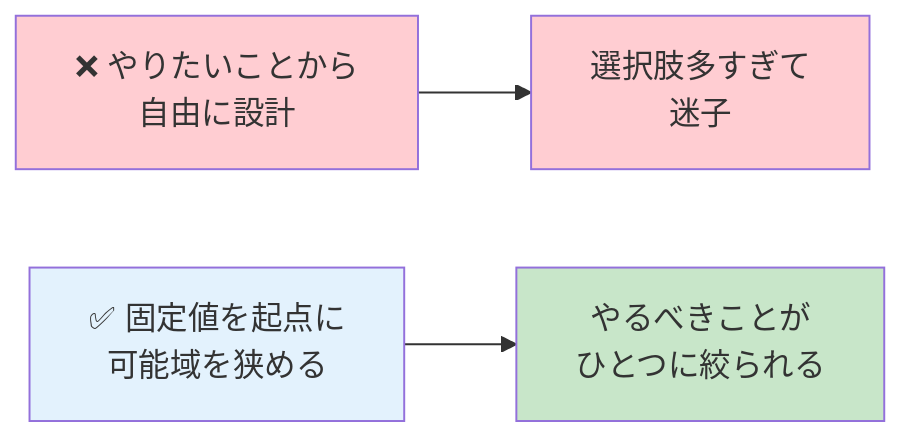

# 制約からの逆算という思考法

## このページは何？

NetPractice で最も効く思考法 **「制約からの逆算」** を深掘りするページ。
この思考を手に入れると、**パズルもバグ調査もサーバー障害対応も** 楽になる。

---

## 🎯 制約からの逆算とは？

!!! tip "一言で"
    **「変えられないもの」を起点に、「変えられるもの」を決める**。

    これは「やりたいこと」から出発するのではなく、
    「できないこと」から出発する **逆向きの思考**。

---

## 🎨 イメージ



---

## 🧩 NetPractice での実例

### Level 9 を思い出す

```
固定: Dr1 gate = 32.30.74.78
  ↓ だから
  R23 の IP は 32.30.74.78 でなければならない
  ↓ だから
  D の町は /18 で 32.30.64.0/18
  ↓ だから
  D1 の IP は 32.30.64.x のどこか
```

**「自由に設計して」と言われたら迷うが、
固定値があることで「こうするしかない」が見えてくる**。

---

## 🛠️ バグ調査への応用

### ケーススタディ: "本番で特定の API だけ 500"

**自由な発想**: 「API を改修しよう、全部見直そう」
**制約からの逆算**:

```
変えられない事実: この API だけが落ちる
  ↓ だから
  API 共通処理や DB 接続の問題ではない（他が動いているので）
  ↓ だから
  このエンドポイント特有のコード or データの問題
  ↓ だから
  最近の変更 or 特定のレコードを調べる
  ↓ だから
  git log でこの endpoint に関する最近 7 日のコミットを見る
```

**「他は動いている」という制約** が、調査範囲を 1/100 に絞り込んだ。

---

## 🔎 コーディングへの応用

### ケーススタディ: 型駆動開発

```haskell
function combine(list: Array<number>): number
```

**制約**:
- 引数は **数字の配列**
- 返り値は **1 つの数字**

**これだけで、実装できる関数の範囲はかなり限られる**:
- sum, product, max, min, average, length, etc.

対して:
```typescript
function doSomething(input: any): any
```

これだと何でもできる = **考えなきゃいけないことが無限**。

!!! tip "型は制約。制約は思考の省力化"
    「any を使うな」と言われるのは、**型という制約で思考コストを下げるため**。
    NetPractice の固定値が思考コストを下げるのと同じ。

---

## 🎭 設計判断への応用

### ケーススタディ: 新機能追加

「認証機能が欲しい」と言われたとき:

**自由な発想 (危険)**:
- OAuth にしよう？
- いや自前実装？
- 魔法の認証フロー設計？
- ユーザー体験も改善したい？
- ついでに MFA も？

**制約からの逆算**:
```
変えられない事実:
  - 予算: 1 週間
  - 既存のフレームワーク: Django
  - チーム人数: 自分 1 人
  - セキュリティ要件: 社内基準 A 級

  ↓ だから
  - 自前実装は時間的に無理
  - Django の標準認証を使う
  - MFA は必須要件に入っていないので MVP では外す
  - OAuth プロバイダは Google のみ（社内で承認済み）

  ↓ 結論
  Django-allauth + Google OAuth で 1 週間で出す
```

**制約が決めてくれる** から、「どれを選ぶか」で悩まない。

---

## 🏗️ システム設計面接への応用

システム設計面接で聞かれる典型:
「Twitter みたいなシステムを設計してください」

**未熟な回答**: いきなりアーキテクチャ図を描き始める

**熟練の回答 (制約確認から入る)**:
```
面接官に質問:
  - 想定ユーザー数は？(100万？ 10億？)
  - 書き込みと読み込みの比率は？(1:100？ 1:1000？)
  - レイテンシ要件は？(1ms？ 100ms？)
  - 可用性要件は？(99%? 99.999%?)
  - 地理的分散は必要？
  - 予算制約は？

ここまで聞いて初めて:
  → 制約が決まったので、設計が導かれる
```

**制約が全て決まれば、設計は「こうするしかない」になる**。
自由度が多いうちは議論も実装も進まない。

---

## 🧠 心理学的な背景

!!! info "ジャムの法則"
    心理学者 Iyengar の研究で有名な「**選択肢が多すぎると人は決められない**」という現象。

    - 試食のジャムを 24 種類並べた店 → 3% しか購入
    - 試食を 6 種類に絞った店 → 30% が購入

    **制約（選択肢を絞ること）が意思決定を早める**。
    これは人間の認知資源が有限だから。

### NetPractice はこれを設計に応用した課題

固定値で選択肢を絞り、**学習者の認知資源を「本質」に集中させる**。

---

## 🛠️ 日常業務で使うフレーム

### 「何が変えられないか」を最初に列挙する

```
変えられないもの:
  - 既存の DB スキーマ (本番データあり)
  - 外部 API の仕様
  - 予算と納期
  - チームメンバーのスキルセット
  - 会社のコーディング規約

変えられるもの:
  - 内部の実装
  - テストの書き方
  - リリース戦略
```

**変えられないもの** から先に考えると、**変えられるもの** の自由度の中で
最適な実装が見えてくる。

---

## 💡 NetPractice 流「制約の見つけ方」

### 画面の各欄を 3 色でマーキング

```
🔴 完全固定 (編集不可)  → 絶対の制約
🟡 半固定 (IP だけ編集可) → 部分的な制約
🟢 自由 (IP/Mask 両方編集可) → 自由度の高い部分
```

### 🔴 から先に考える

1. **赤い欄** の値を読む
2. 「これが固定 → だから何が決まる？」を 1 つずつ辿る
3. 辿った結果を **黄色・緑** の欄に反映

この手順で **ほぼ全ての NetPractice レベルが解ける**。

---

## 🏆 上級者の姿勢

!!! tip "プロは「何が制約か」をまず聞く"
    新卒エンジニア: 「この機能、こう実装していいですか？」
    シニア: 「この機能、**制約は何ですか？**（予算/期限/互換性/性能）**」

    シニアが先に制約を確認するのは、**自由な議論を重ねても無駄** と知っているから。
    制約が決まれば、実装は大体自動的に導かれる。

---

## 🧗 制約がない場合はどうする？

**自分で制約を作る**。

- 時間を区切る（time-boxing）: 「2 時間でできる範囲で」
- 行数を区切る: 「100 行以内で」
- 使える技術を絞る: 「標準ライブラリだけで」

**自由すぎる状況で、あえて制約を課す** のは熟練エンジニアの常套手段。

---

## 📝 まとめ

- NetPractice は「制約からの逆算」という思考を体で覚える課題
- この思考はバグ調査、設計、面接、日常業務、**全てに転用できる**
- 「変えられないもの」から考えると、「変えられるもの」が限定され、判断が楽になる
- プロは最初に「制約は何か？」を確認する

---

## 🏁 第3部を読み終わったら

ここまで読んだ人は、**NetPractice を単なる課題ではなく学びの宝庫** として理解できたはず。
次は評価（ディフェンス）対策で、**口頭でこれを説明できるようにする** ターン。

## ▶️ 次に読むページ

[🎓 ディフェンス Q&A](../04-defense/qa.md) — 評価で聞かれる質問と模範回答
