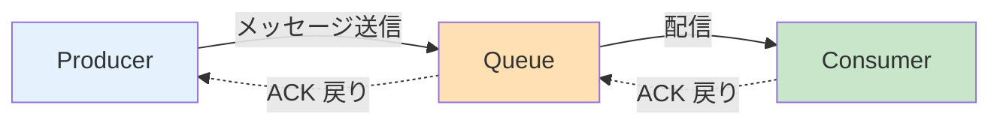

# 他分野に応用できる考え方

## このページは何？

NetPractice を解く中で自然と身につく **考え方・思考パターン** を、
ネットワーク以外のどこで使えるかを徹底的に挙げるページ。
**この記事がこのガイドで一番大切** かもしれません。

---

## 🎯 転用できる 7 つの思考パターン

NetPractice は表面的には「IP パズル」ですが、使っている思考は **普遍的な設計・デバッグの武器**。
ここでは 7 つに分けて掘り下げます。

| # | パターン | ひと言 | 応用先の例 |
|:-:|:---|:---|:---|
| 1 | **制約からの逆算** | 固定値から「こうするしかない」を導く | デバッグ、論理パズル、型付きコーディング |
| 2 | **双方向性の確認** | 行き道と帰り道は独立して考える | API 設計、DB レプリカ、メッセージング |
| 3 | **階層分離** | L2 と L3 は別の責務 | ソフトウェアアーキテクチャ、OSI、OOP のレイヤー |
| 4 | **集約と分割** | 似たものを 1 つにまとめる or 分ける | DRY、モジュール境界、DB シャーディング |
| 5 | **フォールバック設計** | default は最後、具体は先に | 例外処理、switch、エラーハンドリング |
| 6 | **明示 vs 暗黙** | 手で書かされて初めて見える仕組み | テスト駆動、契約による設計 |
| 7 | **トポロジー思考** | 図に起こしてから解く | 分散システム、DAG、依存グラフ |

---

## 1️⃣ 制約からの逆算

### NetPractice での現れ方

- 「R2r1 gate が固定値 `X` → だから R13 の IP は `X`」
- 「マスクが /25 で固定 → だから住人範囲は決まる」
- 「C と D を隣のブロックに置く → 集約できる」

### 他分野への転用

#### デバッグ時の「症状→原因」の逆算

<div class="step-flow">
  <div class="step"><span class="step-num">1</span><b>症状</b><br>レスポンス<br>500 エラー</div>
  <div class="step"><span class="step-num">2</span>ログを見ると<br>DB エラー</div>
  <div class="step"><span class="step-num">3</span>特定の<br>クエリだけで<br>起きる</div>
  <div class="step"><span class="step-num">4</span>そのクエリは<br>特定ユーザー<br>だけ実行</div>
  <div class="step"><span class="step-num">5</span>そのユーザー<br>のレコードに<br>NULL がある</div>
  <div class="step"><span class="step-num">6</span>🎯<br><b>原因特定</b></div>
</div>

**固定された事実（症状）から、変えられない事実を辿って原因に至る**。
NetPractice で固定 IP から推論していくのと同じ構造。

#### 型駆動開発 (Type-Driven Development)

```haskell
foo :: Int -> Int -> String
```

引数の型が固定されている → **実装できる関数の範囲は限られる**。
型が厳しいほど「こうするしかない」が明確になり、コードがシンプルになる。

#### 数独・論理パズル

**「3 マスが決まっている → この行の残りは自動的に 2 通りに絞られる」**
という思考は NetPractice と同型。

---

## 2️⃣ 双方向性の確認

### NetPractice での現れ方

Level 6 以降で毎回:
- ホスト A から Internet への行き route ✅
- Internet からホスト A への帰り route ❓ ← ここで落ちる

### 他分野への転用

#### API 設計

| | 書く内容 | 問題 / 良い点 |
|:---|:---|:---|
| ❌ 悪い設計 | `POST /orders` で注文を作成、しか書かない | レスポンス・エラー時の挙動が未定義 |
| ✅ 良い設計 | `POST /orders` → `201 Created + Location` ヘッダで id 返す → エラー時は `400 + error body` | **request と response の両方** を設計 |

**「投げた後に何が返ってくるか」を設計する** のは、NetPractice の帰り道と完全に同じ発想。

#### メッセージキュー



Producer は「メッセージを投げた」だけでは成立しない。
Consumer から ACK が戻らないと **メッセージ保証** にならない。

#### 分散トランザクション（2-phase commit）

<div class="step-flow">
  <div class="step"><span class="step-num">1</span><b>Prepare</b><br>（行き）<br>各ノードへ<br>準備依頼</div>
  <div class="step"><span class="step-num">2</span>各ノードが<br>準備完了を<br>返す（帰り）</div>
  <div class="step"><span class="step-num">3</span><b>Commit</b><br>（行き）<br>全ノードへ<br>確定指示</div>
  <div class="step"><span class="step-num">4</span>各ノードが<br>完了を返す<br>（帰り）</div>
</div>

片方向だけでは永遠に成立しない。

#### 契約・法務

契約書で「A は B に支払う」だけでは不完全。
「B が受領したら領収書を A に渡す」の **帰り道** を書いておかないと不備。

---

## 3️⃣ 階層分離

### NetPractice での現れ方

- スイッチ (L2) = MAC で判断、IP を知らない
- ルータ (L3) = IP で判断、MAC は下に任せる

**各層が自分の責務だけに集中** している。

### 他分野への転用

#### ソフトウェアアーキテクチャ

```
Presentation Layer    (UI)
  ↓ 知るのは入出力だけ
Application Layer     (ユースケース)
  ↓ 知るのはドメインの動作
Domain Layer          (ビジネスロジック)
  ↓ 知るのはビジネスルール
Infrastructure Layer  (DB, 外部 API)
```

**各層が自分より下の実装を知らなくていい** 設計。
スイッチがルーティングを知らなくて済むのと同じ。

#### 依存関係逆転の原則 (DIP)

上位レイヤーは下位レイヤーの **インターフェイス** に依存し、具体実装を知らない。
これも「上位層が下層の詳細を気にしない」という階層分離の一形態。

#### ネットワークプロトコルスタック全般

- TCP は IP の下のことを知らない
- HTTP は TCP の詳細を知らない
- HTTPS は HTTP の中身を知らない（暗号化の層を噛ませるだけ）

---

## 4️⃣ 集約と分割（スーパーネット / サブネット）

### NetPractice での現れ方

- Level 8: C と D を隣のブロックに置いて /27 で **集約**
- Level 7: /24 を /26 で **4 分割**

### 他分野への転用

#### コードの DRY (Don't Repeat Yourself)

```js
// 集約: 3 つの似た関数を 1 つに
function handleUserAction(action) { ... }

// 分割: 巨大な関数を責務ごとに
function handleClickAction() { ... }
function handleKeyPress() { ... }
function handleScroll() { ... }
```

NetPractice での「隣接ブロック → 集約」と同じく、
**似た処理 → まとめる**、**責務が違う → 分ける** の判断。

#### DB シャーディング

```
user_id % 3:
  shard0: 0, 3, 6, ...
  shard1: 1, 4, 7, ...
  shard2: 2, 5, 8, ...
```

アドレス空間（ユーザー ID 空間）を **複数のサーバーに分割**。
/24 を /26 で分けるのと全く同じ発想。

#### モジュール境界設計

**何を 1 つのモジュールにまとめ**、**何を別モジュールにするか** の判断。
**まとめる基準** は「同じ理由で変更される」（single responsibility）。
NetPractice では「**同じ経路で送る**」が集約の基準。

---

## 5️⃣ フォールバック設計（default は最後）

### NetPractice での現れ方

ルーティングテーブル:
```
10.0.0.0/8 → ...
172.16.0.0/12 → ...
default → ...       ← 必ず最後
```

### 他分野への転用

#### switch 文 / パターンマッチ

```python
match value:
    case 1:
        ...
    case 2:
        ...
    case _:       # default
        ...       # 必ず最後
```

**具体的なケース → 汎用ケース** の順。
逆にすると全てが `_` にマッチして、他の case が意味を失う。

#### 例外処理

```python
try:
    ...
except FileNotFoundError:  # 具体
    ...
except PermissionError:    # 具体
    ...
except Exception:          # 汎用（= default）
    ...
```

広すぎる例外を先にキャッチすると、**具体的な例外の扱いが消える**。
まさにルーティングテーブルで default を上に書くのと同じ NG。

#### デフォルト値の設計

```python
def connect(host, port=22, timeout=30):
    ...
```

**明示的に渡されたら** それを使う、**渡されなかったら** default。
NetPractice と同じ「具体が先、default が後」の思想。

---

## 6️⃣ 明示 vs 暗黙

### NetPractice での現れ方

普段使う OS やクラウドでは:
- ルーティングテーブルは OS が作る
- DHCP がサブネットを配る
- BGP が Internet 全体の経路を伝播する

**全部自動化** されている。

NetPractice は **これを手動にする**:
- route を自分で書け
- mask を自分で指定しろ
- Internet 側の route まで自分で埋めろ

### 他分野への転用

#### テスト駆動開発 (TDD)

TDD は **通常は書かない「期待する挙動の明示化」** を強制する。
本来コードが暗黙に持っている契約を、**テストという形で明文化** する。
NetPractice が「暗黙の route を明示させる」のと同じ構造。

#### 契約による設計 (Design by Contract)

関数に **事前条件・事後条件・不変条件** を明示的に書く。
普通なら「コードを読めば分かるでしょ」で済ませる暗黙の了解を、
**明示して検証可能にする**。

#### 設定ファイル vs 規約 (Convention over Configuration)

Ruby on Rails の「規約」は暗黙的（フォルダ名で決まる）。
一方、Terraform のインフラ定義は全部明示。
**何を暗黙に任せ、何を明示するか** は設計判断。
NetPractice は「ネットワーク設計を明示する側」の訓練。

---

## 7️⃣ トポロジー思考

### NetPractice での現れ方

問題を解くとき、まず:
1. 全ての IF と繋がりを **図に描く**
2. **サブネット境界** を書き込む
3. ルートを **矢印** で追う

### 他分野への転用

#### 分散システムの設計

- サービスとサービスの繋がりを **依存グラフ** で描く
- Circuit Breaker の配置を考える
- retry / timeout を **経路ごと** に決める

#### ソフトウェア依存関係

```
App
 ├── LibA ── LibX
 ├── LibB ── LibX  ← 同じライブラリを 2 箇所から依存
 └── LibC
```

依存を **DAG (有向非巡回グラフ)** で描くと、循環依存・重複依存が見える。

#### プロジェクト管理の PERT 図

タスクの前後関係を **ノードと矢印** で描き、クリティカルパスを探す。
NetPractice で「どの route を通るか」を図で追うのと同じ思考。

---

## 🔑 この 7 つをまとめる 1 つの上位概念

!!! tip "全部に共通するのは何か？"
    **「部品と繋がりを分けて考える」** という姿勢。

    - 部品 = ホスト, ルータ, サブネット, route エントリ, 関数, クラス, モジュール
    - 繋がり = ケーブル, ルート, API 呼び出し, 依存, 継承

    まず部品の責務を明確にし、次に繋がり方を設計する。
    この順序で考えるのが **プロのエンジニアリング**。
    NetPractice はそれの格好の練習台。

---

## 🎓 42 カリキュラム全体での位置づけ

NetPractice で身につく思考は、後続の 42 課題で直接効いてくる:

| 後続課題 | NetPractice の思考が効くポイント |
|:---|:---|
| **webserv** | HTTP の request/response (双方向性) |
| **ft_irc** | IRC プロトコルの階層（L7 のプロトコル設計） |
| **Inception** | Docker コンテナ間のネットワーク設計 |
| **ft_transcendence** | WebSocket の双方向通信、リバプロの route 設計 |
| **Common Core 全体** | 制約からの逆算、モジュール設計 |

---

## 💪 明日から使える練習

!!! tip "日常でできるトレーニング"
    1. **自宅 Wi-Fi のサブネットを調べる** — `ip addr` / `ipconfig` で自分のサブネットが何か確認
    2. **ping を段階的に試す** — まず自分、次にゲートウェイ、次に外部、どこで切れるか
    3. **API のドキュメントを読むとき** — request だけでなく response もセットで読む癖をつける
    4. **コードレビューで「帰り道」をチェック** — エラー時のレスポンス、タイムアウト、リトライ

---

## 📝 まとめ

- NetPractice の表面は IP パズル、本質は **普遍的な設計・デバッグの思考訓練**
- 7 つのパターンは全て **部品と繋がりを分けて考える** に集約される
- 後続課題、実務、どちらでも効いてくる

---

## ▶️ 次に読むページ

[制約からの逆算という思考法](debugging-mindset.md) — 7 つの中で特に強力な 1 つを深掘り
