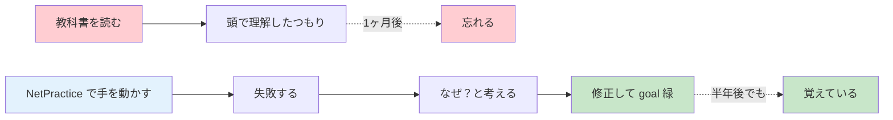

# なぜ 42 はこの課題を出すのか？

## このページは何？

**NetPractice の出題意図を憶測する** ページ。
なぜ 10 個のブラウザパズルを 42 は新卒カリキュラムに入れたのか、何を学んで欲しいのかを考察します。

---

## 💡 最重要メッセージ

!!! tip "42 が伝えたいこと"
    **「ネットワークは魔法ではない」**。
    あなたが普段 `ssh`、`ping`、`curl` を実行するとき、裏で起きていることは
    **極めて単純な「町内の住所を見て、同じなら直送、違えば郵便局へ」というルール** の積み重ねに過ぎない。
    その「単純さ」を体で覚えてほしい。

---

## 🎯 憶測される出題の狙い（5 つ）

### 狙い 1: 「ネットワーク = 魔法」という思い込みを壊す

#### 入学前の多くの人のイメージ

```
インターネット
  = Wi-Fi に繋げば繋がる、謎の技術
  = パスワード入れたら認証される、謎の仕組み
  = 遅いときは再起動で直る、謎の状態
```

#### 42 が学生に身につけてほしい感覚

```
インターネット
  = IP アドレス + サブネットマスク + ルーティング + 双方向到達性
  = これだけの部品の組み合わせ
  = 動かなければ「どこが切れているか」を追える
```

!!! info "脱・謎技術"
    「Wi-Fi が繋がらない」を **「DHCP でアドレスが取れてない」「デフォルトゲートウェイが違う」** と
    分解できる人は、エンジニアとして一段強い。それを身につけるのが NetPractice。

---

### 狙い 2: 抽象概念を「触れる」形で理解させる

**本で読むだけ** だと「/24 は 254 アドレス」のような知識はすぐ忘れる。
**自分で設定して、goal が赤→緑 に変わる体験** をすると身体感覚として残る。



これは心理学で言う **「能動的想起 (active recall)」** と **「手続き記憶」** の組み合わせ。
42 はこれを全課題で徹底している。NetPractice はその **ネットワーク版**。

---

### 狙い 3: 「双方向性」という普遍概念を叩き込む

#### 狙われる誤解

**「通信は一方通行で成立する」** という素朴な誤解。

たとえば:
- 「メッセージを送った」→ 届いたはず？
- 「API を叩いた」→ 処理されたはず？
- 「認証情報を送った」→ ログインできたはず？

**全て、レスポンスが返って来なければ成立していない**。
NetPractice Level 6 以降で **Internet 側の戻り route を手で書かされる** のは、
この感覚を徹底的に叩き込むため。

#### 将来どこで効いてくるか

| 場面 | 双方向性の問題 |
|:---|:---|
| API 設計 | request だけでなく response も設計する |
| DB レプリケーション | primary → replica だけでなく health check の戻り |
| メッセージキュー | enqueue と ack の両方 |
| 分散システム | RPC の往復 + retry + timeout |

**「return path を意識するか否か」** は、シニアエンジニアと新卒の判別ポイントですらある。

---

### 狙い 4: 制約の中での設計力を鍛える

NetPractice の各レベルは **「何かが固定されている」** 問題。
完全に自由な設計問題ではない。

#### なぜ制約が多い方が良い訓練になるか

!!! tip "制約は学びの加速装置"
    完全な自由度で「好きに設計してください」と言われると、
    初心者は **何でもできてしまう** から何も学べない。
    制約があると「この部品は変えられない、でもゴールは達成したい」と
    **限られた選択肢の中で最適解を探す** 思考が鍛えられる。

これは実務で常に起きる:

- レガシーコードの API シグネチャは変えられない
- 使えるデータベースが決まっている
- クラウドの予算枠がある
- 納期まであと 2 週間

**制約の中でどう工夫するか**、が実務の本質。NetPractice はその筋トレ。

---

### 狙い 5: プロトコル・レイヤーの概念を染み込ませる

OSI 参照モデルを教科書で読むと「7 層」「物理層」「データリンク層」…
とにかく **言葉が硬くて抽象的**。

NetPractice は **L2 (スイッチ)** と **L3 (ルータ)** を
物として操作させることで、**「層って何？」** を体で覚えさせる。

```
スイッチ触った → あ、MAC を見て転送する機械 → これが L2
ルータ触った → あ、IP を見て転送する機械 → これが L3
```

将来、学生が:
- TCP/IP スタックを読む → L3/L4 がすっと入る
- VPN を設定する → トンネル内の層構造が見える
- トラブルシューティングする → どの層の問題か切り分けられる

という **「層の感覚」** を持っているかが分かれ道になる。

---

## 🔑 NetPractice ならではの「見える化」

教科書では隠されている、普段のネット利用では見えない次のものを、
**パズル画面で可視化** してくれる:

| 見えにくいもの | NetPractice での見え方 |
|:---|:---|
| サブネットマスクの働き | **1 ビットずつ表示される 2 進数** |
| ルーティングの判断 | **「この宛先ならここへ」という表** |
| 帰り道の存在 | **Internet 側の route 設定欄** |
| サブネット境界 | **ブロック違うと赤くなる** |
| ルータの各口が別サブネット | **口ごとの IP/Mask 入力欄** |

普段なら OS や機器が勝手にやってくれることを、**強制的に自分で書かされる**。
これが NetPractice の教育的価値の核心。

---

## 💬 「NetPractice は簡単」と言う先輩への反論

「あんなのサブネット計算できれば秒で終わる」と言う人がいる。
確かに計算自体は電卓 1 個あれば瞬殺。

しかし、NetPractice で **本当に問うているのはアルゴリズムではなく、直感**:

- 問題を見て **5 秒で「これは /25 に揃える問題」と分かる**
- 赤い goal を見て **10 秒で「帰り道が足りない」と分かる**
- 複雑なトポロジーを **30 秒で頭の中で分解できる**

この **「パッと見える力」** は計算力ではなく **反復とメタ認知** で鍛えられる。
NetPractice を 10 回解いた人と、一度も触っていない人では、
**実機トラブル時の反応速度が 10 倍違う** はず。

---

## 🎓 評価で問われるのもここ

ディフェンスで聞かれる:

- 「なぜこの値なの？」（= **理解の言語化**）
- 「マスクが /25 と /26 で混ざったらどうなる？」（= **制約違反を想像する力**）
- 「Internet が 1 つの route しか持てなかったら？」（= **設計の柔軟性**）

設定ファイルを提出するだけなら AI でもできる。
でも **口頭で説明できる = 自分の中で言語化できている = 本当に理解している**。

---

## 📝 まとめ

!!! note "NetPractice の本当の目的"
    1. **ネットワークの脱・魔法化**（単純な部品の組み合わせだと体感させる）
    2. **抽象概念の手続き記憶化**（触って学んで忘れない）
    3. **双方向性の刷り込み**（request だけでなく response も設計）
    4. **制約下の設計訓練**（実務で必須の筋力）
    5. **レイヤー感覚の育成**（L2 vs L3 を身体で覚える）

    これを踏まえて問題を解くと、**「あ、この固定値はヒントか」**
    **「帰り道はどうする？」** と意図的に気づけるようになる。

---

## ▶️ 次に読むページ

[他分野に応用できる考え方](transferable.md) — ネットワーク以外でも使える思考パターン
