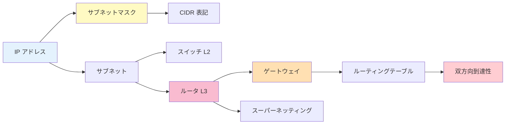

# 📚 用語集

NetPractice で出てくる用語の **50 音順 + アルファベット順** の辞書。
各ページからここへ飛んで、ここから関連ページに戻れます。

---

## あ行

### AND 演算 (ビット AND)
2 つの値の各ビットを比べて、**両方 1 なら 1、それ以外は 0** にする計算。
IP とマスクに AND 演算すると「**町（ネットワーク部）**」が取り出せる。
→ [02. サブネットマスク](01-basics/subnet-mask.md)

### IP アドレス (Internet Protocol address)
コンピュータの住所。32 ビットの 2 進数だが、普段は `192.168.1.10` のように
4 つの数字（0〜255）で書く。
→ [01. IP アドレス](01-basics/ip-address.md)

### インターフェイス (interface)
機器の「口」「ポート」のこと。ルータは複数のインターフェイスを持ち、
それぞれ別のサブネットに属する。

### Internet / インターネット
世界中のネットワークが相互接続されたもの。NetPractice では `I1` や `Ir1` として登場。
Internet 側の route 設定で「**帰り道**」を指定するのが Level 6 以降の核心。
→ [07. 双方向到達性](01-basics/bidirectional.md) / [Level 6](02-levels/level6.md)

### オクテット (octet)
IP アドレスの 4 つに区切った各数字のこと。1 オクテット = 8 ビット = 0〜255。

---

## か行

### CIDR 表記 (サイダー表記)
マスクの 1 の個数を `/24` のように書く表記。
`/24` = 24 ビット が 1 = `255.255.255.0` と同じ意味。
→ [03. CIDR 早見表](01-basics/cidr.md)

### ゲートウェイ (gateway)
自分のネットワーク外に出るときに最初にパケットを送るルータの IP。
**自分と同じサブネット内** にいなければならない。
→ [05. ゲートウェイ](01-basics/gateway.md)

### グローバルアドレス (global address)
Internet 上で一意な IP アドレス。`8.8.8.8` など。

### 後置表記 (prefix length)
`/24` のように「何ビットがネットワーク部か」を示す書き方。
= CIDR 表記。
→ [03. CIDR](01-basics/cidr.md)

---

## さ行

### サブネット (subnet)
「同じネットワーク部を持つ IP の集合 = 同じ町」。
= 同じ broadcast domain。
→ [02. サブネットマスク](01-basics/subnet-mask.md)

### サブネットマスク (subnet mask)
IP アドレスのうち、**どこまでがネットワーク部** かを決める値。
1 が連続して並んだ後に 0 が続く形でなければ無効。
→ [02. サブネットマスク](01-basics/subnet-mask.md)

### スイッチ (switch)
L2 機器。同じサブネット内のパケットを MAC アドレスで転送する。
配下は全員同じサブネット。
→ [04. スイッチとルータ](01-basics/switch-router.md)

### ストリームリンク
NetPractice 用語で、**ケーブルで繋がった両端** のこと。両端は必ず同じサブネット。

### スーパーネッティング (supernetting)
= ルート集約。隣接する複数のサブネットを 1 つの広いプレフィックスで表す技。
→ [Level 8](02-levels/level8.md)

### 双方向到達性 (bidirectional reachability)
通信は **行き道と帰り道の両方** が必要という事実。
NetPractice で最もハマるポイント。
→ [07. 双方向到達性](01-basics/bidirectional.md)

---

## た行

### 2 進数 (binary)
0 と 1 だけで数を表す記法。コンピュータは内部で全て 2 進数で処理する。
IP アドレスやマスクも 2 進数で見ると仕組みが分かる。
→ [01. IP アドレス](01-basics/ip-address.md)

### 直結 (direct link)
ケーブルでホスト同士を直接繋ぐこと。ルータもスイッチもない。
両端は同じサブネットに属する必要がある。
→ [Level 1](02-levels/level1.md)

### TCP/IP
Internet の基本プロトコル。TCP（L4）+ IP（L3）の組み合わせ。
NetPractice は IP 層（L3）を扱う。

---

## な行

### ネットワークアドレス (network address)
サブネットの先頭 IP。ホスト部が全 0 の値。
「そのネットワーク全体」を指す特別な IP なので、個別ホストには割り当てない。
例: `192.168.1.0/24` の `.0`。
→ [02. サブネットマスク](01-basics/subnet-mask.md)

---

## は行

### パケット (packet)
ネットワークで送受信される **データの単位**。
ヘッダに送信元 IP、宛先 IP、データ本体が含まれる。

### ブロック (block, subnet block)
**サブネット（= 町）を 1 つ 1 つのまとまりとして数えるときの呼び方**。
「`/24` を 4 つの `/26` ブロックに分ける」のように使う。
- 意味は **「町（サブネット）」とほぼ同じ**
- ただし **他のブロックと隣接していた** ニュアンスを含む（分割元の大きな町がある）
- 各ブロックは **先頭（全 0）= ネットワークアドレス / 末尾（全 1）= ブロードキャスト** が使えない
→ [03. CIDR 早見表](01-basics/cidr.md)

### ブロードキャストアドレス (broadcast address)
サブネットの末尾 IP。ホスト部が全 1 の値。
「そのネットワーク内の全員」に送信するための IP。個別ホストには割り当てない。
例: `192.168.1.0/24` の `.255`。

### プライベートアドレス (private address)
内輪で自由に使える IP 範囲。
`10.0.0.0/8`, `172.16.0.0/12`, `192.168.0.0/16` の 3 つ。
→ [01. IP アドレス](01-basics/ip-address.md)

### プレフィックス長 (prefix length)
= CIDR 表記の数字。`/24` の「24」のこと。

---

## ま行

### MAC アドレス (Media Access Control address)
LAN カードに物理的に刻まれた固有 ID。L2 のアドレス。
例: `aa:bb:cc:11:22:33`。スイッチは MAC を見る。

### マスク
= サブネットマスク。

---

## ら行

### ループバック (loopback)
`127.0.0.1`。自分自身を指す特別な IP。
`ping 127.0.0.1` が成功すれば、自分の TCP/IP スタックは動いている。

### ルータ (router)
L3 機器。異なるサブネット間のパケットを IP アドレスを見て転送する。
複数のインターフェイスを持ち、各口が別サブネットに属する。
→ [04. スイッチとルータ](01-basics/switch-router.md)

### ルーティングテーブル (routing table)
ルータ（とホスト）が持つ「**宛先 → 次の転送先**」の表。
上から順にマッチを探す。`default` は必ず最後。
→ [06. ルーティングテーブル](01-basics/routing-table.md)

### ルート集約 (route summarization / supernetting)
隣接する複数のサブネットを 1 つの広いプレフィックスで表す技。
→ [Level 8](02-levels/level8.md)

### レイヤー / 層 (layer)
OSI 参照モデルの分類。L2 = データリンク層（スイッチ）、L3 = ネットワーク層（ルータ）等。
→ [04. スイッチとルータ](01-basics/switch-router.md)

---

## アルファベット順

### ACK (Acknowledgment)
「受け取った」という応答メッセージ。双方向通信の「帰り」の一種。

### BGP (Border Gateway Protocol)
Internet 規模のルーティングプロトコル。世界中のルータが経路情報を交換する。
NetPractice では直接扱わないが、**現実の Internet で「帰り道が自動的に決まる仕組み」** の正体。

### CIDR (Classless Inter-Domain Routing)
「/24」のようなプレフィックス長で表すネットワーク表記法。
→ [03. CIDR](01-basics/cidr.md)

### DHCP (Dynamic Host Configuration Protocol)
IP アドレスを自動配布する仕組み。家庭の Wi-Fi ルータが配っている。
NetPractice では手動設定なので DHCP は使わない。

### DNS (Domain Name System)
`google.com` のような名前を IP に変換する仕組み。NetPractice の範囲外。

### L2 / L3
OSI 参照モデルのレイヤー表記。L2 = データリンク層、L3 = ネットワーク層。
→ [04. スイッチとルータ](01-basics/switch-router.md)

### LAN (Local Area Network)
家や会社など限定エリア内のネットワーク。1 つのサブネット単位で考えることが多い。

### NAT (Network Address Translation)
プライベート IP とグローバル IP を相互変換する仕組み。家の Wi-Fi ルータの中身。

### OSI 参照モデル
ネットワーク通信を **7 層に分けた** 国際標準モデル。
→ [04. スイッチとルータ](01-basics/switch-router.md)

### RFC 1918
プライベートアドレスの範囲を規定した Internet 業界の文書。
`10.0.0.0/8`, `172.16.0.0/12`, `192.168.0.0/16` の 3 つを予約。

---

## 🔄 用語間の繋がり図

この図は **Level 1 から Level 10 まで使う全概念** の地図。
どこが分からないかで用語を辿って下さい。

---

## 📖 関連リソース

- [初心者向けの始まりのページ](00-start-here.md)
- [ディフェンス Q&A](04-defense/qa.md)
- [当日チートシート](04-defense/cheatsheet.md)
