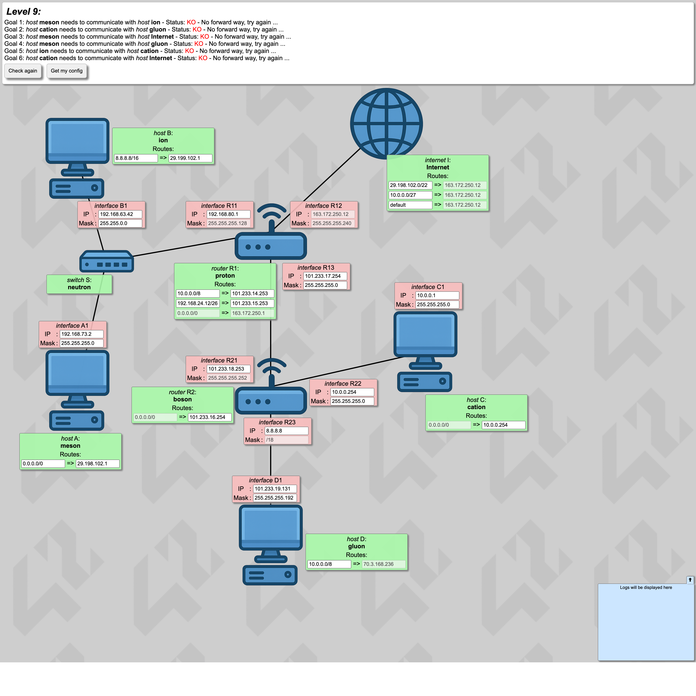
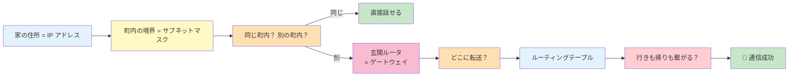

# NetPractice ガイド

## 🌐 何をする課題？

**ブラウザ上の「ネットワーク設定パズル」を 10 問解く** 課題です。
各問には「**ホスト**（パソコン）」「**ルータ**（中継機）」「**Internet**」が線で繋がった図が出てきて、
**どこかの設定が間違っている** ので直して **すべての目標を緑色に変える** のがゴール。

*↑ 実際の画面例。ピンク色の欄を埋めて全ゴールを緑色にする*

---

## 📖 全体目次（クリックで各ページへ）

| # | ページ | 何が分かる？ | 目安時間 |
|:---:|:---|:---|:---:|
| — | **[このガイドの使い方](00-start-here.md)** | 読み進め方・推奨順 | 3分 |
| **第1部** | **ネットワークの基礎** (7 ページ) | これを読めば 10 レベル全部解ける土台ができる | 40分 |
| 01 | [IP アドレスって何？](01-basics/ip-address.md) | 家の住所とおなじ | 5分 |
| 02 | [サブネットマスクって何？](01-basics/subnet-mask.md) | 「町内」の区切り方 | 10分 |
| 03 | [CIDR 早見表と計算](01-basics/cidr.md) | `/24` とか `/25` の意味 | 10分 |
| 04 | [スイッチとルータの違い](01-basics/switch-router.md) | タコ足配線 vs 郵便局 | 5分 |
| 05 | [ゲートウェイって何？](01-basics/gateway.md) | 町内の外に出るときの「玄関」 | 5分 |
| 06 | [ルーティングテーブル](01-basics/routing-table.md) | ルータの「住所録」 | 10分 |
| 07 | [双方向到達性](01-basics/bidirectional.md) | 行き道と帰り道は別問題 | 5分 |
| **第2部** | **全10レベル攻略** | 実際の解答と考え方 | 90分 |
| L1 | [直結リンク](02-levels/level1.md) | 2台を繋ぐだけの最もやさしい問題 | 5分 |
| L2 | [不正マスクの修正](02-levels/level2.md) | 「変なマスク」を見分ける | 10分 |
| L3 | [スイッチで3台接続](02-levels/level3.md) | 3台全員を同じ町内に | 5分 |
| L4 | [ルータ登場](02-levels/level4.md) | ルータの各口は別の町内 | 10分 |
| L5 | [ルーティング初登場](02-levels/level5.md) | ルータを経由する通信 | 10分 |
| L6 | [Internet 越しの通信](02-levels/level6.md) | 帰りの道が核心 | 10分 |
| L7 | [サブネット分割設計](02-levels/level7.md) | /24 を 3 つに割る | 15分 |
| L8 | [2 つの LAN + Internet](02-levels/level8.md) | ルート集約の登場 | 15分 |
| L9 | [大ボス（6 ゴール）](02-levels/level9.md) | 複雑な制約の連鎖 | 20分 |
| L10 | [最終ボス（7 ゴール）](02-levels/level10.md) | 自由度が低いから逆に簡単？ | 20分 |
| **第3部** | **抽象化された学び** ⭐ | 他の分野にも転用できる考え方 | 30分 |
| 🧭 | [なぜ 42 はこの課題を出す？](03-learnings/why-this-exercise.md) | 出題意図を憶測する | 10分 |
| 🔁 | [他分野に応用できる考え方](03-learnings/transferable.md) | ネットワーク以外でも使える思考 | 15分 |
| 🧩 | [制約からの逆算という思考法](03-learnings/debugging-mindset.md) | パズルを解く武器 | 10分 |
| **第4部** | **評価（ディフェンス）対策** | | 20分 |
| 🎓 | [ディフェンス Q&A](04-defense/qa.md) | 聞かれる質問と模範回答 | 15分 |
| 📋 | [当日チートシート](04-defense/cheatsheet.md) | ちら見用の要点集 | 5分 |
| 📚 | [用語集](glossary.md) | IP・マスク・サブネット等の用語解説 | 辞書代わり |

---

## 🎯 このガイドの方針

!!! tip "読み手ファースト"
    このガイドは **「ネットワークのことを全く知らない人でも読める」** を目標にしています。
    **専門用語は使う前に必ず平易な言葉で説明** し、**表とメタファー（例え話）** を多用します。

    42 学生で既にネットワークを勉強した人は第1部を飛ばして OK。
    評価準備なら第4部から読むのも 👍

---

## 🗺️ 学びの全体像（イメージ）

*このガイドを読み終わる頃には、この流れ全部が頭に入っている状態になります。*

---

## 🚀 はじめかた

1. まず [📌 このガイドの使い方](00-start-here.md) を 3 分で読む
2. [01. IP アドレスって何？](01-basics/ip-address.md) から順番に読む
3. 第1部を読み終えたら、自分の生成された問題を [第2部](02-levels/level1.md) と比べながら解く
4. 評価直前に [当日チートシート](04-defense/cheatsheet.md) を印刷

---

## 📦 このガイドと連動する提出リポジトリ

| リポジトリ | 役割 |
|:---|:---|
| [Tsunanko/netpractice](https://github.com/Tsunanko/netpractice) | 提出用: `level1.json` 〜 `level10.json` と `README.md` |
| [Tsunanko/netpractice-guide](https://github.com/Tsunanko/netpractice-guide) | このガイドサイト（学習用） |

!!! info "ガイドはあくまで考え方の解説"
    提出 JSON の数値はアカウント毎に違います（`ijoja` さんの値がそのまま使えるわけではない）。
    **「どう考えて解くか」** を学ぶのがこのサイトの目的です。
